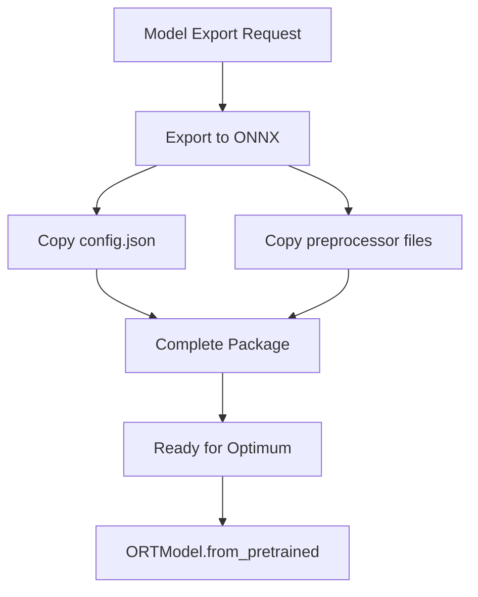

# ADR-013: ONNX Configuration Strategy for Optimum Compatibility

| Status | Date | Decision Maker(s) | Consulted | Informed |
|--------|------|-------------------|-----------|----------|
| Revised | 2025-08-11 | Architecture Team | HTP Team, Optimum Users | All ModelExport Users |

## Context and Problem Statement

ModelExport's HTP (Hierarchical Trace-and-Project) exporter successfully creates ONNX models with preserved module hierarchy metadata. However, these models cannot be directly used with HuggingFace Optimum's inference APIs without proper configuration files.

**Critical Finding**: After analyzing Optimum's codebase, we discovered that Optimum **requires** `config.json` to be present in the same directory as the ONNX model. It does not support loading configuration from ONNX metadata or dynamically fetching from HuggingFace Hub.

## Decision Drivers

- **Compatibility First**: Must work with existing Optimum without modifications
- **Simplicity**: Minimize complexity and maintenance burden
- **Reliability**: Ensure consistent behavior across all scenarios
- **User Experience**: Provide clear, predictable deployment patterns

## Considered Options

### Option 1: Always Copy Configuration
- **Description**: Copy all configuration files during export for all models
- **Pros**: 
  - Works immediately with Optimum
  - Simple, consistent implementation
  - No custom code required
  - Fully offline capable
- **Cons**: 
  - Slightly larger deployment size (2-5KB)
  - Duplicates config for Hub models

### Option 2: Custom Loader with Dynamic Loading
- **Description**: Create custom wrapper that extracts metadata and fetches config
- **Pros**: 
  - Single file deployment for Hub models
  - Smaller deployment size
- **Cons**: 
  - Requires custom loader code
  - Temporary directory management
  - Additional complexity
  - Not immediately compatible with Optimum

### Option 3: Contribute to Optimum
- **Description**: Add metadata-based config loading to Optimum itself
- **Pros**: 
  - Best long-term solution
  - Benefits entire community
- **Cons**: 
  - Requires upstream acceptance
  - Long timeline
  - Not immediately available

## Decision Outcome

**Chosen option: Option 1 - Always Copy Configuration**

We will copy configuration files during export for ALL models to ensure immediate compatibility with Optimum's current implementation.



## Rationale

### Why This Approach?

1. **Optimum's Requirements**: Optimum's `from_pretrained()` expects this structure:
   ```
   model_directory/
   ├── model.onnx
   ├── config.json         # REQUIRED
   ├── tokenizer.json      # Optional
   └── tokenizer_config.json # Optional
   ```

2. **No Workarounds**: Optimum uses `AutoConfig.from_pretrained()` which specifically looks for `config.json` in the directory. Without it, loading fails.

3. **Pragmatic Choice**: The 2-5KB overhead is negligible compared to the complexity of custom loaders or waiting for upstream changes.

### Technical Evidence

From `optimum/modeling_base.py`:
```python
config = AutoConfig.from_pretrained(
    pretrained_model_name_or_path=config_name_or_path,
    # ... other parameters
)
```

This directly calls transformers' `AutoConfig` which requires `config.json` to be present.

## Implementation

### Export Process

```python
def export_with_config(model_name_or_path: str, output_dir: str):
    """Export model to ONNX with configuration files."""
    
    # 1. Export to ONNX using HTP
    onnx_path = os.path.join(output_dir, "model.onnx")
    export_to_onnx(model_name_or_path, onnx_path)
    
    # 2. Copy configuration files
    if is_hub_model(model_name_or_path):
        # Download from Hub
        config = AutoConfig.from_pretrained(model_name_or_path)
        tokenizer = AutoTokenizer.from_pretrained(model_name_or_path)
    else:
        # Load from local
        config = AutoConfig.from_pretrained(model_name_or_path)
        tokenizer = AutoTokenizer.from_pretrained(model_name_or_path)
    
    # 3. Save alongside ONNX
    config.save_pretrained(output_dir)
    tokenizer.save_pretrained(output_dir)
    
    return output_dir
```

### Usage with Optimum

```python
from optimum.onnxruntime import ORTModelForSequenceClassification

# Load directly - no custom code needed!
model = ORTModelForSequenceClassification.from_pretrained("path/to/exported/model")
```

## Consequences

### Positive
- ✅ **Immediate Compatibility**: Works with Optimum today, no waiting
- ✅ **Simple Implementation**: ~50 lines of straightforward code
- ✅ **Consistent Behavior**: Same deployment pattern for all models
- ✅ **Fully Offline**: No internet required after export
- ✅ **Clear Structure**: Predictable file layout

### Negative
- ❌ **Slightly Larger Size**: Additional 2-5KB per model
- ❌ **Config Duplication**: Hub models have config in two places

### Neutral
- ↔️ Future optimization possible if Optimum adds metadata support
- ↔️ Aligns with standard HuggingFace model distribution patterns

## Migration Path

### For New Users
```bash
# Export creates complete package automatically
modelexport export bert-base-uncased output_dir/

# Directory contains everything needed
ls output_dir/
# model.onnx  config.json  tokenizer.json  tokenizer_config.json
```

### For Existing Users
Models exported without configs will show clear error:
```
OSError: config.json not found in model directory.
Please re-export with modelexport >= 1.0.0
```

## Future Enhancements

### Phase 1: Current Implementation (Immediate)
- Always copy configuration files
- Full Optimum compatibility

### Phase 2: Custom Loader (Optional, Later)
- Add `AutoModelForONNX` convenience wrapper
- Keep copying configs for compatibility

### Phase 3: Optimum Contribution (Long-term)
- Propose metadata-based loading to Optimum
- Maintain backward compatibility

## Validation

### Test Cases

1. **Hub Model Export**: Verify config copied correctly
2. **Local Model Export**: Verify config preserved
3. **Optimum Loading**: Test with ORTModel classes
4. **Offline Usage**: Verify no internet needed
5. **Error Messages**: Clear guidance for missing configs

### Success Metrics

- 100% Optimum compatibility
- <100ms overhead for config copying
- Zero user configuration required
- Clear error messages

## Related Decisions

- **HTP Strategy**: Provides the ONNX export with hierarchy preservation
- **Version Management**: Ensures config compatibility across versions

## References

- [Optimum Documentation](https://huggingface.co/docs/optimum)
- [Optimum Source Code](https://github.com/huggingface/optimum)
- [HuggingFace Model Hub](https://huggingface.co/models)

## Notes

### Why Not Smart Hybrid?

The original "smart hybrid" approach (metadata for Hub models, copy for local) is technically infeasible without custom loader code. Optimum cannot load config from metadata.

### Storage Impact

For a typical BERT model:
- ONNX file: ~400MB
- config.json: ~2KB
- tokenizer files: ~1-3KB
- **Total overhead: <0.01% of model size**

### Example Directory Structure

After export:
```
bert-exported/
├── model.onnx           # 400MB - The ONNX model
├── config.json          # 2KB - Model configuration
├── tokenizer.json       # 1KB - Tokenizer data
├── tokenizer_config.json # 1KB - Tokenizer config
└── special_tokens_map.json # 1KB - Special tokens
```

Total: ~400.005MB (negligible overhead)

---
*Decision Date: 2025-08-11*
*Last Updated: 2025-08-11*
*Next Review: 2025-11-11*