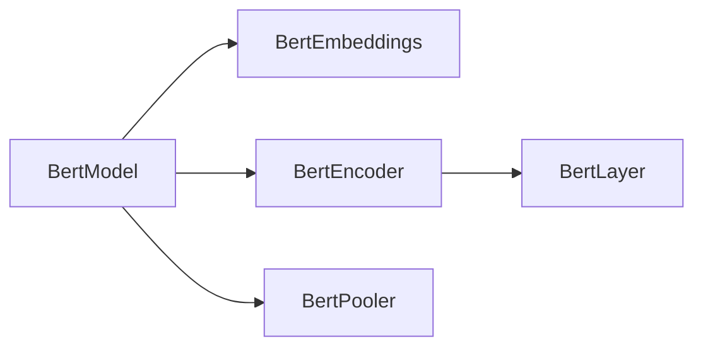

# ADR-005: Tree Visualization Library for HTP Export Reports

| Status | Date | Decision Maker(s) | Consulted | Informed |
|--------|------|-------------------|-----------|----------|
| Accepted | 2025-01-22 | HTP Team | Export Team, Documentation Team | All Developers |

## Context and Problem Statement

The HTP export process generates a hierarchical module structure that needs to be visualized in the markdown report. Currently, the console output uses Rich's tree rendering which gets truncated at 30 lines in the report capture. We need a solution that:

1. Works well within markdown reports
2. Shows complete hierarchy without truncation
3. Is readable both in raw markdown and rendered views
4. Doesn't require external dependencies for viewing the report
5. Provides good visual hierarchy representation

## Decision Drivers

- **Markdown Compatibility**: Must work well in .md files without special rendering
- **No External Dependencies**: Report viewers shouldn't need special tools
- **Complete Information**: No truncation or information loss
- **Visual Clarity**: Clear parent-child relationships
- **Performance**: Fast generation for large hierarchies (100+ modules)
- **Maintainability**: Simple implementation and maintenance

## Considered Options

1. **Mermaid Flowchart LR** - Declarative diagram syntax
2. **ASCII Tree (anytree/treelib)** - Traditional text-based tree
3. **Rich Export to SVG** - Export Rich trees as images
4. **Indented Text Lists** - Simple markdown lists with indentation

## Decision Outcome

**Chosen option**: Hybrid approach using **Mermaid Flowchart LR** for visual overview and **ASCII Tree in Code Blocks** for complete hierarchy.

### Rationale

- Mermaid provides excellent visual representation when markdown is rendered (limited to first 10-20 relationships)
- ASCII tree in code blocks ensures complete hierarchy is shown without truncation
- No Python dependencies needed for report viewing - ASCII trees are generated using built-in string manipulation
- Works in all markdown viewers (GitHub, VS Code, etc.)
- Consistent with console output format (Rich trees converted to ASCII)
- Graceful degradation - if Mermaid doesn't render, ASCII tree is still readable

### Consequences

**Positive:**
- Universal compatibility with markdown renderers
- Complete hierarchy information preserved without truncation
- Visual and textual representations complement each other
- No additional Python dependencies required
- Fast generation and rendering
- Familiar ASCII tree format matches console output
- Collapsible sections manage large hierarchies

**Negative:**
- Mermaid diagrams limited to first 10-20 relationships to avoid clutter
- Two representations might seem redundant
- Limited styling options in both Mermaid and ASCII trees

**Neutral:**
- Report size slightly larger due to dual representation
- Requires learning Mermaid syntax for maintenance
- ASCII trees use fixed-width fonts for proper alignment

## Implementation Notes

```markdown
## Module Hierarchy



### Complete Module Hierarchy
<details>
<summary>Click to expand complete module tree (48 modules)</summary>

```
BertModel
├── BertEmbeddings: embeddings
│   ├── LayerNorm: embeddings.LayerNorm
│   └── Dropout: embeddings.dropout
├── BertEncoder: encoder
│   ├── BertLayer: encoder.layer.0
│   │   ├── BertAttention: encoder.layer.0.attention
│   │   │   ├── BertSelfAttention: encoder.layer.0.attention.self
│   │   │   └── BertSelfOutput: encoder.layer.0.attention.output
│   │   ├── BertIntermediate: encoder.layer.0.intermediate
│   │   └── BertOutput: encoder.layer.0.output
│   └── BertLayer: encoder.layer.1
│       └── ...
└── BertPooler: pooler
```

</details>
```

## Validation/Confirmation

Success criteria:
1. Report renders correctly in GitHub markdown preview
2. Report renders correctly in VS Code markdown preview
3. All modules visible without truncation
4. Generation time < 100ms for 100+ modules
5. Report file size reasonable (< 1MB for typical models)

## Detailed Analysis of Options

### Option 1: Mermaid Flowchart LR
- **Description**: Use Mermaid's flowchart syntax with left-to-right layout
- **Pros**: 
  - Native markdown support in GitHub, GitLab, VS Code
  - Clear visual hierarchy
  - No Python dependencies
  - Declarative syntax
  - Good for overview visualization
- **Cons**: 
  - Can become cluttered with many nodes (50+)
  - Limited customization options
  - Not all markdown viewers support Mermaid
  - Doesn't show module paths clearly
- **Technical Impact**: Simple string generation, no libraries needed

### Option 2: ASCII Tree (anytree/treelib)
- **Description**: Generate traditional ASCII art trees using Python libraries
- **Pros**: 
  - Works everywhere (pure text)
  - Familiar tree representation
  - Shows complete hierarchy clearly
  - anytree: 45K weekly downloads, mature
  - treelib: 250K weekly downloads, very popular
- **Cons**: 
  - Requires additional dependency
  - Less visually appealing in rendered markdown
  - Can be wide for deep hierarchies
  - ASCII art may not align properly in some viewers
- **Technical Impact**: New dependency, but lightweight libraries

### Option 3: Rich Export to SVG
- **Description**: Use Rich's export_svg() to create tree images
- **Pros**: 
  - Beautiful, professional rendering
  - Exactly matches console output
  - Supports colors and styling
- **Cons**: 
  - Requires external image files
  - SVG may not render in all markdown viewers
  - Increases report complexity
  - Still has truncation issues
  - Larger file sizes
- **Technical Impact**: Complex implementation, file management

### Option 4: ASCII Tree in Code Blocks (Selected as part of hybrid)
- **Description**: ASCII art trees in markdown code blocks, similar to console output
- **Pros**: 
  - Universal compatibility
  - No dependencies (generated with string manipulation)
  - Shows complete hierarchy without truncation
  - Familiar format matching console output
  - Clear parent-child relationships with box-drawing characters
  - Works in all markdown viewers
  - Searchable and copyable
- **Cons**: 
  - Requires fixed-width font for proper alignment
  - Less visually rich than graphical diagrams
  - Can be wide for deep hierarchies
- **Technical Impact**: Simple implementation using existing tree building logic

## Related Decisions

- ADR-003: Markdown Report Format Selection
- ADR-004: Report Generation Independence from Console Output

## More Information

- [Mermaid Documentation](https://mermaid.js.org/syntax/flowchart.html)
- [anytree Documentation](https://anytree.readthedocs.io/)
- [treelib Documentation](https://treelib.readthedocs.io/)
- [CommonMark Specification](https://spec.commonmark.org/)

## Implementation Details

### ASCII Tree Generation

The ASCII tree is generated using:
- Unicode box-drawing characters: `├──`, `└──`, `│`
- Recursive tree traversal from the module hierarchy
- Proper indentation based on depth
- Display format: `{symbol} {class_name}: {module_path}`

### Report Structure Updates

1. **Export Process**: Shows module hierarchy preview in Step 3/6
2. **Module Hierarchy Section**: 
   - Mermaid diagram (first 10-20 relationships)
   - Complete ASCII tree in collapsible section
   - Module list table with reordered columns: Execution Order | Class Name | Tag | Scope
3. **Node Distribution**: Shows node distribution preview in Step 5/6

### Additional Improvements from Analysis

1. **Show Hierarchy in Step 3/6**: The Hierarchy Building step includes a module hierarchy preview (limited depth)
2. **Reorder Module List Table**: Changed from "Module Path | Class Name | Tag | Execution Order" to "Execution Order | Class Name | Tag | Scope"
3. **Include Trees in Step Sections**: Step 3 shows module hierarchy, Step 5 shows node distribution

---
*Last updated: 2025-01-22*
*Next review: 2025-04-22*