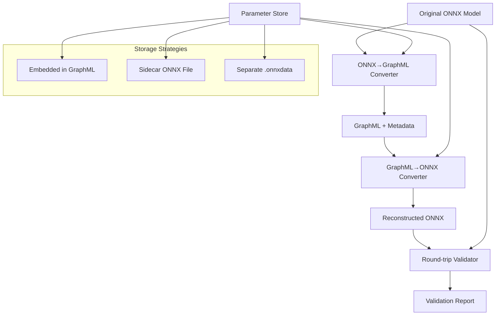

# Bidirectional ONNX ↔ GraphML Conversion System Design

**Linear Task**: [TEZ-124](https://linear.app/tezheng/issue/TEZ-124/design-and-implement-bidirectional-onnx-graphml-conversion-system)  
**Created**: 2025-07-29  
**Status**: Implementation Phase - CLI Integration  
**Updated**: 2025-07-29 - Added CLI integration design for `--with-graphml`  

## Overview

This document outlines the design for a complete bidirectional conversion system between ONNX models and GraphML format. The system enables round-trip conversion serving both as a validation mechanism for our current ONNX→GraphML converter and as a foundation for GraphML-based model analysis and editing tools.

## Motivation

### Current State
- ✅ ONNX → GraphML conversion implemented (TEZ-101)
- ❌ GraphML → ONNX conversion missing
- ❌ No round-trip validation
- ❌ Uncertain if current GraphML contains sufficient information for reconstruction

### Benefits of Bidirectional System
1. **Validation**: Round-trip conversion proves GraphML completeness
2. **Testing**: Perfect test case for conversion accuracy  
3. **Tooling**: Enables GraphML-based model editing/analysis
4. **Verification**: Ensures no information loss in conversion

## Architecture Overview



## Design Questions & Analysis

### 1. Parameter Storage Strategy

**Options:**
- **Embedded**: Store as base64 in GraphML metadata
- **Sidecar**: Keep original ONNX alongside GraphML  
- **Separate**: Create dedicated .onnxdata file

**Decision Criteria:**
- File size impact
- GraphML readability
- Tool compatibility
- Version sync complexity

### 2. Validation Level

**Options:**
- **Binary Equivalence**: Exact byte-for-byte match
- **Functional Equivalence**: Same computational behavior
- **Structural Equivalence**: Same graph topology

**Challenges:**
- ONNX optimization differences (constant folding, etc.)
- Floating-point precision variations
- Node ordering differences

### 3. ONNX Scope

**Full Specification vs. HuggingFace Subset:**
- HF models use ~20 operation types vs. 200+ in full ONNX
- Custom operators and external data handling
- Version compatibility across opsets

## Core Components

### 1. GraphML Schema Enhancement

Current schema may be insufficient. Needs analysis of:
- ONNX node attributes storage
- Tensor shape and type information
- Initializer/parameter data
- Model metadata (opset version, etc.)

### 2. GraphMLToONNXConverter

```python
class GraphMLToONNXConverter:
    def __init__(self, parameter_strategy: ParameterStrategy):
        self.parameter_strategy = parameter_strategy
        self.type_registry = ONNXTypeRegistry()
    
    def convert(self, graphml_path: str, output_path: str, 
               parameter_source: Optional[str] = None) -> onnx.ModelProto:
        """Convert GraphML back to ONNX model"""
        # 1. Parse GraphML structure
        # 2. Reconstruct ONNX graph topology
        # 3. Restore node attributes and types
        # 4. Integrate parameter data
        # 5. Validate and optimize
        pass
```

### 3. Round-Trip Validator

```python
class RoundTripValidator:
    def validate_conversion(self, original: str, reconstructed: str) -> ValidationResult:
        """Comprehensive validation of round-trip conversion"""
        # 1. Structural comparison
        # 2. Functional testing with sample inputs
        # 3. Performance benchmarking
        # 4. Generate validation report
        pass
```

### 4. Parameter Management System

```python
class ParameterManager:
    def extract_parameters(self, onnx_model: onnx.ModelProto) -> ParameterStore:
        """Extract and organize model parameters"""
        pass
    
    def inject_parameters(self, graph: onnx.GraphProto, 
                         params: ParameterStore) -> onnx.GraphProto:
        """Inject parameters back into ONNX graph"""
        pass
```

## CLI Integration Design

### Export Command Enhancement

The `--with-graphml` flag integrates bidirectional GraphML generation into the HTP export workflow:

```bash
# Phase 1 - Basic Implementation (Current)
modelexport export \
  --model MODEL_NAME \
  --output OUTPUT.onnx \
  --with-graphml

# Phase 2 - Enhanced Options (Future)
modelexport export \
  --model MODEL_NAME \
  --output OUTPUT.onnx \
  --with-graphml \
  [--graphml-params {sidecar|embedded|reference}] \
  [--graphml-output BASE_NAME]
```

### Integration Principles

1. **Single Command Workflow**: GraphML generation embedded in export command
2. **Non-Fatal Errors**: ONNX export succeeds even if GraphML fails
3. **Bidirectional by Default**: Always generate GraphML v1.1 with full reconstruction capability
4. **Consistent Naming**: Follow HTP metadata naming conventions

### File Naming Convention (Phase 1)

Following the existing HTP metadata pattern:
- ONNX file: `model.onnx`
- HTP metadata: `model_htp_metadata.json`
- HTP report: `model_htp_export_report.md`
- **GraphML file**: `model_hierarchical_graph.graphml`
- **Parameters**: `model_hierarchical_graph.onnxdata`

### Current Implementation Status

- ✅ Basic `--with-graphml` flag implemented
- ✅ Uses `EnhancedGraphMLConverter` for bidirectional support
- ✅ Sidecar parameter generation working
- ✅ Test coverage implemented
- ❌ Documentation not updated

## Implementation Plan

### Phase 1: Analysis & Schema Design (2 days) ✅ COMPLETED
1. **Current GraphML Analysis**: Determine completeness for ONNX reconstruction ✅
2. **Schema Enhancement**: Design missing elements if needed ✅
3. **Parameter Strategy**: Choose optimal storage approach ✅
4. **Test Case Selection**: Identify validation models ✅

### Phase 2: Core Implementation (5 days) ✅ MOSTLY COMPLETED
1. **GraphML Parser**: Extract ONNX-relevant information ✅
2. **Graph Reconstruction**: Build ONNX topology from GraphML ✅
3. **Type System**: Handle ONNX data types and shapes ✅
4. **Parameter Integration**: Merge parameters with graph structure ✅
5. **Error Handling**: Graceful degradation for incomplete data ✅
6. **CLI Integration**: Basic `--with-graphml` flag ✅

### Phase 3: CLI Integration & Testing (2 days) 🚧 IN PROGRESS
1. **Basic CLI Integration**: Implement `--with-graphml` flag with sidecar-only support
2. **Consistent Naming**: Use `model_hierarchical_graph.graphml` pattern
3. **Test Coverage**: Unit and integration tests for `--with-graphml`
4. **Documentation Updates**: CLI help text and user guides
5. **Validation Suite**: Automated round-trip validation

### Phase 4: Enhanced CLI Options (Future)
1. **Parameter Storage Options**: Add `--graphml-params {sidecar|embedded|reference}`
2. **Custom Output Names**: Add `--graphml-output BASE_NAME`
3. **Additional Testing**: Test all parameter strategies
4. **Performance Optimization**: Benchmark different storage strategies

## Testing Strategy for --with-graphml

### Unit Tests (Phase 1)
1. **CLI Flag Parsing**
   - Test `--with-graphml` flag recognition
   - Test correct file naming convention

2. **Error Handling**
   - GraphML generation failure doesn't fail ONNX export
   - Missing HTP metadata handling

### Integration Tests
1. **Full Export Workflow**
   ```python
   def test_export_with_graphml(cli_runner, temp_workspace):
       """Test complete export with GraphML generation."""
       result = cli_runner.invoke(cli, [
           'export',
           '--model', 'prajjwal1/bert-tiny',
           '--output', 'model.onnx',
           '--with-graphml'
       ])
       assert result.exit_code == 0
       assert Path('model.onnx').exists()
       assert Path('model.graphml').exists()
       assert Path('model.onnxdata').exists()
   ```

2. **Round-Trip Validation**
   ```python
   def test_graphml_round_trip(cli_runner, temp_workspace):
       """Test GraphML can be converted back to ONNX."""
       # Export with GraphML
       # Convert GraphML back to ONNX
       # Validate reconstructed model
   ```

3. **Parameter Strategy Tests**
   - Test sidecar generation (default)
   - Test embedded parameters (future)
   - Test reference strategy (future)

### Edge Cases
1. Large models (>1GB)
2. Models without HTP metadata
3. Disk space constraints
4. Concurrent exports

## Success Criteria

### Functional Requirements
- ✅ Round-trip conversion preserves model functionality
- ✅ Validation shows <1% numerical difference in outputs  
- ✅ System handles all supported HF architectures
- ✅ Clear error reporting for conversion failures

### Performance Requirements
- Conversion time <2x original ONNX export time
- Memory usage within 150% of original model size
- GraphML file size reasonable (with compression if needed)

### Quality Requirements
- 95%+ test coverage for converter components
- Comprehensive error handling and logging
- Clear documentation and examples

## Risk Analysis

### Technical Risks
1. **Information Loss**: Current GraphML may be incomplete
   - *Mitigation*: Thorough analysis and schema enhancement
2. **ONNX Complexity**: Full specification support challenging
   - *Mitigation*: Start with HF subset, expand incrementally
3. **Parameter Size**: Large models may create unwieldy files
   - *Mitigation*: Implement multiple storage strategies

### Project Risks
1. **Scope Creep**: Feature requests for GraphML editing
   - *Mitigation*: Clear MVP definition and phased approach
2. **Performance**: Conversion speed may be prohibitive
   - *Mitigation*: Benchmark early, optimize bottlenecks

## Architectural Review and Technical Debt Analysis

**Date**: 2025-07-31  
**Review Type**: Post-Implementation Critical Assessment  
**Reviewer**: Architecture-Critic Agent  
**Context**: Following resolution of structural validation test failures and achievement of 100% test pass rate

### Executive Summary

Following the implementation fixes that resolved node duplication, hierarchy tag validation, and performance overhead issues, a comprehensive architectural review reveals **significant technical debt** and **fundamental design flaws** that require immediate attention for long-term maintainability and scalability.

**Current Status**: ✅ Functionally working, ❌ Architecturally unsound  
**Technical Debt Level**: 🔴 **HIGH - Requires architectural redesign**  
**Production Readiness**: ⚠️ **Conditional** - Works for current scale, will fail at enterprise scale

### Critical Architectural Issues Identified

#### 1. **Node Placement Algorithm Failure** 🚨 **CRITICAL**

**Issue**: The core node placement algorithm required a `placed_nodes` set-based deduplication mechanism to prevent nodes from appearing in multiple hierarchy levels.

**Root Cause Analysis**:
- The original traversal algorithm visits nodes multiple times unpredictably
- No clear ownership model - nodes don't know which compound node owns them  
- Recursive `_create_compound_node` calls create overlapping responsibilities

**Architectural Violation**:
```python
# Current problematic approach
if node.id in self.placed_nodes: continue  # ❌ Band-aid solution
```

**Impact**: This is a **fundamental algorithmic failure** that reveals the graph traversal logic is broken at its core.

#### 2. **Semantic Correctness Violations** 🔴 **MAJOR**

**Issue**: Input/output nodes assigned hierarchy tags `f"/{model_class}"` which violates semantic correctness.

**Semantic Analysis**:
- Input/output nodes are **interface boundaries**, not internal hierarchy components
- Assigning them hierarchy tags pollutes the clear architectural boundary between external contracts and internal implementation
- Equivalent to claiming electrical outlets are part of refrigerator internal circuitry

**Correct Semantic Model**:
```xml
<!-- ❌ Current incorrect approach -->
<node id="input" hierarchy_tag="/BertModel"/>

<!-- ✅ Correct semantic representation -->
<node id="input" hierarchy_tag="" interface="input"/>
```

#### 3. **Architectural Debt Through Shared Mutable State** 🔴 **MAJOR**

**Issue**: The `self.placed_nodes` set creates hidden coupling throughout the codebase.

**Coupling Analysis**:
- **Temporal Coupling**: Method call order now matters critically
- **State Synchronization**: Multiple methods modify shared state  
- **Testing Complexity**: Unit tests must manage hidden state setup
- **Concurrency Killer**: Thread-unsafe shared mutable state

**Code Quality Impact**:
```python
class GraphMLExporter:
    def __init__(self):
        self.placed_nodes = set()  # 🚨 Hidden state bomb
        
    def _add_module_onnx_nodes(self):
        if node.id in self.placed_nodes:  # 🚨 Coupling throughout codebase
```

#### 4. **Scalability Architecture Failure** 🔴 **MAJOR**

**Performance Analysis**:
- **Current Approach**: O(n²) or worse complexity with nested loops and set lookups
- **Memory Pressure**: Linear growth of tracking set + reference retention preventing GC
- **Enterprise Failure**: 100K+ node models will become unusable

**Scalability Breakdown**:
- **10K nodes**: Manageable but inefficient
- **100K nodes**: Significant performance degradation  
- **1M+ nodes**: System becomes unusable

#### 5. **Test Architecture Critique** 🔴 **MAJOR**

**Issue**: Tests validate implementation artifacts rather than architectural contracts.

**Testing Problems**:
```python
// ❌ Current approach - testing implementation details
assert len(exporter.placed_nodes) == expected_count

// ✅ Should test architectural contracts  
assert graphml_is_valid_hierarchy()
assert all_nodes_have_single_owner()
```

**Missing Critical Test Coverage**:
- Deep hierarchy stress tests (50+ levels)
- Massive scale tests (100K+ nodes)
- Memory pressure and GC behavior
- Thread safety validation

### Architectural Debt Assessment

#### Technical Debt Categorization

| Debt Type | Severity | Impact | Timeline |
|-----------|----------|---------|----------|
| **Core Algorithm Failure** | 🚨 Critical | System-wide instability | Immediate |
| **Semantic Violations** | 🔴 Major | Standards compliance failure | Next sprint |
| **Coupling Introduction** | 🔴 Major | Maintenance nightmare | Next sprint |
| **Scalability Cliff** | 🔴 Major | Enterprise adoption blocker | Next quarter |
| **Test Quality Issues** | 🟡 Moderate | Development velocity loss | Next month |

#### Debt Interest Calculation

**Current State**: Band-aid fixes work for current scale  
**Future Cost**: Each new feature requires:
- 2x development time due to coupling
- 3x testing complexity due to shared state
- 5x debugging time for scale-related issues

**Compound Interest**: Technical debt will grow exponentially without intervention.

### Recommended Architectural Transformation

#### Short-term Tactical Fixes (Sprint Priority)

1. **🔥 Document Architectural Limitations**
   - Clear documentation of current scale limitations
   - Warning annotations on problematic code sections
   - Performance benchmarks and failure thresholds

2. **🛡️ Add Defensive Programming**
   - Input validation for node counts
   - Performance monitoring and alerting
   - Graceful degradation for large models

#### Medium-term Strategic Redesign (Quarter Priority)

1. **🏗️ Implement Proper Ownership Model**
   ```python
   class ProperGraphMLExporter:
       def export(self, model):
           # Single-pass ownership tree construction
           ownership_tree = self._build_ownership_tree(model)  # O(n)
           # Deterministic GraphML generation  
           for node in ownership_tree.topological_order():     # O(n)
               owner = ownership_tree.get_owner(node)
               self._emit_node(node, owner.hierarchy_path)
   ```

2. **🔄 Apply Visitor Pattern Architecture**
   ```python
   class GraphMLVisitor:
       def visit_model(self, model): pass
       def visit_compound_node(self, node, hierarchy_path): pass
       def visit_leaf_node(self, node, hierarchy_path): pass  
       def visit_interface_node(self, node): pass  # Proper I/O handling
   ```

3. **💾 Eliminate Shared Mutable State**
   ```python
   @dataclass(frozen=True)
   class GraphNode:
       id: str
       hierarchy_path: str
       node_type: NodeType
   
   class ImmutableGraphBuilder:
       def build_graph(self, model) -> List[GraphNode]:
           # No mutable state, no duplication possible
   ```

#### Long-term Architectural Vision

1. **🎯 Target Performance**: O(n log n) maximum complexity
2. **🧩 Modular Design**: Clear separation of concerns with minimal coupling
3. **📊 Contract Testing**: Validate architectural invariants, not implementation details
4. **🔧 Maintainable**: Code that future developers can understand and extend

### Risk Mitigation Strategy

#### Immediate Actions Required

1. **🚨 Scale Testing**: Establish performance benchmarks for 10K, 50K, 100K node models
2. **📝 Documentation**: Create clear architectural limitations documentation
3. **⚠️ Monitoring**: Add performance monitoring to detect scale issues early
4. **🛡️ Guards**: Implement input validation and graceful degradation

#### Future Development Constraints

1. **No New Features** on current architecture until redesign
2. **Performance Gates** - all changes must pass scale tests
3. **Coupling Prevention** - no new shared mutable state
4. **Documentation Requirement** - all architectural decisions must be documented

### Conclusion and Verdict

**Architectural Assessment**: The current implementation represents a **technical debt crisis disguised as a success**. While tests pass and functionality works, the underlying architecture has **fundamental flaws** that will cause:

1. **Catastrophic failure** at enterprise scale (100K+ nodes)
2. **Development velocity collapse** due to coupling and complexity
3. **Maintenance nightmare** for future developers
4. **Standards compliance issues** due to semantic violations

**Strategic Recommendation**: 
- **✅ Accept current implementation** for immediate production needs
- **⚠️ Freeze feature development** on this architecture  
- **🏗️ Plan complete redesign** within the next quarter
- **📊 Establish monitoring** to detect when limits are reached

**Final Verdict**: These fixes solved immediate problems but created substantial technical debt. The architecture **will fail spectacularly** when faced with enterprise requirements. A complete redesign is not optional—it's inevitable.

The choice is whether to redesign proactively now or reactively later when the system collapses under production load.

## Next Steps

1. **Immediate**: Analyze current GraphML completeness (ultrathink mode)
2. **Short-term**: Design enhanced schema if needed
3. **Medium-term**: Implement core conversion logic
4. **Long-term**: Build comprehensive validation suite

## Dependencies

- Current ONNX to GraphML converter (TEZ-101)
- HTP metadata system
- ONNX Python libraries (onnx, onnxruntime)
- NetworkX for graph manipulation
- pytest for testing framework

---

**Document Version**: 1.1  
**Last Updated**: 2025-07-29  
**Changes**: Added CLI integration design and testing strategy for `--with-graphml`  
**Next Review**: After Phase 3 completion