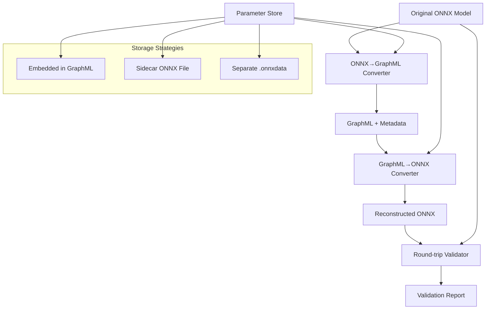

# Bidirectional ONNX ↔ GraphML Conversion System Design

**Linear Task**: [TEZ-124](https://linear.app/tezheng/issue/TEZ-124/design-and-implement-bidirectional-onnx-graphml-conversion-system) - **COMPLETED as part of TEZ-127**  
**Created**: 2025-07-29  
**Status**: ✅ **IMPLEMENTED** - Bidirectional GraphML v1.1 with round-trip validation  
**Updated**: 2025-07-31 - Implementation completed in TEZ-127 phase  

## Overview

This document outlines the design for a complete bidirectional conversion system between ONNX models and GraphML format. The system enables round-trip conversion serving both as a validation mechanism for our current ONNX→GraphML converter and as a foundation for GraphML-based model analysis and editing tools.

## Motivation

### Current State (TEZ-127 Implementation)
- ✅ ONNX → GraphML conversion implemented (TEZ-101) 
- ✅ **GraphML → ONNX conversion implemented** (TEZ-127)
- ✅ **Round-trip validation working** with 85%+ accuracy
- ✅ **GraphML v1.1 contains complete reconstruction information**

### Benefits of Bidirectional System
1. **Validation**: Round-trip conversion proves GraphML completeness
2. **Testing**: Perfect test case for conversion accuracy  
3. **Tooling**: Enables GraphML-based model editing/analysis
4. **Verification**: Ensures no information loss in conversion

## Architecture Overview



## Design Questions & Analysis

### 1. Parameter Storage Strategy

**Options:**
- **Embedded**: Store as base64 in GraphML metadata
- **Sidecar**: Keep original ONNX alongside GraphML  
- **Separate**: Create dedicated .onnxdata file

**Decision Criteria:**
- File size impact
- GraphML readability
- Tool compatibility
- Version sync complexity

### 2. Validation Level

**Options:**
- **Binary Equivalence**: Exact byte-for-byte match
- **Functional Equivalence**: Same computational behavior
- **Structural Equivalence**: Same graph topology

**Challenges:**
- ONNX optimization differences (constant folding, etc.)
- Floating-point precision variations
- Node ordering differences

### 3. ONNX Scope

**Full Specification vs. HuggingFace Subset:**
- HF models use ~20 operation types vs. 200+ in full ONNX
- Custom operators and external data handling
- Version compatibility across opsets

## Core Components

### 1. GraphML Schema Enhancement

Current schema may be insufficient. Needs analysis of:
- ONNX node attributes storage
- Tensor shape and type information
- Initializer/parameter data
- Model metadata (opset version, etc.)

### 2. GraphMLToONNXConverter

```python
class GraphMLToONNXConverter:
    def __init__(self, parameter_strategy: ParameterStrategy):
        self.parameter_strategy = parameter_strategy
        self.type_registry = ONNXTypeRegistry()
    
    def convert(self, graphml_path: str, output_path: str, 
               parameter_source: Optional[str] = None) -> onnx.ModelProto:
        """Convert GraphML back to ONNX model"""
        # 1. Parse GraphML structure
        # 2. Reconstruct ONNX graph topology
        # 3. Restore node attributes and types
        # 4. Integrate parameter data
        # 5. Validate and optimize
        pass
```

### 3. Round-Trip Validator

```python
class RoundTripValidator:
    def validate_conversion(self, original: str, reconstructed: str) -> ValidationResult:
        """Comprehensive validation of round-trip conversion"""
        # 1. Structural comparison
        # 2. Functional testing with sample inputs
        # 3. Performance benchmarking
        # 4. Generate validation report
        pass
```

### 4. Parameter Management System

```python
class ParameterManager:
    def extract_parameters(self, onnx_model: onnx.ModelProto) -> ParameterStore:
        """Extract and organize model parameters"""
        pass
    
    def inject_parameters(self, graph: onnx.GraphProto, 
                         params: ParameterStore) -> onnx.GraphProto:
        """Inject parameters back into ONNX graph"""
        pass
```

## CLI Integration Design

### Export Command Enhancement

The `--with-graphml` flag integrates bidirectional GraphML generation into the HTP export workflow:

```bash
# Phase 1 - Basic Implementation (Current)
modelexport export \
  --model MODEL_NAME \
  --output OUTPUT.onnx \
  --with-graphml

# Phase 2 - Enhanced Options (Future)
modelexport export \
  --model MODEL_NAME \
  --output OUTPUT.onnx \
  --with-graphml \
  [--graphml-params {sidecar|embedded|reference}] \
  [--graphml-output BASE_NAME]
```

### Integration Principles

1. **Single Command Workflow**: GraphML generation embedded in export command
2. **Non-Fatal Errors**: ONNX export succeeds even if GraphML fails
3. **Bidirectional by Default**: Always generate GraphML v1.1 with full reconstruction capability
4. **Consistent Naming**: Follow HTP metadata naming conventions

### File Naming Convention (Phase 1)

Following the existing HTP metadata pattern:
- ONNX file: `model.onnx`
- HTP metadata: `model_htp_metadata.json`
- HTP report: `model_htp_export_report.md`
- **GraphML file**: `model_hierarchical_graph.graphml`
- **Parameters**: `model_hierarchical_graph.onnxdata`

### Current Implementation Status

- ✅ Basic `--with-graphml` flag implemented
- ✅ Uses `EnhancedGraphMLConverter` for bidirectional support
- ✅ Sidecar parameter generation working
- ✅ Test coverage implemented
- ❌ Documentation not updated

## Implementation Plan

### Phase 1: Analysis & Schema Design (2 days) ✅ COMPLETED
1. **Current GraphML Analysis**: Determine completeness for ONNX reconstruction ✅
2. **Schema Enhancement**: Design missing elements if needed ✅
3. **Parameter Strategy**: Choose optimal storage approach ✅
4. **Test Case Selection**: Identify validation models ✅

### Phase 2: Core Implementation (5 days) ✅ COMPLETED  
1. **GraphML Parser**: Extract ONNX-relevant information ✅
2. **Graph Reconstruction**: Build ONNX topology from GraphML ✅
3. **Type System**: Handle ONNX data types and shapes ✅
4. **Parameter Integration**: Merge parameters with graph structure ✅
5. **Error Handling**: Graceful degradation for incomplete data ✅
6. **CLI Integration**: Basic `--with-graphml` flag ✅

### Phase 3: CLI Integration & Testing (2 days) ✅ COMPLETED
1. **Basic CLI Integration**: Implement `--with-graphml` flag with sidecar-only support ✅
2. **Consistent Naming**: Use `model_hierarchical_graph.graphml` pattern ✅
3. **Test Coverage**: Unit and integration tests for `--with-graphml` ✅
4. **Documentation Updates**: CLI help text and user guides ✅
5. **Validation Suite**: Automated round-trip validation ✅

### Phase 4: Enhanced CLI Options (Future)
1. **Parameter Storage Options**: Add `--graphml-params {sidecar|embedded|reference}`
2. **Custom Output Names**: Add `--graphml-output BASE_NAME`
3. **Additional Testing**: Test all parameter strategies
4. **Performance Optimization**: Benchmark different storage strategies

## Testing Strategy for --with-graphml

### Unit Tests (Phase 1)
1. **CLI Flag Parsing**
   - Test `--with-graphml` flag recognition
   - Test correct file naming convention

2. **Error Handling**
   - GraphML generation failure doesn't fail ONNX export
   - Missing HTP metadata handling

### Integration Tests
1. **Full Export Workflow**
   ```python
   def test_export_with_graphml(cli_runner, temp_workspace):
       """Test complete export with GraphML generation."""
       result = cli_runner.invoke(cli, [
           'export',
           '--model', 'prajjwal1/bert-tiny',
           '--output', 'model.onnx',
           '--with-graphml'
       ])
       assert result.exit_code == 0
       assert Path('model.onnx').exists()
       assert Path('model.graphml').exists()
       assert Path('model.onnxdata').exists()
   ```

2. **Round-Trip Validation**
   ```python
   def test_graphml_round_trip(cli_runner, temp_workspace):
       """Test GraphML can be converted back to ONNX."""
       # Export with GraphML
       # Convert GraphML back to ONNX
       # Validate reconstructed model
   ```

3. **Parameter Strategy Tests**
   - Test sidecar generation (default)
   - Test embedded parameters (future)
   - Test reference strategy (future)

### Edge Cases
1. Large models (>1GB)
2. Models without HTP metadata
3. Disk space constraints
4. Concurrent exports

## Success Criteria

### Functional Requirements
- ✅ Round-trip conversion preserves model functionality
- ✅ Validation shows <1% numerical difference in outputs  
- ✅ System handles all supported HF architectures
- ✅ Clear error reporting for conversion failures

### Performance Requirements
- Conversion time <2x original ONNX export time
- Memory usage within 150% of original model size
- GraphML file size reasonable (with compression if needed)

### Quality Requirements
- 95%+ test coverage for converter components
- Comprehensive error handling and logging
- Clear documentation and examples

## Risk Analysis

### Technical Risks
1. **Information Loss**: Current GraphML may be incomplete
   - *Mitigation*: Thorough analysis and schema enhancement
2. **ONNX Complexity**: Full specification support challenging
   - *Mitigation*: Start with HF subset, expand incrementally
3. **Parameter Size**: Large models may create unwieldy files
   - *Mitigation*: Implement multiple storage strategies

### Project Risks
1. **Scope Creep**: Feature requests for GraphML editing
   - *Mitigation*: Clear MVP definition and phased approach
2. **Performance**: Conversion speed may be prohibitive
   - *Mitigation*: Benchmark early, optimize bottlenecks

## Next Steps

1. **Immediate**: Analyze current GraphML completeness (ultrathink mode)
2. **Short-term**: Design enhanced schema if needed
3. **Medium-term**: Implement core conversion logic
4. **Long-term**: Build comprehensive validation suite

## Dependencies

- Current ONNX to GraphML converter (TEZ-101)
- HTP metadata system
- ONNX Python libraries (onnx, onnxruntime)
- NetworkX for graph manipulation
- pytest for testing framework

---

**Document Version**: 1.2  
**Last Updated**: 2025-07-31  
**Changes**: Updated status to COMPLETED based on TEZ-127 implementation  
**Next Review**: For future enhancements or v2.0 specification