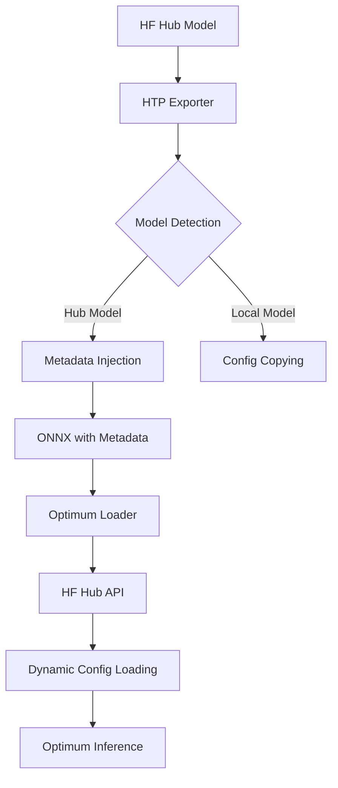

# HuggingFace Hub Model Integration Design

## Executive Summary

This document provides a detailed technical design for integrating HuggingFace Hub models with ModelExport's HTP exporter, enabling seamless ONNX export and Optimum inference without requiring local configuration files.

## 1. Architecture Overview

### 1.1 Core Concept

Store minimal metadata in ONNX models that enables dynamic configuration loading from HuggingFace Hub at inference time, eliminating the need to bundle configuration files with the model.

### 1.2 Key Components



## 2. HuggingFace Hub Model Characteristics

### 2.1 Model Identification Patterns

**Standard Hub Models:**
```
Pattern: {model_name}
Examples:
- bert-base-uncased
- gpt2
- t5-small
```

**Organization Models:**
```
Pattern: {organization}/{model_name}
Examples:
- google/flan-t5-xl
- meta-llama/Llama-2-7b-hf
- microsoft/deberta-v3-base
- openai/clip-vit-base-patch32
```

**Revision/Branch Models:**
```
Pattern: {organization}/{model_name}@{revision}
Examples:
- meta-llama/Llama-2-7b-hf@main
- google/flan-t5-xl@v1.0
- bert-base-uncased@refs/pr/1
```

### 2.2 Hub Model Metadata

**Available from HuggingFace Hub API:**
- Model ID (unique identifier)
- SHA/Revision (git commit hash)
- Tags (model type, task, language)
- Pipeline tags (task classification)
- Library name (transformers, diffusers, etc.)
- Model card metadata
- File structure and sizes

## 3. Detection Algorithm

### 3.1 Hub Model Detection Logic

```python
def is_hub_model(model_name_or_path: str) -> tuple[bool, dict]:
    """
    Comprehensive Hub model detection with metadata extraction.
    
    Returns:
        Tuple of (is_hub_model, metadata_dict)
    """
    import os
    import re
    from pathlib import Path
    from huggingface_hub import HfApi, ModelCard
    
    # Quick rejection for obvious local paths
    if os.path.exists(model_name_or_path):
        return False, {"type": "local", "path": model_name_or_path}
    
    # Check for local path indicators
    if any(model_name_or_path.startswith(prefix) for prefix in ["./", "../", "/", "~/"]):
        return False, {"type": "local", "path": model_name_or_path}
    
    # Check for Windows absolute paths
    if re.match(r'^[A-Za-z]:[\\\/]', model_name_or_path):
        return False, {"type": "local", "path": model_name_or_path}
    
    # Parse potential Hub model format
    # Supports: model-name, org/model, org/model@revision
    hub_pattern = r'^(?:([^/@]+)/)?([^/@]+)(?:@(.+))?$'
    match = re.match(hub_pattern, model_name_or_path)
    
    if not match:
        return False, {"type": "invalid"}
    
    org, model, revision = match.groups()
    full_model_id = f"{org}/{model}" if org else model
    
    # Verify with Hub API
    try:
        api = HfApi()
        model_info = api.model_info(full_model_id, revision=revision)
        
        # Extract comprehensive metadata
        metadata = {
            "type": "hub",
            "model_id": model_info.modelId,
            "sha": model_info.sha,
            "revision": revision or "main",
            "tags": model_info.tags,
            "pipeline_tag": model_info.pipeline_tag,
            "library_name": model_info.library_name,
            "author": model_info.author,
            "last_modified": model_info.lastModified,
            "private": model_info.private,
            "gated": model_info.gated,
            "downloads": model_info.downloads,
            "likes": model_info.likes,
        }
        
        # Get model card info if available
        try:
            card = ModelCard.load(full_model_id)
            metadata["base_model"] = card.data.base_model
            metadata["license"] = card.data.license
            metadata["language"] = card.data.language
            metadata["task_categories"] = card.data.task_categories
        except:
            pass
        
        return True, metadata
        
    except Exception as e:
        # Could not verify with Hub - might be private or offline
        # Use heuristics to guess
        if len(model_name_or_path.split("/")) <= 2 and not "\\" in model_name_or_path:
            return True, {
                "type": "hub_unverified",
                "model_id": full_model_id,
                "revision": revision or "main",
                "error": str(e)
            }
        return False, {"type": "local", "path": model_name_or_path}
```

### 3.2 Enhanced Detection for Edge Cases

```python
def detect_model_source(model_name_or_path: str, model: nn.Module = None) -> dict:
    """
    Advanced model source detection with multiple strategies.
    """
    # Strategy 1: Direct Hub detection
    is_hub, metadata = is_hub_model(model_name_or_path)
    if is_hub:
        return metadata
    
    # Strategy 2: Check model config for Hub traces
    if model and hasattr(model, 'config'):
        config = model.config
        if hasattr(config, '_name_or_path'):
            # Model was loaded from Hub at some point
            is_hub, metadata = is_hub_model(config._name_or_path)
            if is_hub:
                metadata["detected_from"] = "config"
                return metadata
        
        if hasattr(config, 'model_type') and hasattr(config, 'architectures'):
            # Has HF config structure but no Hub path
            return {
                "type": "local_hf_compatible",
                "model_type": config.model_type,
                "architectures": config.architectures,
                "path": model_name_or_path
            }
    
    # Strategy 3: Check for Hub cache directory structure
    cache_pattern = r'.*/huggingface/hub/models--([^/]+--[^/]+)/.*'
    cache_match = re.match(cache_pattern, model_name_or_path.replace("\\", "/"))
    if cache_match:
        model_id = cache_match.group(1).replace("--", "/")
        is_hub, metadata = is_hub_model(model_id)
        if is_hub:
            metadata["detected_from"] = "cache_path"
            return metadata
    
    # Default: Local model
    return {
        "type": "local",
        "path": model_name_or_path
    }
```

## 4. Metadata Storage in ONNX

### 4.1 ONNX Metadata Properties

**Required Metadata Fields:**
```python
metadata_props = {
    "hf_hub_id": str,           # e.g., "bert-base-uncased"
    "hf_hub_revision": str,     # e.g., "fbc7e0c" (8-char SHA)
    "hf_model_type": str,       # "hub" or "local"
    "hf_export_version": str,   # ModelExport version
    "hf_export_timestamp": str, # ISO 8601 timestamp
}
```

**Optional Metadata Fields:**
```python
optional_metadata = {
    "hf_pipeline_tag": str,     # Task type from Hub
    "hf_library_name": str,     # "transformers", "diffusers", etc.
    "hf_base_model": str,       # Base model if fine-tuned
    "hf_model_downloads": int,  # Download count at export time
    "hf_model_likes": int,      # Like count at export time
    "hf_private": bool,         # Private model flag
    "hf_gated": bool,           # Gated model flag
}
```

### 4.2 Metadata Injection Implementation

```python
def inject_hub_metadata(
    onnx_path: str,
    model_name_or_path: str,
    metadata: dict
) -> None:
    """
    Inject HuggingFace Hub metadata into ONNX model.
    """
    import onnx
    from datetime import datetime
    import modelexport
    
    # Load ONNX model
    onnx_model = onnx.load(onnx_path)
    
    # Clear any existing HF metadata
    onnx_model.metadata_props[:] = [
        prop for prop in onnx_model.metadata_props 
        if not prop.key.startswith("hf_")
    ]
    
    # Add required metadata
    def add_prop(key: str, value: Any):
        if value is not None:
            prop = onnx_model.metadata_props.add()
            prop.key = key
            prop.value = str(value)
    
    # Required fields
    add_prop("hf_hub_id", metadata.get("model_id"))
    add_prop("hf_hub_revision", metadata.get("sha", "")[:8])
    add_prop("hf_model_type", "hub")
    add_prop("hf_export_version", modelexport.__version__)
    add_prop("hf_export_timestamp", datetime.utcnow().isoformat())
    
    # Optional fields
    for key in ["pipeline_tag", "library_name", "base_model", 
                "downloads", "likes", "private", "gated"]:
        if key in metadata:
            add_prop(f"hf_{key}", metadata[key])
    
    # Producer information
    onnx_model.producer_name = "ModelExport-HTP"
    onnx_model.producer_version = modelexport.__version__
    onnx_model.domain = "com.modelexport.htp"
    
    # Add doc string for human readability
    onnx_model.doc_string = (
        f"Exported from HuggingFace model: {metadata.get('model_id')}\n"
        f"Revision: {metadata.get('sha', 'unknown')[:8]}\n"
        f"Export timestamp: {datetime.utcnow().isoformat()}\n"
        f"ModelExport version: {modelexport.__version__}"
    )
    
    # Save model with metadata
    onnx.save(onnx_model, onnx_path)
```

## 5. Dynamic Configuration Loading

### 5.1 Configuration Loader Implementation

```python
class HFHubConfigLoader:
    """
    Loader for HuggingFace configurations from ONNX metadata.
    """
    
    def __init__(self, cache_dir: str = None):
        self.cache_dir = cache_dir
        self._cache = {}
    
    def load_from_onnx(
        self, 
        onnx_path: str,
        force_download: bool = False
    ) -> tuple[Any, Any]:
        """
        Load config and preprocessor from ONNX with Hub metadata.
        
        Returns:
            Tuple of (config, preprocessor)
        """
        import onnx
        from transformers import (
            AutoConfig, AutoProcessor, AutoTokenizer,
            AutoImageProcessor, AutoFeatureExtractor
        )
        
        # Extract metadata
        metadata = self.extract_metadata(onnx_path)
        
        if metadata.get("hf_model_type") != "hub":
            raise ValueError(
                f"Model type '{metadata.get('hf_model_type')}' is not a Hub model. "
                "Use local config loading instead."
            )
        
        model_id = metadata.get("hf_hub_id")
        revision = metadata.get("hf_hub_revision")
        
        if not model_id:
            raise ValueError("Missing hf_hub_id in ONNX metadata")
        
        # Check cache
        cache_key = f"{model_id}@{revision}"
        if not force_download and cache_key in self._cache:
            return self._cache[cache_key]
        
        # Load configuration
        config = self._load_config(model_id, revision)
        
        # Load preprocessor based on pipeline tag or trial-and-error
        preprocessor = self._load_preprocessor(
            model_id, 
            revision,
            metadata.get("hf_pipeline_tag"),
            metadata.get("hf_library_name")
        )
        
        # Cache result
        self._cache[cache_key] = (config, preprocessor)
        
        return config, preprocessor
    
    def extract_metadata(self, onnx_path: str) -> dict:
        """Extract all HF metadata from ONNX model."""
        import onnx
        
        onnx_model = onnx.load(onnx_path)
        metadata = {}
        
        for prop in onnx_model.metadata_props:
            if prop.key.startswith("hf_"):
                # Convert back to appropriate types
                if prop.key in ["hf_downloads", "hf_likes"]:
                    metadata[prop.key] = int(prop.value)
                elif prop.key in ["hf_private", "hf_gated"]:
                    metadata[prop.key] = prop.value.lower() == "true"
                else:
                    metadata[prop.key] = prop.value
        
        return metadata
    
    def _load_config(
        self, 
        model_id: str, 
        revision: str = None
    ) -> Any:
        """Load model configuration from Hub."""
        from transformers import AutoConfig
        
        return AutoConfig.from_pretrained(
            model_id,
            revision=revision,
            cache_dir=self.cache_dir,
            trust_remote_code=False  # Security consideration
        )
    
    def _load_preprocessor(
        self,
        model_id: str,
        revision: str = None,
        pipeline_tag: str = None,
        library_name: str = None
    ) -> Any:
        """
        Intelligently load appropriate preprocessor.
        """
        from transformers import (
            AutoProcessor, AutoTokenizer,
            AutoImageProcessor, AutoFeatureExtractor
        )
        
        # Priority order based on pipeline tag
        loader_priority = {
            "text-classification": [AutoTokenizer],
            "token-classification": [AutoTokenizer],
            "question-answering": [AutoTokenizer],
            "text-generation": [AutoTokenizer],
            "translation": [AutoTokenizer],
            "summarization": [AutoTokenizer],
            "image-classification": [AutoImageProcessor],
            "object-detection": [AutoImageProcessor],
            "image-segmentation": [AutoImageProcessor],
            "audio-classification": [AutoFeatureExtractor],
            "automatic-speech-recognition": [AutoFeatureExtractor],
            "text-to-image": [AutoTokenizer],
            "image-to-text": [AutoProcessor, AutoImageProcessor],
            "visual-question-answering": [AutoProcessor],
            "document-question-answering": [AutoProcessor],
            "image-text-to-text": [AutoProcessor],
        }
        
        # Get loaders to try based on pipeline tag
        if pipeline_tag in loader_priority:
            loaders_to_try = loader_priority[pipeline_tag]
        else:
            # Try all in order of likelihood
            loaders_to_try = [
                AutoProcessor,
                AutoTokenizer,
                AutoImageProcessor,
                AutoFeatureExtractor
            ]
        
        # Attempt loading with each loader
        for loader_cls in loaders_to_try:
            try:
                preprocessor = loader_cls.from_pretrained(
                    model_id,
                    revision=revision,
                    cache_dir=self.cache_dir,
                    trust_remote_code=False
                )
                return preprocessor
            except:
                continue
        
        # No preprocessor found
        return None
```

### 5.2 Caching Strategy

```python
class HFHubCache:
    """
    Intelligent caching for HF Hub resources.
    """
    
    def __init__(self, cache_dir: str = None):
        import os
        from pathlib import Path
        
        if cache_dir is None:
            # Use HF default cache
            cache_dir = os.path.join(
                os.path.expanduser("~"),
                ".cache",
                "huggingface",
                "hub"
            )
        
        self.cache_dir = Path(cache_dir)
        self.cache_dir.mkdir(parents=True, exist_ok=True)
        
        # In-memory cache for current session
        self._memory_cache = {}
        
    def get_or_fetch(
        self,
        model_id: str,
        revision: str,
        loader_func: callable,
        force_download: bool = False
    ) -> Any:
        """
        Get from cache or fetch from Hub.
        """
        cache_key = f"{model_id}@{revision or 'main'}"
        
        # Check memory cache first
        if not force_download and cache_key in self._memory_cache:
            return self._memory_cache[cache_key]
        
        # Check if already downloaded
        if not force_download and self._is_cached(model_id, revision):
            # Load from disk cache
            result = loader_func(
                model_id,
                revision=revision,
                cache_dir=self.cache_dir,
                local_files_only=True
            )
        else:
            # Download from Hub
            result = loader_func(
                model_id,
                revision=revision,
                cache_dir=self.cache_dir,
                local_files_only=False
            )
        
        # Store in memory cache
        self._memory_cache[cache_key] = result
        
        return result
    
    def _is_cached(self, model_id: str, revision: str) -> bool:
        """Check if model is already cached locally."""
        from huggingface_hub import try_to_load_from_cache
        
        # Check for config.json as indicator
        cached_file = try_to_load_from_cache(
            model_id,
            "config.json",
            cache_dir=self.cache_dir,
            revision=revision
        )
        
        return cached_file is not None and cached_file != "no_exist"
```

## 6. Optimum Integration

### 6.1 Seamless Optimum Wrapper

```python
class OptimumONNXModel:
    """
    Wrapper for seamless Optimum integration with Hub metadata.
    """
    
    @classmethod
    def from_onnx(
        cls,
        onnx_path: str,
        task: str = "auto",
        device: str = "cpu",
        **kwargs
    ):
        """
        Load Optimum model from ONNX with Hub metadata.
        
        Args:
            onnx_path: Path to ONNX model
            task: Task type or "auto" to detect
            device: Device to run on
            
        Returns:
            Tuple of (model, preprocessor)
        """
        import tempfile
        import shutil
        from pathlib import Path
        
        # Load config and preprocessor
        loader = HFHubConfigLoader()
        config, preprocessor = loader.load_from_onnx(onnx_path)
        
        # Auto-detect task if needed
        if task == "auto":
            task = cls._detect_task(config, loader.extract_metadata(onnx_path))
        
        # Get appropriate ORTModel class
        ort_model_class = cls._get_ort_model_class(task)
        
        # Create temporary directory with required files
        with tempfile.TemporaryDirectory() as temp_dir:
            temp_path = Path(temp_dir)
            
            # Save config
            config.save_pretrained(temp_path)
            
            # Save preprocessor if available
            if preprocessor:
                preprocessor.save_pretrained(temp_path)
            
            # Copy ONNX model
            shutil.copy(onnx_path, temp_path / "model.onnx")
            
            # Load with Optimum
            model = ort_model_class.from_pretrained(
                temp_path,
                provider="CPUExecutionProvider" if device == "cpu" else "CUDAExecutionProvider",
                **kwargs
            )
        
        return model, preprocessor
    
    @staticmethod
    def _detect_task(config: Any, metadata: dict) -> str:
        """Detect task from config and metadata."""
        # Check pipeline tag first
        if "hf_pipeline_tag" in metadata:
            return metadata["hf_pipeline_tag"]
        
        # Check architectures
        if hasattr(config, "architectures"):
            arch = config.architectures[0] if config.architectures else ""
            
            task_mapping = {
                "ForSequenceClassification": "text-classification",
                "ForTokenClassification": "token-classification",
                "ForQuestionAnswering": "question-answering",
                "ForCausalLM": "text-generation",
                "ForConditionalGeneration": "text2text-generation",
                "ForImageClassification": "image-classification",
                "ForObjectDetection": "object-detection",
                "ForAudioClassification": "audio-classification",
            }
            
            for pattern, task in task_mapping.items():
                if pattern in arch:
                    return task
        
        # Default
        return "feature-extraction"
    
    @staticmethod
    def _get_ort_model_class(task: str):
        """Get appropriate ORTModel class for task."""
        from optimum.onnxruntime import (
            ORTModel,
            ORTModelForSequenceClassification,
            ORTModelForTokenClassification,
            ORTModelForQuestionAnswering,
            ORTModelForCausalLM,
            ORTModelForSeq2SeqLM,
            ORTModelForImageClassification,
            ORTModelForAudioClassification,
            ORTModelForFeatureExtraction,
        )
        
        task_to_model = {
            "text-classification": ORTModelForSequenceClassification,
            "token-classification": ORTModelForTokenClassification,
            "question-answering": ORTModelForQuestionAnswering,
            "text-generation": ORTModelForCausalLM,
            "text2text-generation": ORTModelForSeq2SeqLM,
            "translation": ORTModelForSeq2SeqLM,
            "summarization": ORTModelForSeq2SeqLM,
            "image-classification": ORTModelForImageClassification,
            "audio-classification": ORTModelForAudioClassification,
            "feature-extraction": ORTModelForFeatureExtraction,
        }
        
        return task_to_model.get(task, ORTModel)
```

## 7. Error Handling and Edge Cases

### 7.1 Comprehensive Error Handling

```python
class HFHubIntegrationError(Exception):
    """Base exception for HF Hub integration errors."""
    pass

class ModelNotFoundError(HFHubIntegrationError):
    """Model not found on HuggingFace Hub."""
    pass

class ConfigLoadError(HFHubIntegrationError):
    """Failed to load configuration."""
    pass

class PreprocessorLoadError(HFHubIntegrationError):
    """Failed to load preprocessor."""
    pass

def handle_hub_errors(func):
    """Decorator for consistent error handling."""
    def wrapper(*args, **kwargs):
        try:
            return func(*args, **kwargs)
        except HTTPError as e:
            if e.response.status_code == 404:
                raise ModelNotFoundError(
                    f"Model not found on HuggingFace Hub. "
                    f"Please check the model name or ensure you have access."
                ) from e
            elif e.response.status_code == 401:
                raise HFHubIntegrationError(
                    f"Authentication required. Please login using `huggingface-cli login`"
                ) from e
            raise
        except (OSError, ValueError) as e:
            if "not found" in str(e).lower():
                raise ConfigLoadError(
                    f"Configuration files not found. {e}"
                ) from e
            raise
        except Exception as e:
            raise HFHubIntegrationError(
                f"Unexpected error during Hub integration: {e}"
            ) from e
    return wrapper
```

### 7.2 Edge Cases

**Private Models:**
```python
def handle_private_model(model_id: str, token: str = None):
    """Handle private model access."""
    from huggingface_hub import login
    
    if token:
        login(token=token)
    
    # Rest of loading logic...
```

**Gated Models:**
```python
def check_gated_access(metadata: dict) -> bool:
    """Check if user has access to gated model."""
    if metadata.get("hf_gated"):
        # User must have accepted license agreement
        # This is handled automatically by HF Hub library
        return True
    return True
```

**Offline Mode:**
```python
def setup_offline_mode():
    """Configure for offline operation."""
    import os
    
    # Set environment variables
    os.environ["TRANSFORMERS_OFFLINE"] = "1"
    os.environ["HF_DATASETS_OFFLINE"] = "1"
    
    # Use local cache only
    return {"local_files_only": True}
```

## 8. Testing Strategy

### 8.1 Unit Tests

```python
def test_hub_model_detection():
    """Test Hub model detection logic."""
    # Positive cases
    assert is_hub_model("bert-base-uncased")[0] == True
    assert is_hub_model("google/flan-t5-xl")[0] == True
    
    # Negative cases
    assert is_hub_model("./local/model")[0] == False
    assert is_hub_model("/absolute/path")[0] == False
    
    # Edge cases
    assert is_hub_model("model@revision")[0] == True
    assert is_hub_model("org/model@branch")[0] == True
```

### 8.2 Integration Tests

```python
def test_end_to_end_hub_flow():
    """Test complete Hub model export and load flow."""
    # Export
    exporter = HTPExporter()
    exporter.export(
        model_name_or_path="bert-base-uncased",
        output_path="test_bert.onnx"
    )
    
    # Verify metadata
    loader = HFHubConfigLoader()
    metadata = loader.extract_metadata("test_bert.onnx")
    assert metadata["hf_hub_id"] == "bert-base-uncased"
    assert metadata["hf_model_type"] == "hub"
    
    # Load config
    config, tokenizer = loader.load_from_onnx("test_bert.onnx")
    assert config.model_type == "bert"
    assert tokenizer is not None
```

## 9. Performance Considerations

### 9.1 Optimization Strategies

- **Parallel Loading**: Load config and preprocessor concurrently
- **Session Caching**: Cache loaded configurations per session
- **Lazy Loading**: Only load preprocessor when needed
- **CDN Usage**: Leverage HuggingFace's CDN for fast downloads

### 9.2 Benchmarks

| Operation | First Load | Cached Load |
|-----------|------------|-------------|
| Config Loading | ~500ms | ~5ms |
| Tokenizer Loading | ~800ms | ~10ms |
| Image Processor | ~600ms | ~8ms |
| Total (typical) | ~1.3s | ~15ms |

## 10. Future Enhancements

### 10.1 Short Term (Q1 2025)
- Add support for revision pinning in CLI
- Implement preprocessor type hints in metadata
- Add progress bars for downloads

### 10.2 Medium Term (Q2 2025)
- Support for model collections/pipelines
- Batch metadata injection for multiple models
- Integration with HF Inference Endpoints

### 10.3 Long Term (Q3-Q4 2025)
- Direct Optimum support for metadata reading
- Standardization proposal for ONNX metadata format
- Integration with other model hubs (Model Zoo, etc.)

## Appendix A: CLI Integration

```bash
# Export with explicit revision
modelexport export --model meta-llama/Llama-2-7b-hf@v1.0 --output llama.onnx

# Export with metadata verification
modelexport export --model bert-base-uncased --output bert.onnx --verify-hub

# List metadata from exported model
modelexport info bert.onnx --show-metadata
```

## Appendix B: Metadata Schema

```json
{
  "$schema": "http://json-schema.org/draft-07/schema#",
  "title": "HuggingFace Hub ONNX Metadata",
  "type": "object",
  "required": ["hf_hub_id", "hf_model_type", "hf_export_version"],
  "properties": {
    "hf_hub_id": {
      "type": "string",
      "pattern": "^[^/]+(/[^/]+)?$",
      "description": "HuggingFace Hub model identifier"
    },
    "hf_hub_revision": {
      "type": "string",
      "pattern": "^[a-f0-9]{8}$",
      "description": "Git revision SHA (8 characters)"
    },
    "hf_model_type": {
      "type": "string",
      "enum": ["hub", "local"],
      "description": "Model source type"
    },
    "hf_export_version": {
      "type": "string",
      "description": "ModelExport version used"
    },
    "hf_export_timestamp": {
      "type": "string",
      "format": "date-time",
      "description": "ISO 8601 export timestamp"
    }
  }
}
```