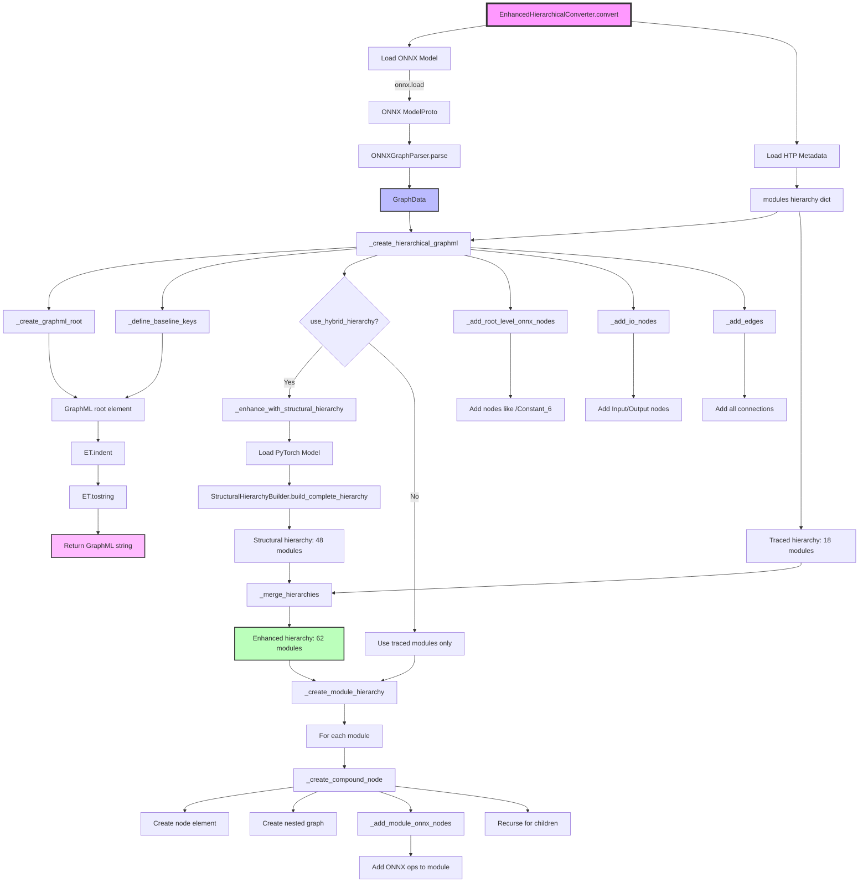

# ONNX to GraphML Conversion Workflow

## Overview

This document details the complete function call sequence for converting ONNX models to hierarchical GraphML format using the EnhancedHierarchicalConverter with hybrid hierarchy support.

## High-Level Architecture

The conversion process combines:
1. **ONNX Parsing**: Extract nodes, edges, and metadata from ONNX model
2. **HTP Metadata**: Hierarchy information from execution tracing
3. **Structural Discovery**: Complete module hierarchy from PyTorch model
4. **GraphML Generation**: Hierarchical graph with compound nodes

## Mermaid Flowchart



## Detailed Function Call Sequence

```
EnhancedHierarchicalConverter.convert(onnx_model_path: str) → str
│
├── Input: Path to ONNX model file (e.g., "model.onnx")
├── Output: GraphML XML string
│
├── [1] Load ONNX Model
│   └── onnx.load(str(model_path)) → onnx.ModelProto
│       ├── Input: File path string
│       └── Output: ONNX protocol buffer model object
│
├── [2] Parse ONNX Structure
│   └── ONNXGraphParser.parse(onnx_model) → GraphData
│       ├── Input: ONNX ModelProto
│       ├── _extract_metadata(onnx_model) → dict
│       │   └── Extracts: model version, producer info, imports
│       ├── _extract_node(node, idx) → NodeData
│       │   ├── For each node in graph.node:
│       │   ├── Creates NodeData with:
│       │   │   ├── id: Sanitized node name (e.g., "/Add_5")
│       │   │   ├── name: Original node name
│       │   │   ├── op_type: Operation type (e.g., "Add")
│       │   │   ├── hierarchy_tag: From node attributes
│       │   │   └── attributes: Node-specific properties
│       │   └── Filters out excluded attributes
│       ├── _extract_input(input_proto) → NodeData
│       │   ├── For each non-initializer input:
│       │   └── Creates Input node with shape info
│       ├── _extract_output(output_proto) → NodeData
│       │   ├── For each model output:
│       │   └── Creates Output node with shape info
│       ├── _extract_edges(graph, node_map, initializer_names) → List[EdgeData]
│       │   ├── For each node's inputs/outputs:
│       │   ├── Creates EdgeData(source, target, tensor_name)
│       │   └── Excludes edges from initializers if configured
│       └── Output: GraphData containing:
│           ├── nodes: List[NodeData] - All ONNX operations
│           ├── edges: List[EdgeData] - Tensor connections
│           ├── inputs: List[NodeData] - Model inputs
│           ├── outputs: List[NodeData] - Model outputs
│           └── metadata: Dict - Model information
│
├── [3] Create Hierarchical GraphML
│   └── _create_hierarchical_graphml(graph_data, onnx_model) → ET.Element
│       │
│       ├── [3.1] Create Root Structure
│       │   ├── _create_graphml_root() → ET.Element
│       │   │   └── Creates: <graphml xmlns="http://graphml.graphdrawing.org/xmlns">
│       │   └── _define_baseline_keys(graphml) → None
│       │       ├── Node keys: n0 (op_type), n1 (hierarchy_tag), n2 (attributes), n3 (name)
│       │       ├── Graph keys: d0-d3 (class_name, module_type, execution_order, traced_tag)
│       │       ├── Edge keys: e0 (tensor_name)
│       │       └── Metadata keys: d4-d7 (source files, version, timestamp)
│       │
│       ├── [3.2] Create Main Graph
│       │   └── Creates: <graph id="BertModel" edgedefault="directed">
│       │       └── With attributes: class_name, module_type, execution_order, traced_tag
│       │
│       ├── [3.3] Enhance with Structural Discovery [if use_hybrid_hierarchy=True]
│       │   └── _enhance_with_structural_hierarchy(traced_modules_data) → dict
│       │       ├── Input: Traced modules from HTP metadata (e.g., 18 modules)
│       │       ├── AutoModel.from_pretrained(model_name) → nn.Module
│       │       │   └── Loads original PyTorch model
│       │       ├── StructuralHierarchyBuilder.build_complete_hierarchy(model) → dict
│       │       │   ├── Iterates model.named_modules()
│       │       │   ├── _should_include_module(name, module) → bool
│       │       │   │   └── Includes: Linear, LayerNorm, Embedding, Dropout, etc.
│       │       │   ├── _build_hierarchy_tree(modules) → dict
│       │       │   │   └── Creates nested dict structure
│       │       │   └── Output: Complete hierarchy (e.g., 48 modules)
│       │       ├── _merge_hierarchies(traced, structural) → dict
│       │       │   ├── Traced modules keep priority (execution order preserved)
│       │       │   ├── Structural modules fill gaps
│       │       │   └── Recursive merge for nested children
│       │       └── Output: Enhanced hierarchy (e.g., 62 modules total)
│       │
│       ├── [3.4] Create Module Hierarchy
│       │   └── _create_module_hierarchy(main_graph, modules_data, graph_data) → None
│       │       └── For each child in modules_data["children"]:
│       │           └── _create_compound_node(parent_elem, child_data, graph_data) → None
│       │               ├── Input: Parent element, module data, graph data
│       │               ├── Create compound node: <node id="/embeddings">
│       │               ├── Add node attributes:
│       │               │   ├── n0: class_name (e.g., "BertEmbeddings")
│       │               │   ├── n1: hierarchy_tag (e.g., "/BertModel/Embeddings")
│       │               │   ├── n2: JSON attributes (module_type, execution_order)
│       │               │   └── n3: node name (scope)
│       │               ├── Create nested graph: <graph id="/embeddings::">
│       │               ├── Add graph attributes (d0-d3)
│       │               ├── _add_module_onnx_nodes(nested_graph, module_tag, graph_data)
│       │               │   ├── Find nodes where hierarchy_tag.startswith(module_tag)
│       │               │   ├── Filter direct children only (no "/" in relative path)
│       │               │   └── For each matching node:
│       │               │       └── _add_onnx_node(graph, node)
│       │               │           └── Creates: <node id="/Add_5"> with empty op_type
│       │               └── Recursively process child modules
│       │
│       ├── [3.5] Add Root-Level ONNX Nodes
│       │   └── _add_root_level_onnx_nodes(main_graph, "/BertModel", graph_data) → None
│       │       ├── Find nodes where hierarchy_tag == root_tag
│       │       └── Add nodes like "/Constant_6" that belong to root model
│       │
│       ├── [3.6] Add Input/Output Nodes
│       │   └── _add_io_nodes(main_graph, graph_data) → None
│       │       ├── For each input: Create <node id="input_ids"> with op_type="Input"
│       │       └── For each output: Create <node id="1855"> with op_type="Output"
│       │
│       ├── [3.7] Add All Edges
│       │   └── _add_edges(main_graph, graph_data) → None
│       │       └── For each edge: Create <edge source="X" target="Y">
│       │           └── With tensor_name in e0 attribute
│       │
│       └── Output: Complete GraphML ET.Element tree
│
├── [4] Format and Convert to String
│   ├── ET.indent(graphml, space="  ") → None
│   │   └── Adds proper indentation to XML
│   └── ET.tostring(graphml, encoding='unicode', xml_declaration=True) → str
│       └── Converts Element tree to XML string
│
└── Return: Complete GraphML XML string
```

## Key Data Structures

### Input: HTP Metadata JSON
```json
{
  "model": {
    "name_or_path": "prajjwal1/bert-tiny",
    "class_name": "BertModel"
  },
  "modules": {
    "scope": "/",
    "class_name": "BertModel",
    "traced_tag": "/BertModel",
    "children": {
      "embeddings": {
        "scope": "/embeddings",
        "class_name": "BertEmbeddings",
        "traced_tag": "/BertModel/Embeddings",
        "execution_order": 1,
        "children": {...}
      }
    }
  },
  "node_mappings": {
    "/Add_5": "/BertModel/Embeddings",
    "/Constant_6": "/BertModel"
  }
}
```

### Intermediate: GraphData
```python
@dataclass
class GraphData:
    nodes: List[NodeData] = field(default_factory=list)
    edges: List[EdgeData] = field(default_factory=list)
    inputs: List[NodeData] = field(default_factory=list)
    outputs: List[NodeData] = field(default_factory=list)
    metadata: Dict[str, Any] = field(default_factory=dict)

@dataclass
class NodeData:
    id: str              # Sanitized ID (e.g., "/Add_5")
    name: str            # Original name
    op_type: str         # ONNX operation type
    node_type: NodeType  # OPERATION, INPUT, OUTPUT
    hierarchy_tag: str   # HTP hierarchy tag
    attributes: Dict     # Additional attributes

@dataclass
class EdgeData:
    source_id: str       # Source node ID
    target_id: str       # Target node ID
    tensor_name: str     # Connecting tensor name
```

### Output: GraphML Structure
```xml
<?xml version='1.0' encoding='utf-8'?>
<graphml xmlns="http://graphml.graphdrawing.org/xmlns">
  <!-- Key definitions -->
  <key id="n0" for="node" attr.name="op_type" attr.type="string"/>
  <key id="n1" for="node" attr.name="hierarchy_tag" attr.type="string"/>
  <key id="n2" for="node" attr.name="node_attributes" attr.type="string"/>
  <key id="n3" for="node" attr.name="name" attr.type="string"/>
  
  <graph id="BertModel" edgedefault="directed">
    <!-- Compound node example -->
    <node id="/embeddings">
      <data key="n0">BertEmbeddings</data>
      <data key="n1">/BertModel/Embeddings</data>
      <data key="n2">{"module_type": "huggingface", "execution_order": 1}</data>
      <data key="n3">/embeddings</data>
      <graph id="/embeddings::" edgedefault="directed">
        <!-- ONNX operations inside this module -->
        <node id="/Add_5">
          <data key="n0"></data>
          <data key="n1">/BertModel/Embeddings</data>
          <data key="n2">{}</data>
          <data key="n3">/Add_5</data>
        </node>
        <!-- Child compound nodes -->
        <node id="word_embeddings">
          <graph id="word_embeddings::">...</graph>
        </node>
      </graph>
    </node>
    
    <!-- Root-level ONNX node -->
    <node id="/Constant_6">
      <data key="n0"></data>
      <data key="n1">/BertModel</data>
      <data key="n2">{}</data>
      <data key="n3">/Constant_6</data>
    </node>
    
    <!-- Edges -->
    <edge source="/Constant_6" target="/Where_1">
      <data key="e0">/Constant_6_output_0</data>
    </edge>
  </graph>
</graphml>
```

## Performance Characteristics

- **Model Loading**: One-time load for structural discovery (~1-2s)
- **ONNX Parsing**: Linear with model size, typically <100ms
- **Hierarchy Merging**: O(n) where n is number of modules
- **GraphML Generation**: Linear with total nodes + edges
- **Total Time**: ~2-5s for typical transformer models

## Error Handling

1. **File Not Found**: Raises FileNotFoundError if ONNX file missing
2. **Model Load Failure**: Falls back to traced hierarchy only
3. **Invalid ONNX**: Propagates onnx.load exceptions
4. **Metadata Issues**: Uses defaults if HTP metadata incomplete

## Configuration Options

- `exclude_initializers`: Skip weight tensors (default: True)
- `exclude_attributes`: Set of node attributes to exclude
- `use_hybrid_hierarchy`: Enable structural discovery (default: True)

## Usage Example

```python
converter = EnhancedHierarchicalConverter(
    htp_metadata_path="model_htp_metadata.json",
    exclude_initializers=True,
    use_hybrid_hierarchy=True
)
graphml_str = converter.convert("model.onnx")
```

This produces a hierarchical GraphML with compound nodes representing the complete PyTorch module structure, suitable for visualization in tools like yEd.