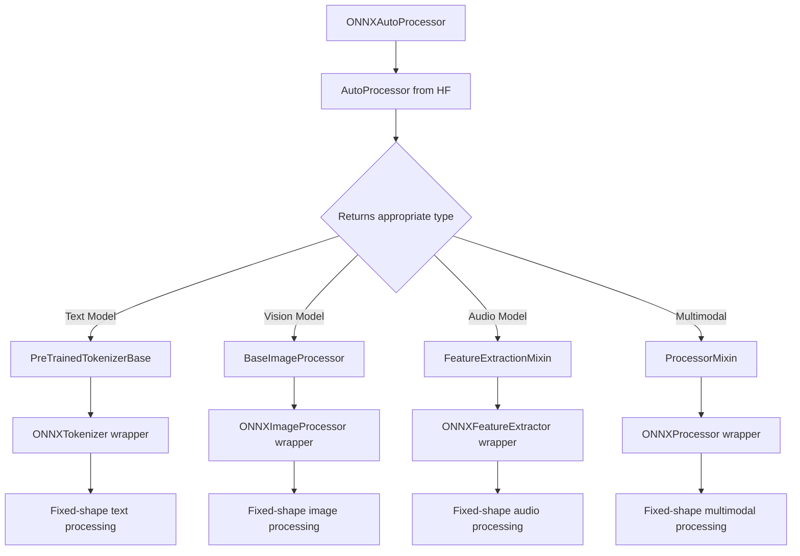

# ONNX Auto Processor Design

**Status**: Production Design  
**Project**: ModelExport - Inference Module  

## Overview

This document details the design of the ONNXAutoProcessor system that automatically configures data processors for ONNX models with optimal fixed-shape processing. The system provides zero-configuration auto-detection while maintaining 40x+ performance improvements.

## Core Processor Categories

### HuggingFace Processor Mapping

| Category | Auto Class | Purpose | Examples |
|----------|------------|---------|----------|
| **Text** | `AutoTokenizer` | Text tokenization | BERT, GPT, T5, RoBERTa |
| **Vision** | `AutoImageProcessor` | Image preprocessing | ViT, ResNet, EfficientNet |
| **Audio** | `AutoFeatureExtractor` | Audio processing | Wav2Vec2, Whisper |
| **Video** | `AutoVideoProcessor` | Video frame processing | VideoMAE, Vivit |
| **Multimodal** | `AutoProcessor` | Combined modalities | CLIP, LayoutLM, BLIP |

### Key Discovery: AutoProcessor Intelligence

`AutoProcessor` is a universal factory that automatically returns the appropriate processor type:

```python
from transformers import AutoProcessor

# Text model → returns tokenizer directly
processor = AutoProcessor.from_pretrained("bert-base-uncased")
# Returns: BertTokenizerFast (PreTrainedTokenizerBase)

# Vision model → returns image processor
processor = AutoProcessor.from_pretrained("google/vit-base-patch16-224")  
# Returns: ViTImageProcessor (BaseImageProcessor)

# Multimodal model → returns combined processor
processor = AutoProcessor.from_pretrained("openai/clip-vit-base-patch32")
# Returns: CLIPProcessor (ProcessorMixin)
```

## ONNXAutoProcessor Architecture

### Core Interface

```python
class ONNXAutoProcessor:
    """Universal ONNX processor with automatic detection and configuration."""
    
    @classmethod
    def from_model(
        cls,
        onnx_model_path: str | Path,
        base_processor: Optional[Any] = None,
        hf_model_path: Optional[str | Path] = None,
        **kwargs
    ) -> ONNXAutoProcessor:
        """
        Create ONNX processor from model with auto-detection.
        
        Args:
            onnx_model_path: Path to ONNX model file (.onnx)
            base_processor: Optional base processor from HuggingFace
            hf_model_path: Optional path to HF configuration files
            
        Returns:
            Configured ONNX processor with optimal fixed shapes
            
        Examples:
            # Primary usage - auto-detect everything
            processor = ONNXAutoProcessor.from_model("model.onnx")
            
            # With custom config directory
            processor = ONNXAutoProcessor.from_model(
                "model.onnx", 
                hf_model_path="./configs/"
            )
        """
```

### Configuration Loading Hierarchy

**Priority Rules:**
1. **Processor configs** → Always from original HF model (never modify)
2. **Model config** → From ONNX folder first, then ONNX metadata
3. **Shapes & I/O** → Always from ONNX model graph (never hardcode)

```python
@classmethod
def from_model(cls, onnx_model_path: str, hf_model_path: Optional[str] = None):
    """Load with proper configuration hierarchy."""
    
    # 1. Extract shapes and metadata from ONNX model
    onnx_model = onnx.load(onnx_model_path)
    onnx_info = cls._extract_onnx_info(onnx_model)
    
    # 2. Determine HF configuration path
    if hf_model_path is None:
        # Try ONNX metadata, fallback to model directory
        hf_model_path = cls._resolve_config_path(onnx_model, onnx_model_path)
    
    # 3. Load base processor using AutoProcessor
    base_processor = AutoProcessor.from_pretrained(hf_model_path)
    
    # 4. Combine HF configs with ONNX-specific information
    final_config = {
        **cls._extract_processor_config(base_processor),  # HF logic
        **onnx_info,  # ONNX shapes and I/O
    }
    
    return cls._create_wrapper(base_processor, final_config)
```

## Multi-Modal Shape Detection

### Intelligent ONNX Analysis

The system performs comprehensive analysis of ONNX models to detect all modalities and their shapes:

```python
@staticmethod
def _extract_onnx_info(model: onnx.ModelProto) -> dict:
    """Extract structured multimodal information from ONNX model."""
    
    modalities = {}
    
    for input_tensor in model.graph.input:
        name = input_tensor.name
        shape = [dim.dim_value for dim in input_tensor.type.tensor_type.shape.dim]
        
        # Text modality detection
        if any(pattern in name.lower() for pattern in ['input_ids', 'token', 'text']):
            modalities["text"] = {
                "type": "text",
                "batch_size": shape[0],
                "sequence_length": shape[1],
                "tensors": [{"name": name, "shape": shape}]
            }
            
        # Image modality detection  
        elif any(pattern in name.lower() for pattern in ['pixel', 'image', 'vision']):
            if len(shape) == 4:  # NCHW format
                modalities["image"] = {
                    "type": "image",
                    "batch_size": shape[0],
                    "num_channels": shape[1], 
                    "height": shape[2],
                    "width": shape[3],
                    "tensors": [{"name": name, "shape": shape}]
                }
                
        # Audio modality detection
        elif any(pattern in name.lower() for pattern in ['audio', 'wave', 'input_values']):
            modalities["audio"] = {
                "type": "audio",
                "batch_size": shape[0],
                "sequence_length": shape[1] if len(shape) >= 2 else shape[-1],
                "tensors": [{"name": name, "shape": shape}]
            }
    
    return {
        "modalities": modalities,
        "is_multimodal": len(modalities) > 1,
        "input_names": [t.name for t in model.graph.input],
        "output_names": [t.name for t in model.graph.output]
    }
```

### Example Outputs

**CLIP Model (Text + Vision):**
```json
{
  "modalities": {
    "text": {
      "type": "text",
      "batch_size": 1,
      "sequence_length": 77,
      "tensors": [
        {"name": "input_ids", "shape": [1, 77]},
        {"name": "attention_mask", "shape": [1, 77]}
      ]
    },
    "image": {
      "type": "image",
      "batch_size": 1,
      "num_channels": 3,
      "height": 224,
      "width": 224,
      "tensors": [
        {"name": "pixel_values", "shape": [1, 3, 224, 224]}
      ]
    }
  },
  "is_multimodal": true
}
```

**BERT Model (Text Only):**
```json
{
  "modalities": {
    "text": {
      "type": "text",
      "batch_size": 1,
      "sequence_length": 128,
      "tensors": [
        {"name": "input_ids", "shape": [1, 128]},
        {"name": "attention_mask", "shape": [1, 128]}
      ]
    }
  },
  "is_multimodal": false,
  "batch_size": 1,
  "sequence_length": 128
}
```

## Processor Wrapping Strategy

### Dynamic Processor Selection

```python
def _create_onnx_wrapper(self, base_processor: Any, onnx_config: dict):
    """Wrap base processor with appropriate ONNX-specific implementation."""
    
    from transformers import (
        PreTrainedTokenizerBase,
        BaseImageProcessor, 
        FeatureExtractionMixin,
        ProcessorMixin
    )
    
    # Determine processor type via isinstance() checks
    if isinstance(base_processor, PreTrainedTokenizerBase):
        return ONNXTokenizer(
            tokenizer=base_processor,
            batch_size=onnx_config.get("batch_size", 1),
            sequence_length=onnx_config.get("sequence_length", 128)
        )
        
    elif isinstance(base_processor, BaseImageProcessor):
        return ONNXImageProcessor(
            image_processor=base_processor,
            batch_size=onnx_config.get("batch_size", 1),
            height=onnx_config.get("height", 224),
            width=onnx_config.get("width", 224)
        )
        
    elif isinstance(base_processor, FeatureExtractionMixin):
        return ONNXFeatureExtractor(
            feature_extractor=base_processor,
            batch_size=onnx_config.get("batch_size", 1),
            sequence_length=onnx_config.get("sequence_length", 16000)
        )
        
    elif isinstance(base_processor, ProcessorMixin):
        return ONNXProcessor(
            processor=base_processor,
            onnx_config=onnx_config
        )
        
    else:
        raise ValueError(f"Unknown processor type: {type(base_processor)}")
```

## Component Dependencies



## Required Metadata

### Text Processing (ONNXTokenizer)

From **config.json**:
- `vocab_size`: 30522
- `model_type`: "bert"

From **tokenizer_config.json**:
- `tokenizer_class`: "BertTokenizerFast"
- `padding`: strategy
- `truncation`: true/false  
- `max_length`: 512

From **ONNX model**:
- `batch_size`: 1
- `sequence_length`: 128

### Vision Processing (ONNXImageProcessor)

From **preprocessor_config.json**:
- `image_processor_type`: "ViTImageProcessor"
- `size`: {"height": 224, "width": 224}
- `do_resize`: true
- `image_mean`: [0.485, 0.456, 0.406]
- `image_std`: [0.229, 0.224, 0.225]

From **ONNX model**:
- `batch_size`: 1
- `height`: 224
- `width`: 224
- `num_channels`: 3

### Audio Processing (ONNXFeatureExtractor)

From **preprocessor_config.json**:
- `sampling_rate`: 16000
- `feature_size`: 1
- `do_normalize`: true
- `padding_value`: 0.0

From **ONNX model**:
- `batch_size`: 1
- `sequence_length`: 16000

## Integration Examples

### Basic Usage

```python
from modelexport.inference import ONNXAutoProcessor, create_pipeline

# Auto-detect processor configuration
processor = ONNXAutoProcessor.from_model("bert-classification.onnx")

# Create optimized pipeline  
pipeline = create_pipeline(
    "text-classification",
    model="bert-classification.onnx",
    data_processor=processor  # Universal parameter
)

# Process with 40x+ speedup
result = pipeline("This is fantastic!")
```

### Multi-Modal Example

```python
# Works with complex multi-modal models
processor = ONNXAutoProcessor.from_model("clip-model.onnx")

pipeline = create_pipeline(
    "zero-shot-image-classification", 
    model="clip-model.onnx",
    data_processor=processor
)

result = pipeline("image.jpg", candidate_labels=["cat", "dog", "bird"])
```

## Key Benefits

### For Developers
- **Zero Configuration**: Everything auto-detected from ONNX model
- **Universal Interface**: Single factory for all processor types  
- **Type Safety**: Full typing and IDE support
- **Drop-in Replacement**: Works with existing pipeline code

### For Performance
- **Fixed-Shape Optimization**: ONNX Runtime optimizations enabled
- **40x+ Speedup**: Dramatic performance improvements
- **Memory Efficiency**: Static allocation for optimal performance
- **Multi-Modal Support**: Handles complex models seamlessly

### For Maintainability  
- **Leverages AutoProcessor**: Uses HuggingFace's intelligent factory
- **Separation of Concerns**: Clean split between HF logic and ONNX optimization
- **Extensible Design**: Easy to add new processor types
- **Robust Detection**: Comprehensive modality and shape detection

This design ensures ONNXAutoProcessor provides maximum performance while maintaining full compatibility with the HuggingFace ecosystem and requiring zero manual configuration.