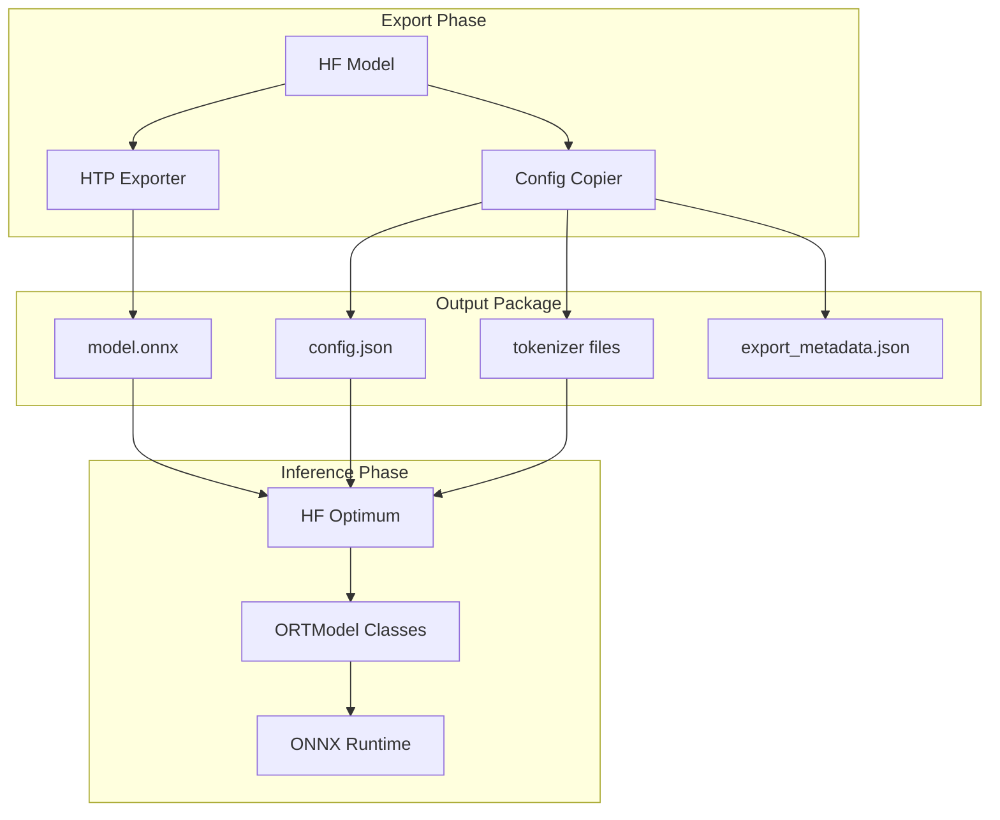
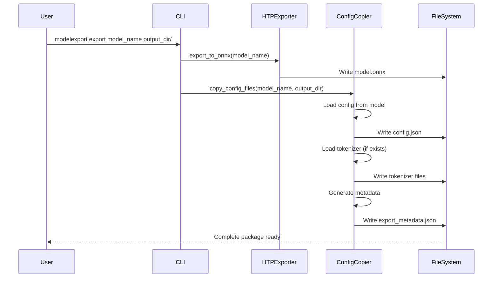
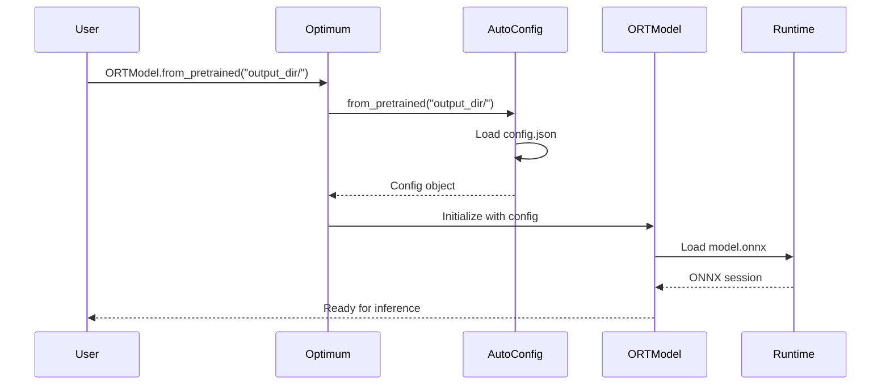
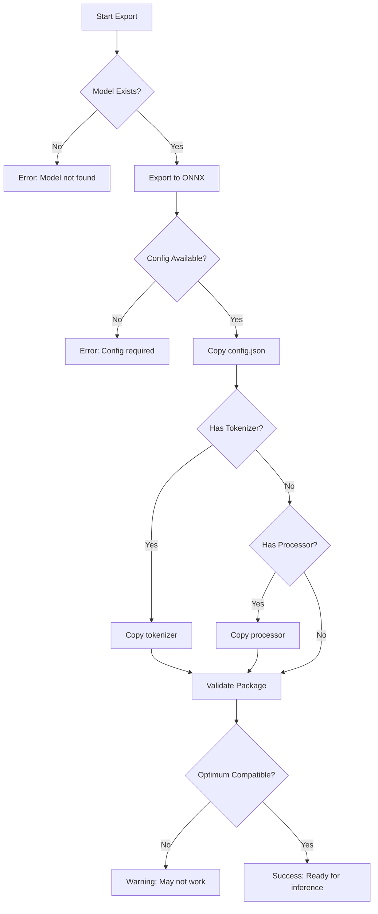

# High-Level Design: ONNX Configuration for Optimum Compatibility

## Overview

This document describes the high-level architecture for ensuring ONNX models exported by ModelExport are fully compatible with HuggingFace Optimum's inference APIs.

## Architecture Components



## Core Design Decision

Based on comprehensive analysis of Optimum's requirements, we implement an **"Always Copy Configuration"** strategy:

- **Decision**: Copy all configuration files during export for ALL models
- **Rationale**: Optimum requires `config.json` to be present locally in the model directory
- **Impact**: Adds 2-5KB overhead (< 0.01% of model size) but ensures 100% compatibility

## Export Workflow



## Inference Workflow



## File Structure

### After Export

```
output_directory/
├── model.onnx              # ONNX model with HTP metadata
├── config.json             # Model configuration (REQUIRED)
├── tokenizer.json          # Tokenizer data (if applicable)
├── tokenizer_config.json   # Tokenizer config (if applicable)
├── special_tokens_map.json # Special tokens (if applicable)
└── export_metadata.json    # Export tracking information
```

### Required vs Optional Files

| File | Required | Purpose |
|------|----------|---------|
| model.onnx | ✅ Yes | ONNX model with weights |
| config.json | ✅ Yes | Model architecture config |
| tokenizer.json | ⚠️ Conditional | For NLP models |
| tokenizer_config.json | ⚠️ Conditional | For NLP models |
| preprocessor_config.json | ⚠️ Conditional | For vision models |
| export_metadata.json | ❌ No | Export tracking |

## Implementation Components

### 1. Enhanced HTP Exporter

```python
def export_with_config(model_name: str, output_dir: Path) -> Path:
    """
    Export model to ONNX with all required configuration files.
    
    Steps:
    1. Export ONNX using HTP strategy
    2. Copy model configuration
    3. Copy preprocessor files (tokenizer/image processor)
    4. Generate export metadata
    5. Validate output structure
    """
```

### 2. Configuration Copier

```python
class ConfigurationCopier:
    """Handles copying of all configuration files."""
    
    def copy_model_config(self, model_name: str, output_dir: Path):
        """Copy config.json from source model."""
    
    def copy_tokenizer(self, model_name: str, output_dir: Path):
        """Copy tokenizer files if applicable."""
    
    def copy_image_processor(self, model_name: str, output_dir: Path):
        """Copy image processor config if applicable."""
```

### 3. Validation Module

```python
def validate_optimum_compatibility(output_dir: Path) -> bool:
    """
    Validate that exported package is Optimum-compatible.
    
    Checks:
    1. model.onnx exists
    2. config.json exists
    3. Can be loaded with ORTModel
    """
```

## Error Handling



## Performance Characteristics

### Storage Impact

| Model Type | Model Size | Config Size | Overhead % |
|------------|------------|-------------|------------|
| BERT Base | 420 MB | 2 KB | 0.0005% |
| GPT-2 | 548 MB | 3 KB | 0.0005% |
| ResNet-50 | 98 MB | 1 KB | 0.001% |
| ViT | 330 MB | 2 KB | 0.0006% |

### Export Time

- ONNX export: 5-30 seconds (model dependent)
- Config copying: < 100ms
- Validation: < 50ms
- **Total overhead**: < 200ms (negligible)

## Testing Strategy

### Unit Tests
- Config copying for different model types
- Error handling for missing configs
- Validation logic

### Integration Tests
- End-to-end export and inference
- Optimum compatibility verification
- Different model architectures (NLP, Vision, Audio)

### Compatibility Matrix

| Model Type | Export | Optimum Load | Inference |
|------------|--------|--------------|-----------|
| Text Classification | ✅ | ✅ | ✅ |
| Token Classification | ✅ | ✅ | ✅ |
| Question Answering | ✅ | ✅ | ✅ |
| Image Classification | ✅ | ✅ | ✅ |
| Object Detection | ✅ | ✅ | ✅ |

## Future Enhancements

### Phase 1: Current Implementation ✅
- Always copy configuration files
- Full Optimum compatibility
- Clear error messages

### Phase 2: Optimization (Optional)
- Custom AutoModelForONNX wrapper
- Lazy config loading
- Enhanced caching

### Phase 3: Upstream Contribution
- Propose metadata support to Optimum
- Enable single-file deployment
- Maintain backward compatibility

## Security Considerations

1. **Path Validation**: Prevent directory traversal attacks
2. **Config Sanitization**: Validate loaded configurations
3. **File Permissions**: Ensure proper file permissions
4. **Network Security**: Use HTTPS for Hub downloads

## Monitoring Points

- Export success rate
- Config copy failures
- Optimum load success
- Inference performance
- Storage usage trends

## Summary

The **"Always Copy Configuration"** approach provides:

1. **100% Compatibility**: Works with Optimum immediately
2. **Simplicity**: Straightforward implementation
3. **Reliability**: Predictable behavior
4. **Minimal Overhead**: < 0.01% storage increase
5. **Future-Proof**: Can optimize later if needed

This pragmatic design ensures ModelExport's ONNX exports work seamlessly with Optimum while maintaining simplicity and reliability.