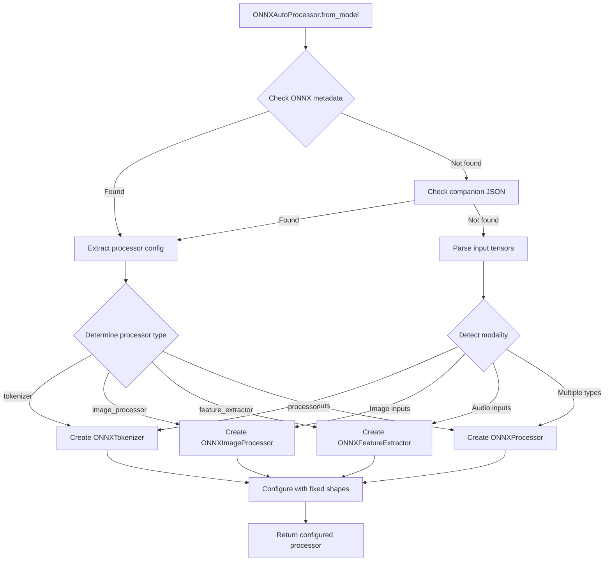
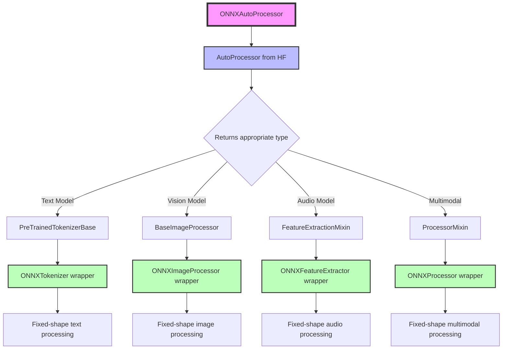

# ONNX Auto Processor Detailed Design

## 1. HuggingFace Processor Types Investigation

### AutoProcessor Discovery

**Important Finding**: `AutoProcessor` is actually a universal factory that returns the appropriate processor type:

```python
from transformers import AutoProcessor

# For text models - returns tokenizer directly
processor = AutoProcessor.from_pretrained("bert-base-uncased")
# Returns: BertTokenizerFast (instance of PreTrainedTokenizerBase)

# For multimodal models - returns processor class
processor = AutoProcessor.from_pretrained("openai/clip-vit-base-patch32")
# Returns: CLIPProcessor (instance of ProcessorMixin)
```

### Core Processor Categories

#### 1.1 Text Processing

- **AutoTokenizer**: For all text-based models (BERT, GPT, T5, etc.)
  - Methods: `tokenize()`, `encode()`, `decode()`, `__call__()`
  - Returns: `BatchEncoding` with input_ids, attention_mask, etc.
  - **AutoProcessor behavior**: Returns tokenizer directly

#### 1.2 Vision Processing

- **AutoImageProcessor**: For vision models (ViT, ResNet, EfficientNet, etc.)
  - Methods: `preprocess()`, `__call__()`
  - Returns: Pixel values, possibly masks
  - **AutoProcessor behavior**: Returns image processor directly

#### 1.3 Audio Processing

- **AutoFeatureExtractor**: For audio models (Wav2Vec2, Whisper, etc.)
  - Methods: `__call__()`, returns input_values, attention_mask
  - Handles audio sampling rate conversion
  - **AutoProcessor behavior**: Returns feature extractor directly

#### 1.4 Multimodal Processing

- **AutoProcessor**: For multimodal models (CLIP, LayoutLM, BLIP, etc.)
  - Combines multiple processors (e.g., tokenizer + image_processor)
  - Methods: Delegates to appropriate sub-processors
  - Returns: Combined dict with all required inputs
  - **AutoProcessor behavior**: Returns ProcessorMixin subclass

### Task-to-Processor Mapping

| Task Category | Tasks | Processor Type |
|--------------|-------|----------------|
| **Text** | text-classification, token-classification, question-answering, text-generation, summarization, translation, fill-mask | AutoTokenizer |
| **Vision** | image-classification, object-detection, image-segmentation, depth-estimation | AutoImageProcessor |
| **Audio** | audio-classification, automatic-speech-recognition, text-to-speech | AutoFeatureExtractor |
| **Video** | video-classification, video-text-to-text, video-to-text | AutoVideoProcessor |
| **Multimodal** | image-to-text, visual-question-answering, document-question-answering, zero-shot-image-classification | AutoProcessor |

### 1.5 Processor Metadata Requirements

For ONNX export with fixed-shape optimization, each processor type requires specific metadata. These fields come from different source files in HuggingFace models:

#### Metadata Source Files in HuggingFace Models

| File | Purpose | Contains |
|------|---------|----------|
| **config.json** | Model configuration | model_type, architectures, vocab_size, hidden_size |
| **tokenizer_config.json** | Tokenizer settings | padding, truncation, special tokens, do_lower_case |
| **tokenizer.json** | Fast tokenizer data | vocabulary, merges, normalizer settings |
| **vocab.txt/vocab.json** | Vocabulary | Token-to-ID mappings |
| **preprocessor_config.json** | Image/audio preprocessing | image_size, normalization, sampling_rate |
| **processor_config.json** | Multimodal processor config | Processor type mappings |
| **special_tokens_map.json** | Special token definitions | CLS, SEP, PAD, UNK tokens |

#### Metadata Summary Table

| Processor Type | Auto Class | Key Required Metadata | Fixed Shapes |
|----------------|------------|----------------------|--------------|
| **Text** | `AutoTokenizer` | vocab_size, padding_strategy, max_length | batch_size, sequence_length |
| **Vision** | `AutoImageProcessor` | image_size, normalize params (mean/std) | batch_size, height, width, channels |
| **Audio** | `AutoFeatureExtractor` | sampling_rate, feature_size, n_fft | batch_size, sequence_length |
| **Video** | `AutoVideoProcessor` | num_frames, frame_sampling_rate | batch_size, num_frames, height, width, channels |
| **Multimodal** | `AutoProcessor` | modalities list, sub-configs per modality | Varies by modality combination |

#### Text Processing Metadata (ONNXTokenizer)

**Required Fields by Source File:**

From **config.json**:
- `vocab_size`: e.g., 30522
- `model_type`: e.g., "bert"

From **tokenizer_config.json**:
- `tokenizer_class`: e.g., "BertTokenizerFast" 
- `padding`: true/false or strategy
- `truncation`: true/false or strategy
- `max_length`: e.g., 512
- `do_lower_case`: true/false (for BERT-like models)

From **special_tokens_map.json**:
- `pad_token`: "[PAD]" → `pad_token_id`: 0
- `cls_token`: "[CLS]" → `cls_token_id`: 101
- `sep_token`: "[SEP]" → `sep_token_id`: 102
- `unk_token`: "[UNK]" → `unk_token_id`: 100

**ONNX-Specific (must be added)**:
- `processor_type`: "tokenizer"
- `batch_size`: typically 1
- `sequence_length`: e.g., 128

#### Vision Processing Metadata (ONNXImageProcessor)

**Required Fields by Source File:**

From **config.json**:
- `model_type`: e.g., "vit"
- `image_size`: 224 or 384 (some models)
- `num_channels`: 3

From **preprocessor_config.json**:
- `image_processor_type`: e.g., "ViTImageProcessor"
- `size`: {"height": 224, "width": 224} or {"shortest_edge": 224}
- `do_resize`: true
- `do_rescale`: true
- `rescale_factor`: 0.00392156862 (1/255)
- `do_normalize`: true
- `image_mean`: [0.485, 0.456, 0.406]
- `image_std`: [0.229, 0.224, 0.225]
- `resample`: 3 (PIL.Image.BICUBIC)
- `do_center_crop`: false
- `crop_size`: {"height": 224, "width": 224}

**ONNX-Specific (must be added)**:
- `processor_type`: "image_processor"
- `batch_size`: typically 1
- `height`: e.g., 224
- `width`: e.g., 224

#### Audio Processing Metadata (ONNXFeatureExtractor)

**Required Fields by Source File:**

From **config.json**:
- `model_type`: e.g., "wav2vec2", "whisper"
- `num_mel_bins`: 80 (for Whisper)
- `feature_size`: 1 (for Wav2Vec2)

From **preprocessor_config.json**:
- `feature_extractor_type`: e.g., "Wav2Vec2FeatureExtractor"
- `sampling_rate`: 16000
- `do_normalize`: true
- `padding_value`: 0.0
- `padding_side`: "right"
- `return_attention_mask`: true
- `feature_size`: 1 (raw waveform) or 80 (mel spectrogram)
- `n_fft`: 400 (for spectrogram models)
- `hop_length`: 160
- `n_mels`: 80 (for mel spectrogram)
- `chunk_length`: 30 (for Whisper)
- `n_samples`: 480000 (for Whisper)

**ONNX-Specific (must be added)**:
- `processor_type`: "feature_extractor"
- `batch_size`: typically 1
- `sequence_length`: e.g., 16000 or 3000 (for spectrograms)

#### Video Processing Metadata (ONNXVideoProcessor)

**Required Fields by Source File:**

From **config.json**:
- `model_type`: e.g., "videomae", "vivit"
- `num_frames`: 16
- `tubelet_size`: [2, 16, 16] (for VideoMAE)
- `num_channels`: 3
- `image_size`: 224

From **preprocessor_config.json** (often reuses image processor):
- `video_processor_type`: e.g., "VideoMAEImageProcessor"
- `size`: {"height": 224, "width": 224}
- `do_resize`: true
- `do_center_crop`: true
- `crop_size`: {"height": 224, "width": 224}
- `do_rescale`: true
- `rescale_factor`: 0.00392156862 (1/255)
- `do_normalize`: true
- `image_mean`: [0.485, 0.456, 0.406]
- `image_std`: [0.229, 0.224, 0.225]
- `resample`: 3 (PIL.Image.BICUBIC)

From **processor_config.json** (for some video models):
- `num_frames`: 8 or 16
- `frame_sampling_rate`: 4

**ONNX-Specific (must be added)**:
- `processor_type`: "video_processor"
- `batch_size`: typically 1
- `num_frames`: e.g., 16
- `height`: e.g., 224
- `width`: e.g., 224

#### Multimodal Processing Metadata (ONNXProcessor)

**Required Fields by Source File:**

From **config.json**:
- `model_type`: e.g., "clip", "layoutlm", "whisper"
- `architectures`: ["CLIPModel"] 
- Model-specific configs for each modality

From **processor_config.json**:
- `processor_class`: e.g., "CLIPProcessor", "LayoutLMv2Processor"
- `feature_extractor_type`: (for audio-based multimodal)
- `image_processor_type`: (for vision-based multimodal)
- `tokenizer_class`: (for text component)

From **tokenizer_config.json** (text modality):
- Same as text processing metadata

From **preprocessor_config.json** (vision/audio modality):
- Same as vision/audio processing metadata

**ONNX-Specific (must be added)**:
- `processor_type`: "processor"
- `modalities`: ["text", "vision"] or other combinations
- `batch_size`: typically 1
- Per-modality shapes in sub-configs

**Example CLIP Metadata Structure:**
```json
{
  "processor_type": "processor",
  "processor_class": "CLIPProcessor",
  "modalities": ["text", "vision"],
  "batch_size": 1,
  "text_config": {
    "tokenizer_class": "CLIPTokenizer",
    "sequence_length": 77,
    "vocab_size": 49408
    // Fields from tokenizer_config.json
  },
  "vision_config": {
    "image_processor_class": "CLIPImageProcessor",
    "height": 224,
    "width": 224
    // Fields from preprocessor_config.json
  }
}
```

## 2. ONNXAutoProcessor Design

### 2.1 Core Interface

```python
class ONNXAutoProcessor:
    """Universal ONNX processor that auto-detects and configures based on model metadata."""
    
    @classmethod
    def from_model(
        cls,
        onnx_model_path: str | Path,
        base_processor: Optional[Any] = None,
        hf_model_path: Optional[str | Path] = None,
        **kwargs
    ) -> ONNXAutoProcessor:
        """
        Create an ONNX processor from an ONNX model with auto-detection.
        
        This is the primary and only method for creating ONNX processors.
        
        Args:
            onnx_model_path: Path to ONNX model file (.onnx)
            base_processor: Optional base processor (tokenizer, image_processor, etc.)
                           If not provided, will attempt to load from model directory
            hf_model_path: Optional path to HuggingFace model directory containing configs
                          If not provided, uses ONNX model directory
            **kwargs: Additional configuration options
            
        Returns:
            Configured ONNX processor with fixed shapes for optimal performance
            
        Examples:
            >>> # Primary usage with ONNX model
            >>> processor = ONNXAutoProcessor.from_model("model.onnx")
            
            >>> # Specify HF config directory
            >>> processor = ONNXAutoProcessor.from_model(
            ...     "model.onnx",
            ...     hf_model_path="./hf_configs/"
            ... )
        """
        pass
```

### 2.2 Required ONNX Metadata

For `ONNXAutoProcessor.from_model()` to work universally, the ONNX model file MUST contain processor configuration metadata as specified in **Section 1.5 Processor Metadata Requirements**.

**Note**: This is an ONNX-first design. We deliberately avoid using `from_pretrained()` naming to prevent confusion with HuggingFace patterns. The `from_model()` method clearly indicates we're working with ONNX models as the primary target.

The metadata must include:
- **Processor type identification** (processor_type, processor_class)
- **Fixed shape specifications** for ONNX optimization
- **Configuration parameters** specific to each processor type
- **Modality information** for multimodal processors

See Section 1.5 for complete metadata specifications for all 5 processor types.

### 2.3 Metadata Loading Rules

> **📌 KEY PRINCIPLES**
> 
> 1. **Processor configs** → Always from original HF model (never modify)
> 2. **Model config** → From ONNX folder first, then ONNX metadata
> 3. **Shapes & I/O** → Always from ONNX model graph (never hardcode)
> 
> **Note**: We don't use "fixed_" prefix for shape fields (e.g., just `batch_size` not `fixed_batch_size`) because in ONNX context, ALL shapes are fixed by definition.

#### Loading Hierarchy

1. **Processor Configuration Files** (tokenizer_config.json, preprocessor_config.json, etc.)
   - **MUST** be inherited from original HuggingFace model directory
   - These files contain the essential preprocessing logic
   - Never modify or override these files

2. **Model Configuration** (config.json)
   - First try: Load from ONNX model folder if exists
   - Fallback: Extract from ONNX model metadata
   - Contains model architecture information

3. **ONNX-Specific Information** (shapes, input/output names)
   - **MUST** be extracted directly from ONNX model graph
   - Input/output tensor names from model.graph.input/output
   - Fixed shapes from tensor dimensions
   - No hardcoding - always derive from the actual ONNX model

#### Implementation Strategy

```python
class ONNXAutoProcessor:
    @classmethod
    def from_model(cls, onnx_model_path: str, hf_model_path: Optional[str] = None):
        """
        Load processor with proper hierarchy:
        1. HF configs from original model
        2. Model config from ONNX folder or metadata
        3. Shapes from ONNX model itself
        """
        
        # 1. Load ONNX model to extract shapes and metadata
        onnx_model = onnx.load(onnx_model_path)
        onnx_info = cls._extract_onnx_info(onnx_model)
        
        # 2. Determine HF model path (either provided or from ONNX metadata)
        if hf_model_path is None:
            # Try to get from ONNX metadata
            hf_model_path = cls._get_hf_path_from_metadata(onnx_model)
            if hf_model_path is None:
                # Try same directory as ONNX model
                hf_model_path = Path(onnx_model_path).parent
        
        # 3. Load processor configs from HF model directory
        processor_configs = cls._load_hf_configs(hf_model_path)
        
        # 4. Combine: HF configs + ONNX shapes
        final_config = {
            **processor_configs,  # HF preprocessing logic
            **onnx_info,          # ONNX shapes and I/O names
        }
        
        return cls._create_processor(final_config)
    
    @staticmethod
    def _extract_onnx_info(model: onnx.ModelProto) -> dict:
        """
        Extract structured multimodal information from ONNX model.
        
        Returns a structured dict with proper modality separation and type safety.
        This properly handles multimodal models like CLIP, Whisper, etc.
        """
        from enum import Enum
        from typing import Dict, List, Optional
        
        class ModalityType(Enum):
            TEXT = "text"
            IMAGE = "image" 
            AUDIO = "audio"
            VIDEO = "video"
            UNKNOWN = "unknown"
        
        # Initialize modality-specific storage
        modalities = {}
        all_inputs = []
        all_outputs = []
        
        # Process each input tensor
        for input_tensor in model.graph.input:
            name = input_tensor.name
            all_inputs.append(name)
            
            # Extract shape and data type
            shape = []
            for dim in input_tensor.type.tensor_type.shape.dim:
                shape.append(dim.dim_value if dim.dim_value > 0 else -1)  # -1 for dynamic dims
            
            dtype = input_tensor.type.tensor_type.elem_type  # ONNX data type enum
            
            # Detect modality based on tensor name and shape patterns
            modality = ModalityType.UNKNOWN
            modality_info = {}
            
            # Text modality detection
            if any(pattern in name.lower() for pattern in ['input_ids', 'token', 'text']):
                modality = ModalityType.TEXT
                if len(shape) >= 2:
                    modality_info = {
                        "batch_size": shape[0],
                        "sequence_length": shape[1] if len(shape) >= 2 else None,
                    }
            elif 'attention_mask' in name.lower() and len(shape) == 2:
                modality = ModalityType.TEXT
                # Don't override existing text modality info
                if ModalityType.TEXT not in modalities:
                    modality_info = {
                        "batch_size": shape[0],
                        "sequence_length": shape[1],
                    }
                    
            # Image modality detection
            elif any(pattern in name.lower() for pattern in ['pixel', 'image', 'vision']):
                modality = ModalityType.IMAGE
                if len(shape) == 4:  # NCHW format
                    modality_info = {
                        "batch_size": shape[0],
                        "num_channels": shape[1],
                        "height": shape[2],
                        "width": shape[3],
                    }
            elif len(shape) == 4 and shape[1] in [1, 3]:  # Likely image in NCHW
                modality = ModalityType.IMAGE
                modality_info = {
                    "batch_size": shape[0],
                    "num_channels": shape[1],
                    "height": shape[2],
                    "width": shape[3],
                }
                
            # Audio modality detection  
            elif any(pattern in name.lower() for pattern in ['audio', 'wave', 'mel', 'spectrogram']):
                modality = ModalityType.AUDIO
                if len(shape) >= 2:
                    modality_info = {
                        "batch_size": shape[0],
                        "sequence_length": shape[1] if len(shape) == 2 else shape[-1],
                        "feature_size": shape[1] if len(shape) == 3 else 1,
                    }
            elif 'input_values' in name.lower() or 'input_features' in name.lower():
                modality = ModalityType.AUDIO
                if len(shape) >= 2:
                    modality_info = {
                        "batch_size": shape[0],
                        "sequence_length": shape[1] if len(shape) == 2 else shape[-1],
                    }
                    
            # Video modality detection
            elif any(pattern in name.lower() for pattern in ['video', 'frames', 'clip']):
                modality = ModalityType.VIDEO
                if len(shape) == 5:  # NCTHW format
                    modality_info = {
                        "batch_size": shape[0],
                        "num_channels": shape[1],
                        "num_frames": shape[2],
                        "height": shape[3],
                        "width": shape[4],
                    }
            elif len(shape) == 5:  # Likely video
                modality = ModalityType.VIDEO
                modality_info = {
                    "batch_size": shape[0],
                    "num_channels": shape[1],
                    "num_frames": shape[2],
                    "height": shape[3],
                    "width": shape[4],
                }
            
            # Store modality information
            if modality != ModalityType.UNKNOWN:
                if modality.value not in modalities:
                    modalities[modality.value] = {
                        "type": modality.value,
                        "tensors": [],
                        **modality_info  # Unpack modality-specific info
                    }
                
                # Add tensor info to modality
                modalities[modality.value]["tensors"].append({
                    "name": name,
                    "shape": shape,
                    "dtype": dtype
                })
            else:
                # Store unknown tensors separately
                if "unknown" not in modalities:
                    modalities["unknown"] = {
                        "type": "unknown",
                        "tensors": []
                    }
                modalities["unknown"]["tensors"].append({
                    "name": name,
                    "shape": shape,
                    "dtype": dtype
                })
        
        # Process outputs
        for output_tensor in model.graph.output:
            all_outputs.append(output_tensor.name)
        
        # Build final structured info
        info = {
            "modalities": modalities,
            "is_multimodal": len([m for m in modalities if m != "unknown"]) > 1,
            "input_names": all_inputs,
            "output_names": all_outputs,
            "input_count": len(all_inputs),
            "output_count": len(all_outputs),
        }
        
        # Add flattened info for backward compatibility (but prioritize modality-specific info)
        # Only add if single modality for backward compatibility
        if not info["is_multimodal"] and len(modalities) == 1:
            # Flatten single modality info to top level for simple cases
            single_modality = list(modalities.values())[0]
            if single_modality["type"] != "unknown":
                for key, value in single_modality.items():
                    if key not in ["type", "tensors"]:
                        info[key] = value
        
        return info
```

#### Example Output for Multimodal Models

**CLIP Model (Text + Image):**
```json
{
  "modalities": {
    "text": {
      "type": "text",
      "batch_size": 1,
      "sequence_length": 77,
      "tensors": [
        {"name": "input_ids", "shape": [1, 77], "dtype": 7},
        {"name": "attention_mask", "shape": [1, 77], "dtype": 7}
      ]
    },
    "image": {
      "type": "image", 
      "batch_size": 1,
      "num_channels": 3,
      "height": 224,
      "width": 224,
      "tensors": [
        {"name": "pixel_values", "shape": [1, 3, 224, 224], "dtype": 1}
      ]
    }
  },
  "is_multimodal": true,
  "input_names": ["input_ids", "attention_mask", "pixel_values"],
  "output_names": ["logits_per_image", "logits_per_text"],
  "input_count": 3,
  "output_count": 2
}
```

**Single Modality (BERT):**
```json
{
  "modalities": {
    "text": {
      "type": "text",
      "batch_size": 1,
      "sequence_length": 128,
      "tensors": [
        {"name": "input_ids", "shape": [1, 128], "dtype": 7},
        {"name": "attention_mask", "shape": [1, 128], "dtype": 7},
        {"name": "token_type_ids", "shape": [1, 128], "dtype": 7}
      ]
    }
  },
  "is_multimodal": false,
  "input_names": ["input_ids", "attention_mask", "token_type_ids"],
  "output_names": ["logits"],
  "input_count": 3,
  "output_count": 1,
  "batch_size": 1,  // Flattened for backward compatibility
  "sequence_length": 128  // Flattened for backward compatibility
}
```

### 2.4 How HuggingFace Handles Dynamic Shapes

#### Dynamic Shape Strategy in HuggingFace

HuggingFace tokenizers and processors handle dynamic shapes through:

1. **Padding Strategies**:
   ```python
   tokenizer(texts, 
            padding=True,          # Pad to longest in batch
            padding="max_length",  # Pad to model max length
            padding="longest",     # Pad to longest sequence
            max_length=512,        # Maximum allowed length
            truncation=True)       # Truncate if exceeds max
   ```

2. **Dynamic Batching**:
   - No fixed batch size - determined at runtime
   - Batch size = number of inputs provided
   - Each sample can have different length initially

3. **Attention Masks**:
   - Used to handle variable sequence lengths
   - Mask indicates which tokens are padding (0) vs real (1)
   - Model ignores padded positions during computation

4. **Runtime Shape Inference**:
   ```python
   # HuggingFace approach (dynamic)
   outputs = tokenizer(["Hello", "Hello world", "Hello world from HF"])
   # Results in shape: [3, 5] where 5 is longest sequence
   
   # ONNX approach (fixed)
   outputs = onnx_tokenizer(["Hello", "Hello world", "Hello world from HF"])
   # Must result in shape: [1, 128] due to fixed ONNX shapes
   # Requires batching/padding/truncation to match fixed shape
   ```

5. **Why ONNX Needs Fixed Shapes**:
   - ONNX Runtime optimizations require known shapes
   - Graph optimization happens at compile time
   - Memory allocation is static for performance
   - 40x+ speedup comes from these optimizations

This is why ONNXAutoProcessor must enforce fixed shapes while preserving the preprocessing logic from HuggingFace configs.

### 2.5 Metadata Storage Options

#### Option 1: ONNX Model Metadata (Preferred)

Store as custom metadata in the ONNX model itself:

```python
import onnx

model = onnx.load("model.onnx")
metadata = {
    "model_type": "bert",
    "task": "text-classification",
    "processor_type": "tokenizer",
    "batch_size": "1",
    "sequence_length": "128"
}

for key, value in metadata.items():
    meta = model.metadata_props.add()
    meta.key = key
    meta.value = str(value)

onnx.save(model, "model_with_metadata.onnx")
```

#### Option 2: Companion JSON File

Store in `model_metadata.json` alongside the ONNX file:

```json
model_directory/
├── model.onnx
├── model_metadata.json  # Our metadata
├── config.json          # HF config
└── tokenizer.json       # Base processor config
```

### 2.6 Auto-Detection Flow



### 2.7 Implementation Components

#### Simplified Architecture with AutoProcessor

```python
class ONNXAutoProcessor:
    """
    Universal ONNX processor with auto-detection.
    
    This class leverages AutoProcessor for loading and wraps the result
    with appropriate ONNX-specific processors for fixed-shape optimization.
    
    Dependencies:
    - ONNXTokenizer: For wrapping text tokenizers with fixed shapes
    - ONNXImageProcessor: For wrapping image processors with fixed shapes  
    - ONNXFeatureExtractor: For wrapping audio processors with fixed shapes
    - ONNXProcessor: For wrapping multimodal processors with fixed shapes
    """
    
    def __init__(self, base_processor: Any, onnx_config: dict):
        """
        Initialize with a base processor from AutoProcessor and ONNX config.
        
        Args:
            base_processor: Processor returned by AutoProcessor (loaded from HF configs)
            onnx_config: Configuration extracted from ONNX model metadata
        """
        self.base_processor = base_processor
        self.onnx_config = onnx_config
        
        # Wrap with appropriate ONNX processor based on type
        self._onnx_processor = self._create_onnx_wrapper(base_processor, onnx_config)
    
    @classmethod
    def from_model(cls, onnx_model_path: str, base_processor: Optional[Any] = None, 
                   hf_model_path: Optional[str] = None):
        """
        Create ONNXAutoProcessor from an ONNX model file.
        
        Uses AutoProcessor to load the base processor from HF configs, then wraps it with
        the appropriate ONNX-specific processor for fixed-shape optimization.
        """
        # 1. Load ONNX model for metadata extraction
        model = onnx.load(onnx_model_path)
        metadata = cls._extract_metadata(model)
        
        # 2. Load base processor using AutoProcessor (if not provided)
        if base_processor is None:
            # Determine config directory
            if hf_model_path:
                config_dir = Path(hf_model_path)
            else:
                # Default to same directory as ONNX model
                config_dir = Path(onnx_model_path).parent
            
            try:
                # AutoProcessor automatically returns the right type!
                # Note: AutoProcessor.from_pretrained is HF's internal method
                # We use it to load configs, but expose only from_model() to users
                base_processor = AutoProcessor.from_pretrained(str(config_dir))
            except:
                # Fallback: try to load from model name in metadata
                if "original_model" in metadata:
                    base_processor = AutoProcessor.from_pretrained(metadata["original_model"])
                else:
                    raise ValueError("Cannot load processor. Please provide base_processor or hf_model_path.")
        
        # 3. Extract ONNX-specific configuration (fixed shapes, etc.)
        onnx_config = cls._extract_onnx_config(model, metadata)
        
        # 4. Create and return wrapped processor
        return cls(base_processor, onnx_config)
    
    def _create_onnx_wrapper(self, base_processor: Any, onnx_config: dict):
        """
        Wrap the base processor with the appropriate ONNX-specific processor.
        
        This is where ONNXAutoProcessor depends on the other ONNX processors!
        Each processor type needs its corresponding ONNX wrapper for fixed shapes.
        """
        from transformers import PreTrainedTokenizerBase
        from transformers.image_processing_utils import BaseImageProcessor
        from transformers.feature_extraction_utils import FeatureExtractionMixin
        from transformers.processing_utils import ProcessorMixin
        
        # Determine processor type and wrap accordingly
        if isinstance(base_processor, PreTrainedTokenizerBase):
            # Text model - wrap with ONNXTokenizer
            from onnx_tokenizer import ONNXTokenizer
            return ONNXTokenizer(
                tokenizer=base_processor,
                batch_size=onnx_config.get("batch_size", 1),
                sequence_length=onnx_config.get("sequence_length", 128)
            )
            
        elif isinstance(base_processor, BaseImageProcessor):
            # Vision model - wrap with ONNXImageProcessor
            from onnx_image_processor import ONNXImageProcessor
            return ONNXImageProcessor(
                image_processor=base_processor,
                batch_size=onnx_config.get("batch_size", 1),
                height=onnx_config.get("height", 224),
                width=onnx_config.get("width", 224)
            )
            
        elif isinstance(base_processor, FeatureExtractionMixin):
            # Audio model - wrap with ONNXFeatureExtractor
            from onnx_feature_extractor import ONNXFeatureExtractor
            return ONNXFeatureExtractor(
                feature_extractor=base_processor,
                batch_size=onnx_config.get("batch_size", 1),
                sequence_length=onnx_config.get("sequence_length", 16000)
            )
            
        elif isinstance(base_processor, ProcessorMixin):
            # Multimodal model - wrap with ONNXProcessor
            from onnx_processor import ONNXProcessor
            return ONNXProcessor(
                processor=base_processor,
                onnx_config=onnx_config
            )
            
        else:
            raise ValueError(f"Unknown processor type: {type(base_processor)}")
    
    @staticmethod
    def _extract_metadata(model: onnx.ModelProto) -> dict:
        """Extract metadata from ONNX model."""
        metadata = {}
        for prop in model.metadata_props:
            metadata[prop.key] = prop.value
        return metadata
    
    @staticmethod
    def _extract_onnx_config(model: onnx.ModelProto, metadata: dict) -> dict:
        """
        Extract ONNX-specific configuration like shapes.
        """
        config = {}
        
        # From metadata
        if "batch_size" in metadata:
            config["batch_size"] = int(metadata["batch_size"])
        if "sequence_length" in metadata:
            config["sequence_length"] = int(metadata["sequence_length"])
            
        # From input shapes
        for input_tensor in model.graph.input:
            shape = [dim.dim_value for dim in input_tensor.type.tensor_type.shape.dim]
            if "input_ids" in input_tensor.name and len(shape) >= 2:
                config["batch_size"] = shape[0]
                config["sequence_length"] = shape[1]
            elif "pixel_values" in input_tensor.name and len(shape) >= 4:
                config["batch_size"] = shape[0]
                config["height"] = shape[2]
                config["width"] = shape[3]
                
        return config
```

## 3. Dependency Architecture

### ONNXAutoProcessor Component Dependencies



### Component Responsibilities

1. **ONNXAutoProcessor**: 
   - Uses `AutoProcessor` to load base processor
   - Detects processor type via `isinstance()` checks
   - Wraps with appropriate ONNX processor

2. **Required ONNX Processors**:
   - **ONNXTokenizer**: Handles fixed-shape text tokenization
   - **ONNXImageProcessor**: Handles fixed-shape image preprocessing
   - **ONNXFeatureExtractor**: Handles fixed-shape audio processing
   - **ONNXProcessor**: Handles fixed-shape multimodal processing

3. **AutoProcessor (from HuggingFace)**:
   - Smart factory that returns the right processor type
   - Simplifies loading logic significantly

## 4. Integration with Existing System

### 3.1 Enhanced Pipeline Integration

```python
from enhanced_pipeline import create_pipeline
from onnx_auto_processor import ONNXAutoProcessor

# Auto-detect and configure processor
auto_processor = ONNXAutoProcessor.from_model("model.onnx")

# Use with enhanced pipeline
pipe = create_pipeline(
    task="text-classification",
    model="model.onnx",
    data_processor=auto_processor  # Universal parameter
)

# Run inference
results = pipe("Hello world!")
```

### 3.2 Backward Compatibility

The ONNXAutoProcessor will be fully compatible with existing code:

```python
# Works with explicit processor types
onnx_tokenizer = ONNXTokenizer(...)
onnx_image_processor = ONNXImageProcessor(...)

# Also works with auto-detection
auto_processor = ONNXAutoProcessor.from_model("model.onnx")

# Both work with enhanced pipeline
pipe1 = create_pipeline(task, model, data_processor=onnx_tokenizer)
pipe2 = create_pipeline(task, model, data_processor=auto_processor)
```

## 4. Success Criteria

1. **Universal Support**: Works with all HF model types (text, vision, audio, multimodal)
2. **Zero Configuration**: Auto-detects everything from ONNX metadata
3. **Performance**: Maintains 40x+ speedup through fixed-shape optimization
4. **Compatibility**: Drop-in replacement for existing processors
5. **Extensibility**: Easy to add new processor types

## 5. Implementation Phases

### Phase 1: Core Infrastructure
- [ ] Implement metadata extraction from ONNX models
- [ ] Create processor type detection logic
- [ ] Build ONNXAutoProcessor base class

### Phase 2: Processor Implementation
- [ ] Implement text processor auto-configuration
- [ ] Implement vision processor auto-configuration
- [ ] Implement audio processor auto-configuration
- [ ] Implement multimodal processor auto-configuration

### Phase 3: Integration & Testing
- [ ] Integrate with enhanced pipeline
- [ ] Create comprehensive test suite
- [ ] Performance benchmarking
- [ ] Documentation and examples

## 6. Related Tasks

- Parent: TEZ-144 (ONNX Model Inference Guide)
- Related: TEZ-148 (ADR-014: Enhanced Data Processors)
- Related: TEZ-150 (High-Level Design)
- Related: TEZ-151 (ONNX Auto Processor Detailed Design)

## 7. Processor Types Summary

HuggingFace supports **5 main processor categories**:

1. **Text Processing** (`AutoTokenizer`) - For NLP models (~200+ implementations)
2. **Vision Processing** (`AutoImageProcessor`) - For computer vision models (~100+ implementations)
3. **Audio Processing** (`AutoFeatureExtractor`) - For speech/audio models (~30+ implementations)
4. **Video Processing** (`AutoVideoProcessor`) - For video models (since v4.37+, ~20+ implementations)
5. **Multimodal Processing** (`AutoProcessor`) - For models combining modalities (~50+ implementations)

**Total**: Approximately **400-600+ concrete processor implementations** across all categories.

**Key Finding**: `AutoProcessor` is a smart factory that returns the appropriate processor type for any model, simplifying our design significantly.

**Video Support**: Yes, HuggingFace supports video processing through `AutoVideoProcessor` and various video-specific processor classes (VideoMAEImageProcessor, LlavaNextVideoProcessor, etc.). Videos are typically processed as sequences of frames.

For concrete metadata examples and additional specifications, see the companion [Processor Metadata Requirements](./processor_metadata_requirements.md) document.
