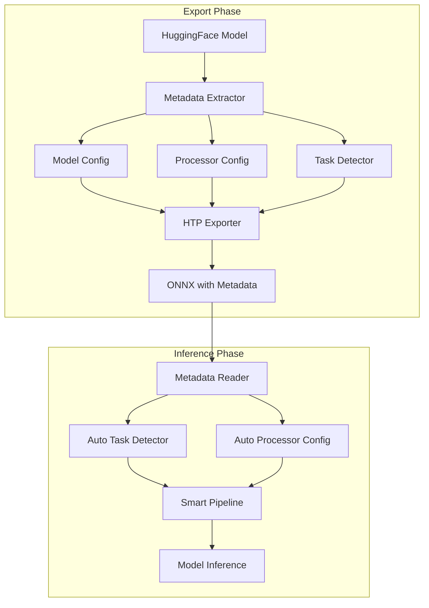

# ONNX Inference Phase 2 Technical Design

## Document Structure

This design is organized into multiple documents for clarity:

1. **[Requirements](./requirements.md)** - Functional and non-functional requirements
2. **[Self-Contained ONNX Requirements](./self-contained-onnx-requirements.md)** - P0 feature requirements
3. **[High-Level Design](./high-level-design.md)** - System architecture and strategic design
4. **[Detailed Design](./detailed-design.md)** - Implementation specifications
5. **[Feature Engineering Metadata](./feature-engineering-metadata.md)** - Metadata standards
6. **This Document** - Technical design overview and integration points

## Architecture Overview



## Component Design

### 1. Metadata Extractor

**Purpose**: Extract configuration from HuggingFace models and processors

**Location**: `modelexport/conversion/metadata_extractor.py`

```python
class MetadataExtractor:
    """Extract metadata from HuggingFace models and processors."""
    
    def extract_model_config(self, model: PreTrainedModel) -> Dict[str, Any]:
        """Extract model configuration."""
        config = model.config.to_dict()
        return {
            "architectures": config.get("architectures", []),
            "model_type": config.get("model_type"),
            "hidden_size": config.get("hidden_size"),
            "num_attention_heads": config.get("num_attention_heads"),
            "num_hidden_layers": config.get("num_hidden_layers"),
            "vocab_size": config.get("vocab_size"),
            "num_labels": config.get("num_labels"),
            "id2label": config.get("id2label"),
            "label2id": config.get("label2id"),
            "task_specific_params": config.get("task_specific_params", {})
        }
    
    def extract_processor_config(self, processor: Any) -> Dict[str, Any]:
        """Extract processor configuration."""
        # Implementation varies by processor type
        pass
    
    def detect_task_type(self, model: PreTrainedModel) -> str:
        """Detect pipeline task from model architecture."""
        architecture = model.config.architectures[0]
        return ARCHITECTURE_TO_TASK_MAPPING.get(architecture, "feature-extraction")
```

### 2. Enhanced HTP Exporter

**Purpose**: Integrate metadata embedding with hierarchy tag preservation

**Modifications to**: `modelexport/conversion/hf_universal_hierarchy_exporter.py`

```python
class HierarchyTagPreservationExporter:
    def export_with_metadata(
        self,
        model_name_or_path: str,
        output_path: str,
        embed_metadata: bool = True,
        **kwargs
    ) -> Dict[str, Any]:
        """Export ONNX with hierarchy tags and embedded metadata."""
        
        # Existing HTP export logic
        onnx_model = self._export_base_onnx(model, dummy_input)
        
        if embed_metadata:
            # Extract metadata
            metadata = self.metadata_extractor.extract_all(model, processor)
            
            # Embed in ONNX
            self._embed_metadata_in_onnx(onnx_model, metadata)
        
        # Continue with hierarchy tagging
        self._add_hierarchy_tags(onnx_model, trace_info)
        
        return {
            "onnx_path": output_path,
            "metadata": metadata if embed_metadata else None
        }
    
    def _embed_metadata_in_onnx(
        self, 
        onnx_model: onnx.ModelProto, 
        metadata: Dict[str, Any]
    ):
        """Embed metadata as ONNX model properties."""
        # Clear existing metadata_props
        del onnx_model.metadata_props[:]
        
        # Add metadata with proper prefixes
        metadata_props = {
            "hf_model_config": json.dumps(metadata["model_config"]),
            "hf_processor_config": json.dumps(metadata["processor_config"]),
            "hf_pipeline_task": metadata["task"],
            "hf_metadata_version": "2.0",
            "hf_export_timestamp": datetime.now().isoformat()
        }
        
        for key, value in metadata_props.items():
            prop = onnx_model.metadata_props.add()
            prop.key = key
            prop.value = str(value)
```

### 3. Metadata Reader

**Purpose**: Extract and parse metadata from ONNX models

**Location**: `modelexport/inference/metadata_reader.py`

```python
class ONNXMetadataReader:
    """Read and parse metadata from ONNX models."""
    
    def __init__(self, cache_metadata: bool = True):
        self.cache_metadata = cache_metadata
        self._cache = {}
    
    def read_metadata(self, onnx_path: str) -> Optional[Dict[str, Any]]:
        """Read metadata from ONNX model."""
        if self.cache_metadata and onnx_path in self._cache:
            return self._cache[onnx_path]
        
        try:
            model = onnx.load(onnx_path)
            metadata = self._extract_metadata_from_model(model)
            
            if self.cache_metadata:
                self._cache[onnx_path] = metadata
            
            return metadata
        except Exception as e:
            logger.warning(f"Failed to read metadata: {e}")
            return None
    
    def _extract_metadata_from_model(
        self, 
        model: onnx.ModelProto
    ) -> Dict[str, Any]:
        """Extract metadata from ONNX model properties."""
        metadata = {}
        
        for prop in model.metadata_props:
            if prop.key.startswith("hf_"):
                key = prop.key[3:]  # Remove 'hf_' prefix
                
                # Parse JSON fields
                if key in ["model_config", "processor_config"]:
                    metadata[key] = json.loads(prop.value)
                else:
                    metadata[key] = prop.value
        
        return metadata if metadata else None
```

### 4. Enhanced Pipeline

**Purpose**: Auto-detect task and configure pipeline from metadata

**Modifications to**: `modelexport/inference/pipelines.py`

```python
def pipeline(
    task: Optional[str] = None,
    model: Optional[Union[str, onnx.ModelProto]] = None,
    processor: Optional[Any] = None,
    **kwargs
) -> Pipeline:
    """
    Create inference pipeline with auto-task detection.
    
    Args:
        task: Pipeline task (optional if model has metadata)
        model: ONNX model path or loaded model
        processor: Data processor (optional if model has metadata)
    """
    
    # Try to read metadata if task not specified
    if task is None and isinstance(model, str):
        metadata_reader = ONNXMetadataReader()
        metadata = metadata_reader.read_metadata(model)
        
        if metadata and "pipeline_task" in metadata:
            task = metadata["pipeline_task"]
            logger.info(f"Auto-detected task: {task}")
            
            # Auto-configure processor if not provided
            if processor is None and "processor_config" in metadata:
                processor = _create_processor_from_metadata(
                    metadata["processor_config"]
                )
        else:
            raise ValueError(
                "Task not specified and model lacks metadata. "
                "Please specify task explicitly or use a model with embedded metadata."
            )
    
    # Continue with existing pipeline creation
    return _create_pipeline(task, model, processor, **kwargs)

def _create_processor_from_metadata(
    processor_config: Dict[str, Any]
) -> Any:
    """Create processor from metadata configuration."""
    processor_type = processor_config.get("processor_type", "AutoProcessor")
    
    if processor_type == "AutoTokenizer":
        from transformers import AutoTokenizer
        # Create tokenizer with saved config
        return AutoTokenizer.from_pretrained(
            processor_config["tokenizer_class"],
            **processor_config.get("tokenizer_kwargs", {})
        )
    elif processor_type == "AutoImageProcessor":
        # Similar for image processor
        pass
    # ... other processor types
```

## Data Flow

### Export Flow

1. User calls `modelexport export` with model name
2. HTP Exporter loads HuggingFace model
3. MetadataExtractor extracts:
   - Model configuration
   - Processor requirements
   - Task type detection
4. HTP Exporter embeds metadata in ONNX
5. ONNX file saved with both hierarchy tags and metadata

### Inference Flow

1. User calls `pipeline(model="model.onnx")`
2. Pipeline checks if task specified
3. If no task, ONNXMetadataReader reads metadata
4. Auto-detect task from metadata
5. Auto-create processor from metadata
6. Create appropriate pipeline class
7. Execute inference

## Metadata Schema

### Version 2.0 Schema

```json
{
  "metadata_version": "2.0",
  "export_timestamp": "2024-01-15T10:30:00Z",
  "exporter_version": "modelexport-1.2.0",
  
  "model_config": {
    "architectures": ["BertForSequenceClassification"],
    "model_type": "bert",
    "hidden_size": 768,
    "num_attention_heads": 12,
    "num_hidden_layers": 12,
    "vocab_size": 30522,
    "max_position_embeddings": 512,
    "type_vocab_size": 2,
    "num_labels": 2,
    "id2label": {"0": "NEGATIVE", "1": "POSITIVE"},
    "label2id": {"NEGATIVE": 0, "POSITIVE": 1}
  },
  
  "processor_config": {
    "processor_type": "AutoTokenizer",
    "tokenizer_class": "BertTokenizerFast",
    "do_lower_case": true,
    "max_length": 512,
    "padding": "max_length",
    "truncation": true,
    "model_max_length": 512,
    "special_tokens": {
      "unk_token": "[UNK]",
      "sep_token": "[SEP]",
      "pad_token": "[PAD]",
      "cls_token": "[CLS]",
      "mask_token": "[MASK]"
    }
  },
  
  "pipeline_task": "text-classification",
  
  "pipeline_config": {
    "framework": "onnx",
    "device": "cpu",
    "batch_size": 1,
    "num_threads": 4
  },
  
  "export_config": {
    "opset_version": 14,
    "optimization_level": 1,
    "use_external_data": false,
    "hierarchy_tags_enabled": true
  }
}
```

## Storage Strategy

### ONNX Metadata Properties

Metadata is stored in ONNX model's `metadata_props` field:

```python
# ONNX protobuf structure
model.metadata_props = [
    {"key": "hf_metadata_version", "value": "2.0"},
    {"key": "hf_model_config", "value": "{...}"},  # JSON string
    {"key": "hf_processor_config", "value": "{...}"},  # JSON string
    {"key": "hf_pipeline_task", "value": "text-classification"},
    {"key": "hf_export_timestamp", "value": "2024-01-15T10:30:00Z"}
]
```

### Size Optimization

For large metadata:

1. Use gzip compression for JSON strings > 10KB
2. Store only essential fields
3. Reference external config files for very large configs
4. Use compact JSON serialization (no whitespace)

## Backward Compatibility

### Compatibility Matrix

| Scenario | Behavior |
|----------|----------|
| Phase 2 model + Phase 2 pipeline | Auto-detection works |
| Phase 2 model + Phase 1 pipeline | Metadata ignored, explicit task required |
| Phase 1 model + Phase 2 pipeline | Fallback to explicit task |
| Phase 1 model + Phase 1 pipeline | Works as before |

### Fallback Strategy

```python
def pipeline(task=None, model=None, **kwargs):
    if task is None:
        # Try auto-detection
        metadata = read_metadata(model)
        if metadata:
            task = metadata["pipeline_task"]
        else:
            # Fallback options
            if "force_task_detection" in kwargs:
                task = infer_task_from_architecture(model)
            else:
                raise ValueError("Task required for models without metadata")
    
    return create_pipeline(task, model, **kwargs)
```

## Testing Strategy

### Unit Tests

1. **Metadata Extraction**
   - Test extraction from various model types
   - Validate metadata completeness
   - Test error handling

2. **ONNX Embedding**
   - Verify metadata in ONNX properties
   - Test size constraints
   - Validate JSON serialization

3. **Auto-Detection**
   - Test task detection accuracy
   - Verify processor creation
   - Test fallback mechanisms

### Integration Tests

1. **End-to-End Export**
   - Export models with metadata
   - Verify ONNX validity
   - Check metadata integrity

2. **End-to-End Inference**
   - Test auto-detection pipeline
   - Verify inference results
   - Test backward compatibility

### Performance Tests

1. **Export Performance**
   - Measure metadata extraction overhead
   - Test with large models
   - Benchmark against Phase 1

2. **Inference Performance**
   - Measure metadata parsing time
   - Test cache effectiveness
   - Verify no inference regression

## Migration Plan

### Phase 2.1: Experimental (Week 1-2)

- Implement metadata extraction
- Create prototype scripts
- Validate approach

### Phase 2.2: Integration (Week 3-4)

- Integrate with HTP exporter
- Add CLI support
- Test with multiple models

### Phase 2.3: Pipeline Enhancement (Week 5-6)

- Implement auto-detection
- Add fallback mechanisms
- Create compatibility layer

### Phase 2.4: Testing & Documentation (Week 7-8)

- Comprehensive testing
- Performance optimization
- Documentation updates

### Phase 2.5: Production Release

- Code review
- Final testing
- Gradual rollout

## Risk Mitigation

1. **Metadata Corruption**
   - Implement checksums
   - Validate on read
   - Graceful fallback

2. **Performance Impact**
   - Cache parsed metadata
   - Lazy loading
   - Async parsing option

3. **Compatibility Issues**
   - Extensive testing
   - Version detection
   - Clear migration guide

## Success Criteria

- [ ] Metadata extraction < 500ms
- [ ] Metadata parsing < 100ms  
- [ ] 100% backward compatibility
- [ ] Auto-detection accuracy > 95%
- [ ] Zero inference performance regression
- [ ] Metadata size < 100KB typical
