# Self-Contained ONNX Models - High-Level Design

## Executive Summary

This document presents the high-level design for implementing self-contained ONNX models - a revolutionary approach to ML model deployment that embeds all necessary metadata directly into ONNX files, enabling single-file deployment with zero external dependencies.

## Important Clarification: Two-Stage Process

**"Self-contained" is for INFERENCE, not for metadata discovery**:
1. **Metadata Embedding Stage**: Requires HuggingFace model to discover and extract complete configurations
2. **Inference Stage**: Self-contained ONNX works offline with zero dependencies

This is by design - we need the authoritative source (HF model) to get correct, complete metadata.

## System Context

### Current State Problem Analysis

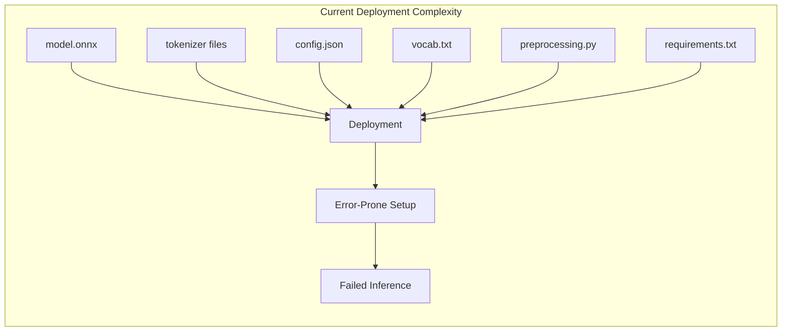

**Pain Points:**

- 10+ files required for deployment
- Manual configuration needed
- Version compatibility issues
- Internet dependency for configs
- Preprocessing mismatch errors
- Documentation burden

### Target State Vision

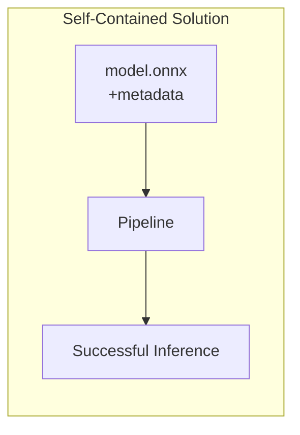

**Benefits:**

- Single file deployment
- Zero configuration
- Offline operation
- Guaranteed reproducibility
- Self-documenting models

## Architectural Design

### System Architecture

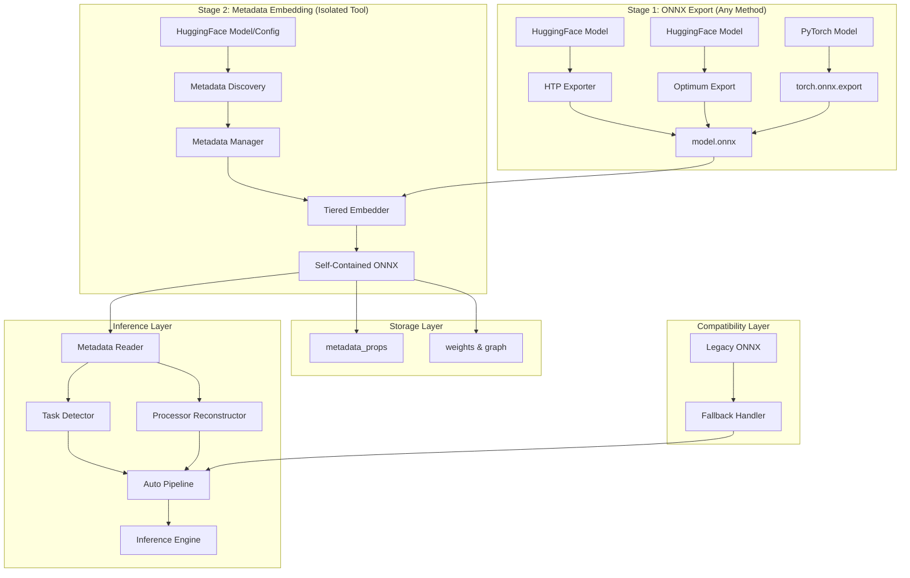

### Component Architecture

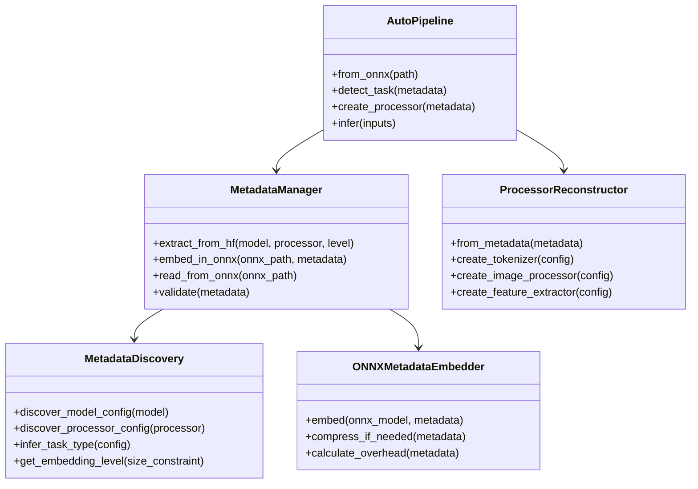

## Data Model Design

### Metadata Structure

```yaml
metadata:
  # Version Control
  hf_metadata_version: "2.0"
  hf_export_timestamp: "ISO-8601"
  hf_transformers_version: "4.x.x"
  
  # Model Configuration (Complete, Unmodified)
  hf_model_config:
    # Complete output from model.config.to_dict()
    # All fields preserved without filtering
    architectures: [...]
    model_type: "..."
    task_specific_params: {...}
    # Every original HF config field preserved
  
  # Feature Engineering (Complete, Unmodified)
  feature_engineering:
    type: "tokenizer|image_processor|feature_extractor"
    # Complete output from processor.to_dict()
    config: {...}  # Complete processor config, unmodified
    
  # Task Identification
  hf_pipeline_task: "text-classification|..."
  hf_pipeline_config: {...}
  
  # Export Metadata
  export:
    hierarchy_preserved: true
    compression_used: false
    vocab_included: false
```

### Configuration Preservation Strategy

```mermaid
graph TD
    subgraph "Complete Configuration Preservation"
        MC[Model Config] --> COMPLETE[config.to_dict()]
        PC[Processor Config] --> COMPLETE
        COMPLETE --> EMBED[Embed in ONNX]
        EMBED --> |"5-20KB typical"| ONNX[Self-Contained Model]
    end
```

**Core Principle**: Honor all original configuration fields
- Always use `.to_dict()` for complete preservation
- Trust that every field exists for a reason  
- No filtering or "essential" field selection
- Typical overhead: 5-20KB (negligible vs model weights)

## Process Flow Design

### Metadata Embedding Process Flow (Detailed)

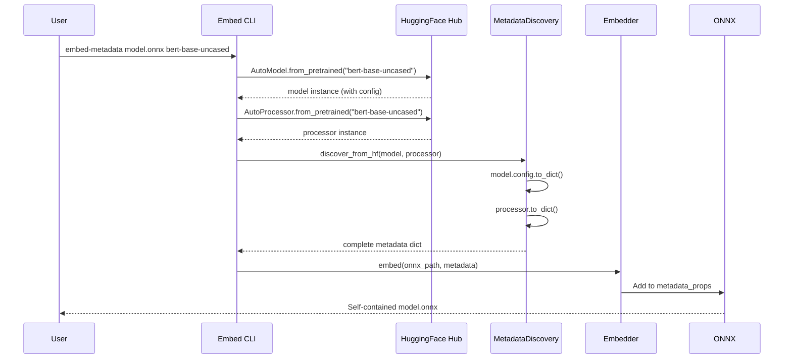

### Core Loop Pseudo-Code

```python
# PSEUDO-CODE: How embed_metadata actually works internally

def embed_metadata(onnx_path: str, model_name: str):
    """
    Core workflow showing model loading requirement.
    """
    # Step 1: Load EXISTING ONNX model (from any exporter)
    onnx_model = onnx.load(onnx_path)
    
    # Step 2: Load HuggingFace model to get config
    # THIS IS THE KEY POINT - we need the model instance!
    hf_model = AutoModel.from_pretrained(model_name)
    hf_processor = AutoProcessor.from_pretrained(model_name)
    
    # Step 3: Discover metadata from loaded model
    discovery = MetadataDiscovery()
    metadata = discovery.discover_from_hf(
        model=hf_model,  # Requires loaded model with .config
        processor=hf_processor  # Optional, but needs loaded processor
    )
    # Internally does:
    #   metadata['hf_model_config'] = hf_model.config.to_dict()
    #   metadata['hf_processor_config'] = hf_processor.to_dict()
    
    # Step 4: Embed metadata into ONNX
    embedder = ONNXMetadataEmbedder()
    embedder.embed(onnx_model, metadata)
    
    # Step 5: Save enhanced ONNX
    onnx.save(onnx_model, onnx_path)
```

### Inference Process Flow

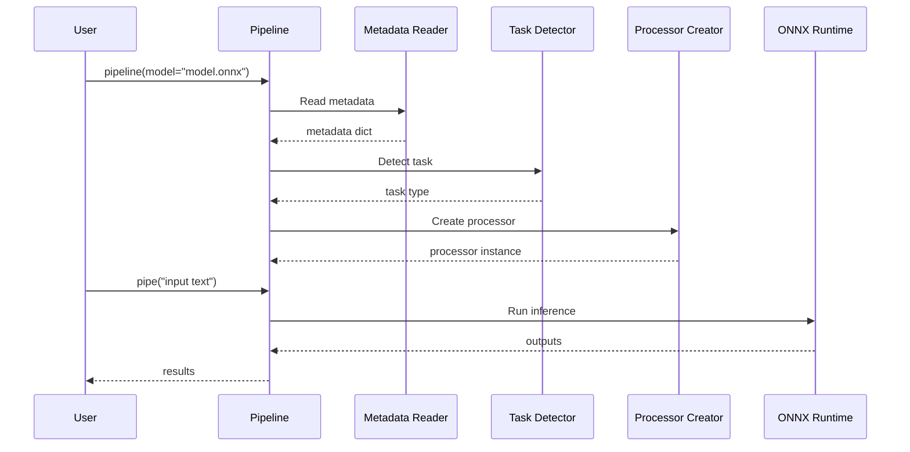

## Interface Design

### CLI Interface

```bash
# Two-stage workflow

# Stage 1: Export ONNX (using any exporter)
modelexport export bert-base-uncased model.onnx  # HTP exporter
# OR use optimum-cli, or any other ONNX exporter

# Stage 2: Add metadata (standalone tool)
modelexport embed-metadata model.onnx bert-base-uncased
modelexport embed-metadata model.onnx bert-base-uncased --include-vocab

# Analyze embedded metadata
modelexport analyze model.onnx --show-metadata
modelexport validate model.onnx --check-metadata
```

### Python API

```python
# Two-Stage Process

# Stage 1: Export ONNX using any method
from transformers import AutoModel
import torch

model = AutoModel.from_pretrained("bert-base-uncased")
# Export using any method (HTP, Optimum, torch.onnx, etc.)
torch.onnx.export(model, dummy_input, "model.onnx")

# Stage 2: Add metadata as separate step
from modelexport.metadata import embed_metadata

embed_metadata(
    onnx_path="model.onnx",
    model_name="bert-base-uncased",
    include_vocab=False  # Set True to include vocabulary
)

# Inference - Zero Configuration
from modelexport.inference import pipeline

# Auto-detects everything from metadata!
pipe = pipeline(model="model.onnx")
result = pipe("This movie is great!")

# Advanced API
from modelexport.inference import ONNXAutoModel, ONNXAutoProcessor

model = ONNXAutoModel.from_model("model.onnx")
processor = ONNXAutoProcessor.from_model("model.onnx")
```

## Technology Stack

### Core Technologies

- **ONNX**: 1.14+ for metadata_props support
- **ONNX Runtime**: 1.14+ for inference
- **HuggingFace Transformers**: 4.0+ for model/processor configs
- **Python**: 3.8+ for implementation

### Storage Technologies

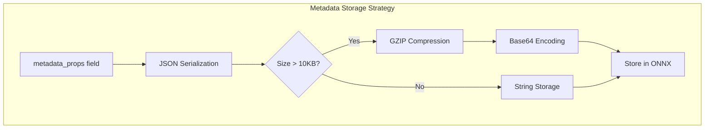

## Quality Attributes

### Performance Requirements

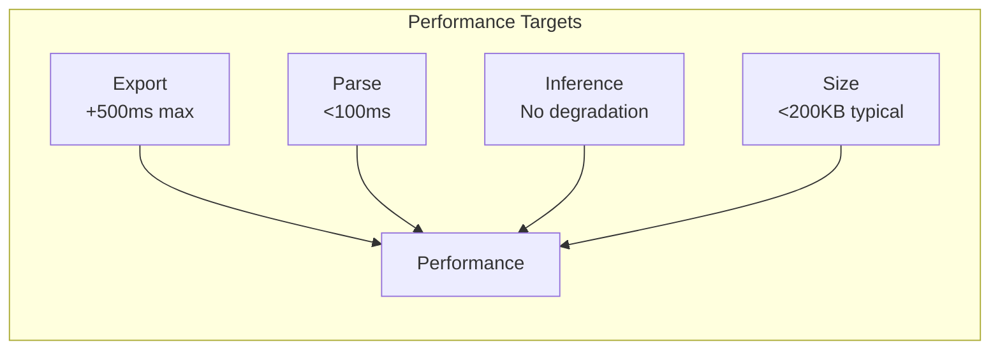

- **Export Overhead**: < 500ms for metadata extraction/embedding
- **Parse Overhead**: < 100ms for metadata reading
- **Inference Impact**: Zero degradation
- **Memory Usage**: < 10MB for metadata handling
- **File Size**: < 200KB metadata for 95% of models

### Compatibility Matrix

| Component | Version Support |
|-----------|----------------|
| ONNX Runtime | 1.14+ |
| Transformers | 4.0+ |
| Python | 3.8+ |
| ONNX Spec | 1.14+ (opset 14+) |

### Security & Privacy

- No sensitive data in metadata
- No user data collection
- Offline operation capability
- Reproducible builds

## Deployment Architecture

### Deployment Scenarios

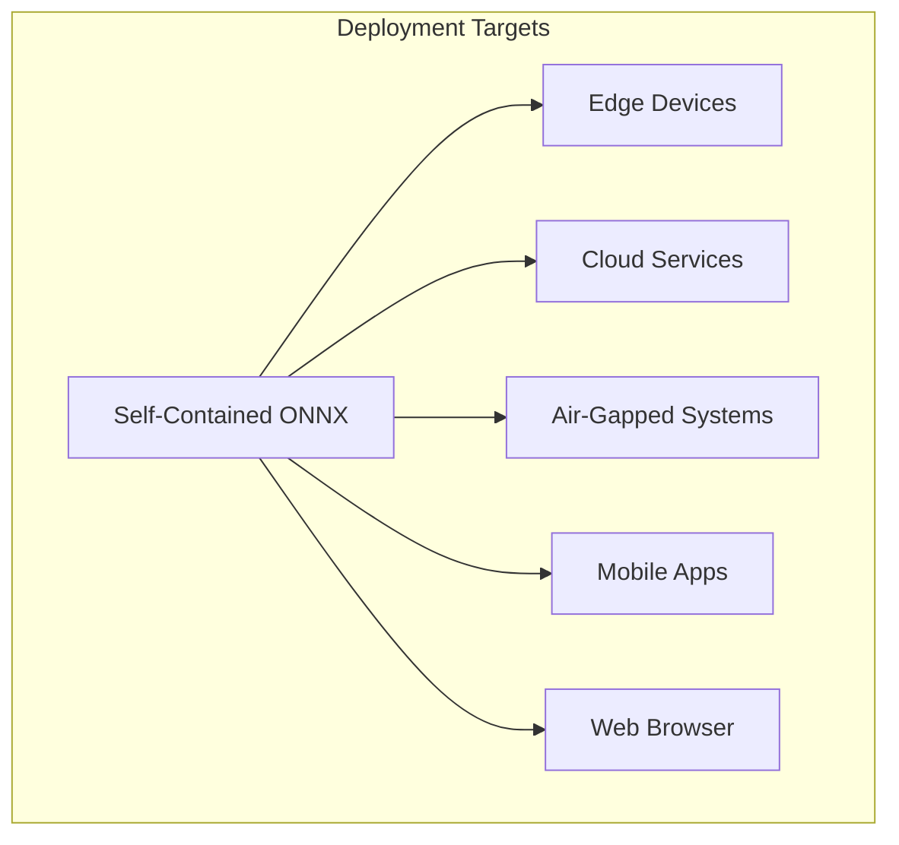

### Migration Strategy

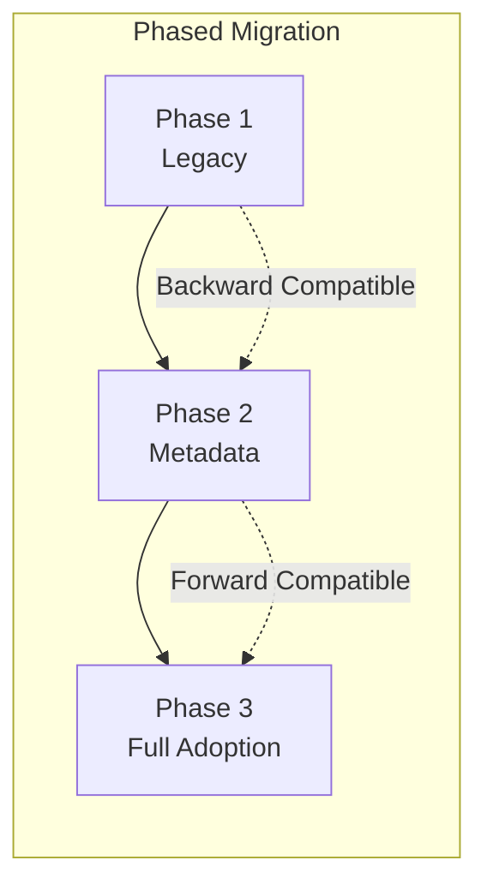

## Risk Analysis

### Technical Risks

| Risk | Impact | Probability | Mitigation |
|------|--------|-------------|------------|
| Metadata bloat | High | Medium | Tiered embedding, compression |
| Compatibility break | High | Low | Extensive testing, versioning |
| Performance degradation | Medium | Low | Caching, lazy loading |
| Metadata corruption | Medium | Low | Checksums, validation |

### Business Risks

| Risk | Impact | Probability | Mitigation |
|------|--------|-------------|------------|
| Adoption resistance | Medium | Low | Clear benefits, easy migration |
| Support burden | Low | Low | Self-documenting, good errors |
| Version fragmentation | Medium | Medium | Clear versioning strategy |

## Success Metrics

### Quantitative Metrics

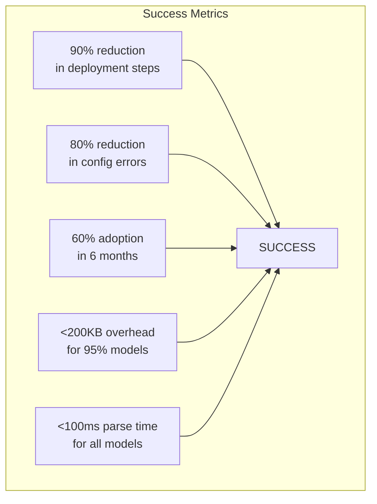

### Qualitative Metrics

- **Developer Experience**: Simplified deployment workflow
- **User Satisfaction**: "It just works" experience
- **Operational Excellence**: Reduced deployment failures
- **Documentation**: Self-documenting models

## Implementation Roadmap

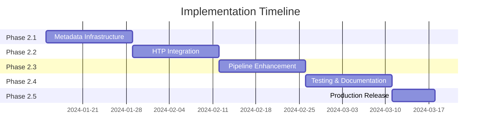

## Conclusion

Self-contained ONNX models represent a paradigm shift in ML model deployment, solving the "works with my preprocessing" problem analogous to how Docker solved "works on my machine". By embedding all necessary metadata directly in ONNX files, we enable:

1. **Single-file deployment** with zero external dependencies
2. **Guaranteed reproducibility** across all environments
3. **Offline operation** without internet access
4. **Self-documenting models** that explain their own requirements
5. **90% reduction** in deployment complexity

This design provides a clear path to implementation while maintaining backward compatibility and ensuring no performance degradation.
