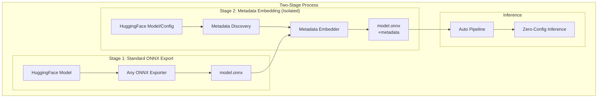

# ONNX Inference Phase 2 - Self-Contained ONNX Models

This directory contains the implementation of **self-contained ONNX models** - a P0 feature that embeds all necessary metadata directly into ONNX files for single-file deployment.

## 🎯 Vision

Transform this:

```python
# Current: Complex multi-file deployment
session = ort.InferenceSession("model.onnx")
tokenizer = BertTokenizer.from_pretrained("bert-base")  # Needs internet!
# Manual preprocessing, configuration, error-prone...
```

Into this:

```python
# Future: Single file, zero configuration
from modelexport.inference import pipeline
pipe = pipeline(model="model.onnx")  # Auto-detects everything!
result = pipe("This movie is great!")
# Output: [{"label": "POSITIVE", "score": 0.99}]
```

## 📚 Documentation Structure

The design is organized into comprehensive documents:

1. **[ADR-015](../../docs/adr/ADR-015-self-contained-onnx-models.md)** - Architectural Decision Record (includes Complete Config Preservation principle)
2. **[Requirements](./docs/requirements-unified.md)** - Unified Phase 2 requirements (functional, non-functional, and P0 features)
3. **[High-Level Design](./docs/high-level-design.md)** - System architecture and strategic design
4. **[Detailed Design](./docs/detailed-design.md)** - Implementation specifications
5. **[Implementation Plan](./docs/implementation-plan.md)** - Phased delivery roadmap
6. **[Feature Engineering Metadata](./docs/feature-engineering-metadata.md)** - Metadata standards
7. **[Technical Design](./docs/design.md)** - Component integration and data flow

## 🏗️ Architecture Overview



## 🚀 Key Features

### Complete Configuration Preservation

- **Core Principle**: Honor all original configuration fields
- **No Filtering**: Preserve complete `.to_dict()` output
- **Trust Original Design**: Every field exists for a reason
- **Typical Size**: 5-20KB metadata overhead (negligible vs model weights)

### Auto-Detection Capabilities

- Automatically detect task type from metadata
- Reconstruct processors from embedded configs
- Configure pipeline without user intervention
- Load label mappings for proper output

### Deployment Benefits

- **90% reduction** in deployment complexity (10+ files → 1 file)
- **Zero configuration** required for inference
- **Offline operation** without internet access
- **Guaranteed reproducibility** across environments
- **Self-documenting** models

## 📁 Project Structure

```text
tez-153_onnx-infer-2/
├── docs/                           # Comprehensive documentation
│   ├── requirements.md            # Phase 2 requirements
│   ├── self-contained-onnx-requirements.md  # P0 feature specs
│   ├── high-level-design.md      # System architecture
│   ├── detailed-design.md        # Implementation details
│   ├── implementation-plan.md    # Delivery roadmap
│   ├── design.md                  # Technical design
│   └── feature-engineering-metadata.md  # Metadata standards
│
├── metadata_utils.py              # Core metadata utilities
├── processor_reconstruction.py   # Processor reconstruction
├── test_metadata_discovery.py    # Test harness
│
└── experiments/                   # Experimental implementations
```

## 🔗 Linear Tasks

- **Main Task**: [TEZ-153](https://linear.app/tezheng/issue/TEZ-153/) - ONNX Inference Phase 2
- **Sub-task 1**: [TEZ-154](https://linear.app/tezheng/issue/TEZ-154/) - Model Config & Processor Metadata Export  
- **Sub-task 2**: [TEZ-155](https://linear.app/tezheng/issue/TEZ-155/) - Smart Pipeline with Auto-Task Detection
- **P0 Feature**: [TEZ-157](https://linear.app/tezheng/issue/TEZ-157/) - Self-Contained ONNX Models

## 🔧 Implementation Status

### Phase 2.1: Foundation ✅

- [x] Metadata discovery utilities
- [x] ONNX embedding infrastructure
- [x] Metadata reading capabilities
- [x] Initial test framework

### Phase 2.2: Standalone Metadata Tool 🚧

- [ ] Create standalone metadata embedding tool
- [ ] CLI support for embedding levels
- [ ] Metadata compression
- [ ] Works with any ONNX model (HTP, Optimum, etc.)

### Phase 2.3: Processor Reconstruction 🚧

- [x] Processor proxy implementations
- [ ] Full processor reconstruction
- [ ] Caching mechanism

### Phase 2.4: Pipeline Enhancement 📋

- [ ] Auto-task detection
- [ ] Fallback mechanisms
- [ ] Backward compatibility

### Phase 2.5: Testing & Documentation 📋

- [ ] Comprehensive testing
- [ ] Performance benchmarking
- [ ] User documentation

## 🎯 Success Metrics

- **Deployment Steps**: 90% reduction (10+ steps → 1 step)
- **Configuration Errors**: 80% reduction
- **Adoption Rate**: 60% within 6 months
- **Metadata Overhead**: < 200KB for 95% of models
- **Performance Impact**: < 100ms parsing time

## 🚦 Quick Start

```bash
# Test metadata discovery
python test_metadata_discovery.py --model prajjwal1/bert-tiny

# Discover and embed metadata (coming soon)
modelexport embed-metadata model.onnx bert-base --level essential

# Use self-contained model (coming soon)
from modelexport.inference import pipeline
pipe = pipeline(model="model.onnx")  # Auto-detects everything!
```

## 📈 Phase Comparison

| Aspect | Phase 1 (Current) | Phase 2 (Target) |
|--------|------------------|------------------|
| **Files Required** | model.onnx + configs + tokenizer | model.onnx only |
| **Task Detection** | Manual specification | Automatic |
| **Processor Setup** | Manual configuration | Auto-reconstruction |
| **Internet Required** | Yes (for configs) | No |
| **Deployment Complexity** | High (10+ steps) | Low (1 step) |

## 🔗 Related Work

- **Phase 1 Implementation**: `modelexport/inference/` (production)
- **ONNX Exporters**: Works with any - HTP, Optimum, torch.onnx.export, etc.
- **ADR**: [ADR-015](../../docs/adr/ADR-015-self-contained-onnx-models.md) - Architectural Decision

## 📊 Impact

Self-contained ONNX models are the **"Docker for ML models"** - solving "works with my preprocessing" like Docker solved "works on my machine". This P0 feature is fundamental to the modelexport project's vision of simplified ML deployment.

## 🛠️ Development

```python
# Current development focus
from experiments.tez_153_onnx_infer_2.metadata_utils import MetadataManager

# Discover and embed metadata
manager = MetadataManager()
metadata = manager.process_model(
    model=hf_model,
    processor=hf_processor,
    onnx_path="model.onnx",
    embed_level="essential"
)

# Read and validate metadata
metadata = manager.read_and_validate("model.onnx")
print(f"Task: {metadata['hf_pipeline_task']}")
```

## 📝 Notes

This is experimental work for Phase 2. Once validated, the implementation will be integrated into the production codebase at `modelexport/conversion/` and `modelexport/inference/`.
