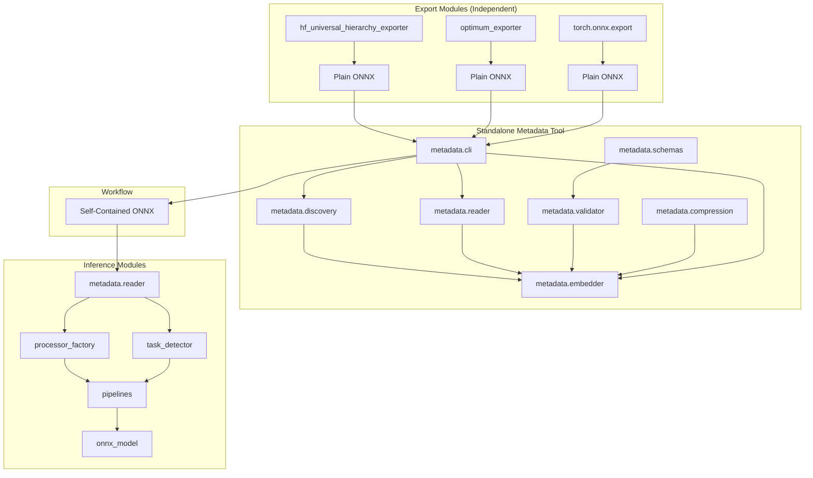

# Self-Contained ONNX Models - Detailed Design

## Table of Contents

1. [Module Architecture](#module-architecture)
2. [Component Specifications](#component-specifications)
3. [Data Structures](#data-structures)
4. [Algorithm Design](#algorithm-design)
5. [Interface Specifications](#interface-specifications)
6. [Error Handling](#error-handling)
7. [Performance Optimizations](#performance-optimizations)
8. [Testing Strategy](#testing-strategy)

## Module Architecture

### Package Structure

```
modelexport/
├── metadata/                    # Standalone metadata package
│   ├── __init__.py
│   ├── cli.py                  # CLI for metadata operations
│   ├── discovery.py            # Metadata discovery from HF models
│   ├── embedder.py             # Embedding metadata in ONNX
│   ├── reader.py               # Read metadata from ONNX
│   ├── schemas.py              # Metadata schema definitions
│   ├── validator.py            # Metadata validation
│   └── compression.py          # Metadata compression utilities
│
├── conversion/
│   ├── hf_universal_hierarchy_exporter.py  # Unchanged - exports ONNX
│   ├── optimum_exporter.py     # Other exporters work independently
│   └── export_manager.py       # Orchestrates exports
│
├── inference/
│   ├── metadata/
│   │   ├── __init__.py
│   │   ├── processor_factory.py # Reconstruct processors
│   │   └── task_detector.py     # Auto-detect pipeline tasks
│   ├── pipelines.py             # Enhanced with auto-detection
│   └── onnx_model.py           # ONNXAutoModel with metadata support
│
└── utils/
    └── compatibility.py         # Version compatibility checks
```

### Module Dependencies



## Component Specifications

### MetadataDiscovery

```python
class MetadataDiscovery:
    """
    Discovers and aggregates metadata from HuggingFace models and processors.
    
    Responsibilities:
    - Discover model configuration
    - Aggregate processor configuration
    - Detect task type
    - Determine embedding level
    """
    
    def __init__(self, 
                 size_threshold: int = 204800):  # 200KB
        """
        Args:
            size_threshold: Max metadata size before compression (bytes)
        """
        self.size_threshold = size_threshold
        self._task_mapping = self._load_task_mapping()
    
    def discover_from_hf(self,
                       model: PreTrainedModel,
                       processor: Optional[PreTrainedTokenizerBase] = None) -> Dict[str, Any]:
        """
        Discover and aggregate metadata from HuggingFace model and processor.
        Honors all original configuration fields without filtering.
        
        Args:
            model: HuggingFace model instance
            processor: Optional processor (tokenizer/image_processor/etc)
            
        Returns:
            Dictionary containing:
            - hf_model_config: Complete model configuration (unmodified)
            - hf_processor_config: Complete processor configuration (unmodified)
            - hf_pipeline_task: Detected task type
            - hf_metadata_version: Metadata format version
            - feature_engineering: Feature engineering metadata
        """
        pass
    
    def _discover_model_config(self,
                             model: PreTrainedModel) -> Dict[str, Any]:
        """Discover complete model configuration - honor all fields.
        
        Core Principle: We preserve all configuration fields exactly as 
        provided by HuggingFace, trusting that every field exists for a reason.
        """
        return model.config.to_dict()  # Complete, unmodified configuration
    
    def _infer_task_type(self, config: PretrainedConfig) -> Optional[str]:
        """
        Infer pipeline task from model architecture.
        
        Uses a mapping table of architecture patterns to task types.
        Falls back to heuristics if no exact match found.
        """
        architecture = config.architectures[0] if config.architectures else ""
        
        # Direct mapping
        if architecture in self._task_mapping:
            return self._task_mapping[architecture]
        
        # Pattern matching
        arch_lower = architecture.lower()
        if "sequenceclassification" in arch_lower:
            return "text-classification"
        elif "tokenclassification" in arch_lower:
            return "token-classification"
        # ... more patterns
        
        return None
```

### ONNXMetadataEmbedder

```python
class ONNXMetadataEmbedder:
    """
    Embeds metadata into ONNX models using metadata_props.
    
    Responsibilities:
    - Serialize metadata to JSON
    - Compress large metadata
    - Add to ONNX metadata_props
    - Validate embedded metadata
    """
    
    def __init__(self,
                 compress_threshold: int = 10240,  # 10KB
                 compression_level: int = 6):
        """
        Args:
            compress_threshold: Compress metadata larger than this
            compression_level: GZIP compression level (1-9)
        """
        self.compress_threshold = compress_threshold
        self.compression_level = compression_level
    
    def embed(self,
              onnx_model: Union[str, onnx.ModelProto],
              metadata: Dict[str, Any],
              validate: bool = True) -> None:
        """
        Embed metadata into ONNX model.
        
        Args:
            onnx_model: Path to ONNX file or ModelProto object
            metadata: Metadata dictionary to embed
            validate: Whether to validate after embedding
            
        Raises:
            ValueError: If metadata is invalid
            IOError: If ONNX file cannot be modified
        """
        # Load model if path provided
        if isinstance(onnx_model, str):
            model = onnx.load(onnx_model)
            output_path = onnx_model
        else:
            model = onnx_model
            output_path = None
        
        # Clear existing HF metadata
        self._clear_existing_metadata(model)
        
        # Process and add new metadata
        for key, value in metadata.items():
            self._add_metadata_prop(model, key, value)
        
        # Validate if requested
        if validate:
            self._validate_embedded_metadata(model)
        
        # Save if path provided
        if output_path:
            onnx.save(model, output_path)
    
    def _add_metadata_prop(self,
                          model: onnx.ModelProto,
                          key: str,
                          value: Any) -> None:
        """Add single metadata property with compression if needed."""
        # Serialize value
        if isinstance(value, (dict, list)):
            value_str = json.dumps(value, separators=(',', ':'))
        else:
            value_str = str(value)
        
        # Compress if large
        if len(value_str) > self.compress_threshold:
            value_str = self._compress_value(value_str)
            key = f"{key}:compressed"
        
        # Add to model
        prop = model.metadata_props.add()
        prop.key = key
        prop.value = value_str
    
    def _compress_value(self, value: str) -> str:
        """Compress and base64 encode a value."""
        import gzip
        import base64
        
        compressed = gzip.compress(
            value.encode('utf-8'),
            compresslevel=self.compression_level
        )
        return base64.b64encode(compressed).decode('ascii')
```

### ProcessorReconstructor

```python
class ProcessorReconstructor:
    """
    Reconstructs HuggingFace processors from embedded metadata.
    
    Responsibilities:
    - Create tokenizers from config
    - Create image processors from config
    - Create feature extractors from config
    - Handle missing vocabulary gracefully
    """
    
    def __init__(self, cache_processors: bool = True):
        """
        Args:
            cache_processors: Cache reconstructed processors
        """
        self.cache_processors = cache_processors
        self._cache = {}
    
    def from_metadata(self,
                     metadata: Dict[str, Any],
                     processor_type: Optional[str] = None) -> Any:
        """
        Reconstruct processor from metadata.
        
        Args:
            metadata: Metadata dictionary from ONNX
            processor_type: Force specific processor type
            
        Returns:
            Reconstructed processor or None if not possible
        """
        # Determine processor type
        if processor_type is None:
            processor_type = self._detect_processor_type(metadata)
        
        if processor_type is None:
            return None
        
        # Check cache
        cache_key = self._compute_cache_key(metadata, processor_type)
        if self.cache_processors and cache_key in self._cache:
            return self._cache[cache_key]
        
        # Reconstruct based on type
        processor = None
        if processor_type == "tokenizer":
            processor = self._reconstruct_tokenizer(metadata)
        elif processor_type == "image_processor":
            processor = self._reconstruct_image_processor(metadata)
        elif processor_type == "feature_extractor":
            processor = self._reconstruct_feature_extractor(metadata)
        
        # Cache if successful
        if processor and self.cache_processors:
            self._cache[cache_key] = processor
        
        return processor
    
    def _reconstruct_tokenizer(self,
                              metadata: Dict[str, Any]) -> Optional[Any]:
        """
        Reconstruct tokenizer from metadata.
        
        Strategy:
        1. If vocabulary is embedded, reconstruct full tokenizer
        2. If no vocabulary, create limited proxy for metadata access
        3. For production use, --include-vocab is required
        """
        config = metadata.get("hf_tokenizer_config", {})
        
        # Check if we have vocabulary
        has_vocab = "vocab" in config or "vocab_file" in metadata
        
        if has_vocab:
            # Full reconstruction with vocabulary
            from transformers import AutoTokenizer
            return AutoTokenizer.from_dict(config)
        else:
            # Limited proxy - can access config but not tokenize
            # User should use --include-vocab for full functionality
            logger.warning("No vocabulary found. Use --include-vocab for full tokenization.")
            return TokenizerProxy(config)  # Config-only proxy
```

## Data Structures

### Metadata Schema v2.0

```python
from typing import TypedDict, Optional, Dict, Any, List
from datetime import datetime

class ModelConfigSchema(TypedDict, total=False):
    """Schema for model configuration."""
    architectures: List[str]
    model_type: str
    hidden_size: int
    num_attention_heads: int
    num_hidden_layers: int
    vocab_size: int
    max_position_embeddings: int
    num_labels: Optional[int]
    id2label: Optional[Dict[str, str]]
    label2id: Optional[Dict[str, int]]
    task_specific_params: Optional[Dict[str, Any]]

class TokenizerConfigSchema(TypedDict, total=False):
    """Schema for tokenizer configuration."""
    tokenizer_class: str
    do_lower_case: bool
    model_max_length: int
    padding: str
    truncation: bool
    pad_token: str
    cls_token: str
    sep_token: str
    unk_token: str
    mask_token: Optional[str]
    special_tokens: Dict[str, str]
    vocab: Optional[Dict[str, int]]  # For full embedding

class FeatureEngineeringSchema(TypedDict):
    """Schema for feature engineering metadata."""
    type: str  # tokenizer|image_processor|feature_extractor
    config: Dict[str, Any]

class MetadataSchemaV2(TypedDict):
    """Complete metadata schema version 2.0."""
    hf_metadata_version: str
    hf_export_timestamp: str
    hf_transformers_version: str
    hf_model_config: ModelConfigSchema
    hf_tokenizer_config: Optional[TokenizerConfigSchema]
    hf_image_processor_config: Optional[Dict[str, Any]]
    hf_feature_extractor_config: Optional[Dict[str, Any]]
    feature_engineering: FeatureEngineeringSchema
    hf_pipeline_task: str
    hf_pipeline_config: Optional[Dict[str, Any]]
    export_config: Optional[Dict[str, Any]]
```

### Embedding Level Configuration

```python
@dataclass
class EmbeddingLevel:
    """Configuration for metadata embedding level."""
    name: str
    max_size_kb: int
    include_model_config: bool
    include_processor_config: bool
    include_vocabulary: bool
    include_task_params: bool
    compress_threshold_kb: int

EMBEDDING_LEVELS = {
    "minimal": EmbeddingLevel(
        name="minimal",
        max_size_kb=2,
        include_model_config=False,  # Only essential fields
        include_processor_config=False,
        include_vocabulary=False,
        include_task_params=False,
        compress_threshold_kb=1
    ),
    "essential": EmbeddingLevel(
        name="essential",
        max_size_kb=10,
        include_model_config=True,  # Full config
        include_processor_config=True,  # Without vocab
        include_vocabulary=False,
        include_task_params=True,
        compress_threshold_kb=5
    ),
    "full": EmbeddingLevel(
        name="full",
        max_size_kb=500,
        include_model_config=True,
        include_processor_config=True,
        include_vocabulary=True,  # Include vocab
        include_task_params=True,
        compress_threshold_kb=10
    )
}
```

## Algorithm Design

### Task Detection Algorithm

```python
def detect_task_type(model_config: Dict[str, Any]) -> Optional[str]:
    """
    Detect pipeline task type from model configuration.
    
    Algorithm:
    1. Check architectures field for exact matches
    2. Apply pattern matching rules
    3. Check task_specific_params for hints
    4. Use model_type as fallback
    5. Return None if undetermined
    """
    # Priority 1: Architecture exact match
    architectures = model_config.get("architectures", [])
    if architectures:
        arch = architectures[0]
        if arch in ARCHITECTURE_TASK_MAP:
            return ARCHITECTURE_TASK_MAP[arch]
    
    # Priority 2: Architecture pattern matching
    if architectures:
        arch_lower = architectures[0].lower()
        for pattern, task in ARCHITECTURE_PATTERNS:
            if pattern in arch_lower:
                return task
    
    # Priority 3: Task-specific parameters
    task_params = model_config.get("task_specific_params", {})
    if task_params:
        # Check for task hints in parameters
        if "translation" in str(task_params):
            return "translation"
        elif "summarization" in str(task_params):
            return "summarization"
    
    # Priority 4: Model type fallback
    model_type = model_config.get("model_type", "").lower()
    if model_type in MODEL_TYPE_TASK_MAP:
        return MODEL_TYPE_TASK_MAP[model_type]
    
    # Priority 5: Label-based detection
    if "num_labels" in model_config:
        if "id2label" in model_config:
            return "text-classification"  # or image-classification
    
    return None
```

### Metadata Compression Algorithm

```python
def compress_metadata(metadata: Dict[str, Any],
                     threshold: int = 10240) -> Dict[str, Any]:
    """
    Compress large metadata values.
    
    Algorithm:
    1. Iterate through metadata dictionary
    2. For each value, check size after JSON serialization
    3. If size > threshold, compress with GZIP
    4. Base64 encode compressed data
    5. Mark key with :compressed suffix
    6. Return modified metadata
    """
    compressed_metadata = {}
    
    for key, value in metadata.items():
        # Serialize to check size
        if isinstance(value, (dict, list)):
            serialized = json.dumps(value, separators=(',', ':'))
        else:
            serialized = str(value)
        
        # Check if compression needed
        if len(serialized) > threshold:
            # Compress
            compressed = gzip.compress(serialized.encode('utf-8'))
            encoded = base64.b64encode(compressed).decode('ascii')
            
            # Mark as compressed
            compressed_metadata[f"{key}:compressed"] = encoded
            
            # Log compression ratio
            ratio = len(encoded) / len(serialized)
            logger.debug(f"Compressed {key}: {len(serialized)} -> {len(encoded)} "
                        f"(ratio: {ratio:.2%})")
        else:
            compressed_metadata[key] = value
    
    return compressed_metadata
```

### Processor Reconstruction Algorithm

```python
def reconstruct_processor(metadata: Dict[str, Any]) -> Optional[Any]:
    """
    Reconstruct processor from metadata.
    
    Algorithm:
    1. Identify processor type from metadata
    2. Extract relevant configuration
    3. Check for required components (vocab, etc.)
    4. If components missing, create proxy processor
    5. If components present, reconstruct actual processor
    6. Cache reconstructed processor
    7. Return processor or None
    """
    # Step 1: Identify type
    fe_type = metadata.get("feature_engineering", {}).get("type")
    
    if not fe_type:
        # Try to infer from available configs
        if "hf_tokenizer_config" in metadata:
            fe_type = "tokenizer"
        elif "hf_image_processor_config" in metadata:
            fe_type = "image_processor"
        else:
            return None
    
    # Step 2: Extract config
    config_key = f"hf_{fe_type}_config"
    config = metadata.get(config_key, {})
    
    if not config:
        return None
    
    # Step 3: Check requirements
    if fe_type == "tokenizer":
        has_vocab = "vocab" in config or "vocab_file" in metadata
        if not has_vocab:
            # Step 4: Create proxy
            return TokenizerProxy(config)
        else:
            # Step 5: Reconstruct actual
            return reconstruct_tokenizer(config)
    
    # Similar for other processor types
    return None
```

## Interface Specifications

### CLI Commands

```bash
# Standalone metadata embedding tool
modelexport embed-metadata <onnx_file> <model_name> [options]
  --output <path>        # Output path (default: overwrites input)
  --no-compress         # Disable compression
  --compress-threshold  # Compression threshold in KB (default: 10)
  --include-vocab       # Include vocabulary (increases size)

# Examples:
# Add metadata to existing ONNX (from any exporter)
modelexport embed-metadata model.onnx bert-base-uncased
modelexport embed-metadata model.onnx prajjwal1/bert-tiny --include-vocab
modelexport embed-metadata optimum_model.onnx gpt2 --output gpt2_self_contained.onnx

# Analysis commands
modelexport analyze <onnx_file> [options]
  --show-metadata        # Display embedded metadata
  --show-task           # Show detected task type
  --show-processor      # Show processor configuration
  --validate-metadata   # Validate metadata integrity

# Validation commands
modelexport validate <onnx_file> [options]
  --check-metadata      # Validate metadata completeness
  --check-task         # Validate task detection
  --check-processor    # Validate processor reconstruction

# Export commands (unchanged - exports plain ONNX)
modelexport export <model> <output> [options]
  # Standard export without metadata
```

### Python API

```python
# Standalone Metadata API
from modelexport.metadata import embed_metadata, read_metadata

# Add metadata to any existing ONNX model
embed_metadata(
    onnx_path: str,                    # Path to existing ONNX model
    model_name_or_path: str,           # HF model name or path
    output_path: Optional[str] = None, # Output path (None = overwrite)
    include_vocab: bool = False,       # Include vocabulary (larger size)
    compress_large_configs: bool = True,
    validate: bool = True
) -> Dict[str, Any]

# Read metadata from ONNX
metadata = read_metadata(
    onnx_path: str
) -> Dict[str, Any]

# Example workflow:
# 1. Export ONNX using any method
from optimum.exporters import onnx
onnx.export(model, "model.onnx")

# 2. Add metadata as separate step
from modelexport.metadata import embed_metadata
embed_metadata("model.onnx", "bert-base-uncased")

# Inference API
from modelexport.inference import pipeline

# Basic usage - auto-detection
pipe = pipeline(model="model.onnx")

# Advanced usage - with overrides
pipe = pipeline(
    model="model.onnx",
    task=None,  # Auto-detect from metadata
    processor=None,  # Auto-create from metadata
    device="cpu",
    providers=["CPUExecutionProvider"],
    session_options=None
)

# Direct model/processor access
from modelexport.inference import ONNXAutoModel, ONNXAutoProcessor

model = ONNXAutoModel.from_model(
    model_path: str,
    providers: Optional[List[str]] = None,
    session_options: Optional[ort.SessionOptions] = None
) -> ONNXModel

processor = ONNXAutoProcessor.from_model(
    model_path: str,
    processor_type: Optional[str] = None  # Auto-detect
) -> Union[TokenizerProxy, ImageProcessorProxy, FeatureExtractorProxy]
```

## Error Handling

### Error Hierarchy

```python
class MetadataError(Exception):
    """Base exception for metadata-related errors."""
    pass

class MetadataExtractionError(MetadataError):
    """Error during metadata extraction from HF models."""
    pass

class MetadataEmbeddingError(MetadataError):
    """Error during metadata embedding in ONNX."""
    pass

class MetadataReadError(MetadataError):
    """Error reading metadata from ONNX."""
    pass

class MetadataValidationError(MetadataError):
    """Metadata validation failed."""
    pass

class ProcessorReconstructionError(MetadataError):
    """Failed to reconstruct processor from metadata."""
    pass

class TaskDetectionError(MetadataError):
    """Failed to detect task from metadata."""
    pass
```

### Error Handling Strategy

```python
def robust_metadata_extraction(model, processor=None):
    """
    Extract metadata with comprehensive error handling.
    """
    try:
        # Primary extraction
        metadata = extract_metadata(model, processor)
        validate_metadata(metadata)
        return metadata
        
    except MetadataExtractionError as e:
        logger.warning(f"Extraction failed: {e}")
        
        # Fallback to minimal extraction
        try:
            metadata = extract_minimal_metadata(model)
            logger.info("Fallback to minimal metadata succeeded")
            return metadata
            
        except Exception as e2:
            logger.error(f"Minimal extraction also failed: {e2}")
            
            # Return empty metadata
            return {
                "hf_metadata_version": "2.0",
                "hf_pipeline_task": "unknown",
                "error": str(e)
            }
            
    except Exception as e:
        logger.error(f"Unexpected error during extraction: {e}")
        raise MetadataError(f"Critical extraction failure: {e}")
```

## Performance Optimizations

### Caching Strategy

```python
class MetadataCache:
    """
    LRU cache for metadata and processors.
    """
    
    def __init__(self, max_size: int = 100):
        self.cache = OrderedDict()
        self.max_size = max_size
    
    def get(self, key: str) -> Optional[Any]:
        if key in self.cache:
            # Move to end (most recently used)
            self.cache.move_to_end(key)
            return self.cache[key]
        return None
    
    def put(self, key: str, value: Any) -> None:
        if key in self.cache:
            self.cache.move_to_end(key)
        else:
            if len(self.cache) >= self.max_size:
                # Remove least recently used
                self.cache.popitem(last=False)
            self.cache[key] = value
```

### Lazy Loading

```python
class LazyMetadataReader:
    """
    Lazy loading of metadata from ONNX.
    """
    
    def __init__(self, onnx_path: str):
        self.onnx_path = onnx_path
        self._metadata = None
        self._model = None
    
    @property
    def metadata(self) -> Dict[str, Any]:
        if self._metadata is None:
            self._load_metadata()
        return self._metadata
    
    def _load_metadata(self):
        """Load only metadata without full model."""
        # Use ONNX's partial loading if available
        # Otherwise load full model
        self._model = onnx.load(self.onnx_path)
        self._metadata = extract_metadata(self._model)
```

### Parallel Processing

```python
def parallel_metadata_extraction(model_names: List[str]) -> Dict[str, Dict]:
    """
    Extract metadata from multiple models in parallel.
    """
    from concurrent.futures import ThreadPoolExecutor, as_completed
    
    results = {}
    
    with ThreadPoolExecutor(max_workers=4) as executor:
        futures = {
            executor.submit(extract_model_metadata, name): name
            for name in model_names
        }
        
        for future in as_completed(futures):
            model_name = futures[future]
            try:
                metadata = future.result()
                results[model_name] = metadata
            except Exception as e:
                logger.error(f"Failed to extract from {model_name}: {e}")
                results[model_name] = None
    
    return results
```

## Testing Strategy

### Unit Test Coverage

```python
# test_metadata_discovery.py
class TestMetadataDiscovery:
    def test_discover_minimal_config(self):
        """Test minimal config discovery."""
        
    def test_discover_essential_config(self):
        """Test essential config discovery."""
        
    def test_discover_full_config(self):
        """Test full config discovery."""
        
    def test_task_detection_accuracy(self):
        """Test task detection for various architectures."""
        
    def test_processor_config_discovery(self):
        """Test processor configuration discovery."""

# test_metadata_embedder.py
class TestMetadataEmbedder:
    def test_embed_small_metadata(self):
        """Test embedding without compression."""
        
    def test_embed_large_metadata(self):
        """Test embedding with compression."""
        
    def test_metadata_validation(self):
        """Test metadata validation after embedding."""
        
    def test_compression_threshold(self):
        """Test compression triggers at correct threshold."""

# test_processor_reconstruction.py
class TestProcessorReconstruction:
    def test_tokenizer_reconstruction(self):
        """Test tokenizer reconstruction from metadata."""
        
    def test_image_processor_reconstruction(self):
        """Test image processor reconstruction."""
        
    def test_missing_vocab_handling(self):
        """Test graceful handling of missing vocabulary."""
        
    def test_processor_caching(self):
        """Test processor caching mechanism."""
```

### Integration Test Scenarios

```python
# test_end_to_end.py
class TestEndToEnd:
    def test_export_with_minimal_metadata(self):
        """Export model with minimal metadata."""
        
    def test_export_with_essential_metadata(self):
        """Export model with essential metadata."""
        
    def test_export_with_full_metadata(self):
        """Export model with full metadata."""
        
    def test_inference_with_auto_detection(self):
        """Test inference with automatic task detection."""
        
    def test_backward_compatibility(self):
        """Test Phase 1 models work with Phase 2 pipeline."""
        
    def test_forward_compatibility(self):
        """Test Phase 2 models work with Phase 1 pipeline."""
```

### Performance Benchmarks

```python
# benchmark_metadata_operations.py
def benchmark_metadata_extraction():
    """Benchmark metadata extraction performance."""
    models = ["bert-base", "gpt2", "vit-base", "whisper-tiny"]
    
    for model_name in models:
        start = time.time()
        metadata = extract_metadata(model_name)
        elapsed = time.time() - start
        
        print(f"{model_name}: {elapsed:.3f}s, size: {len(json.dumps(metadata))} bytes")

def benchmark_metadata_parsing():
    """Benchmark metadata parsing from ONNX."""
    test_files = ["minimal.onnx", "essential.onnx", "full.onnx"]
    
    for file in test_files:
        start = time.time()
        metadata = read_metadata(file)
        elapsed = time.time() - start
        
        print(f"{file}: {elapsed:.3f}s")
```

## Conclusion

This detailed design provides a comprehensive blueprint for implementing self-contained ONNX models with embedded metadata. The design ensures:

1. **Modular architecture** with clear separation of concerns
2. **Robust error handling** with graceful fallbacks
3. **Performance optimization** through caching and lazy loading
4. **Comprehensive testing** at unit, integration, and performance levels
5. **Clear interfaces** for both CLI and Python API usage

The implementation follows this design to achieve the goal of single-file deployment with zero external dependencies.
