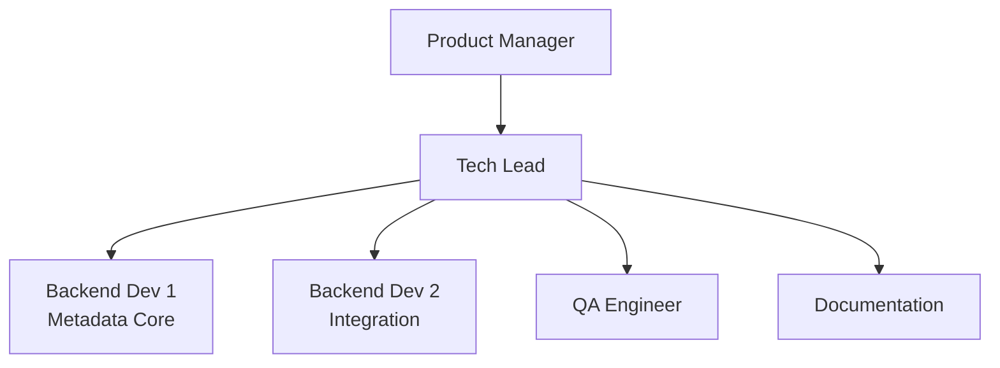
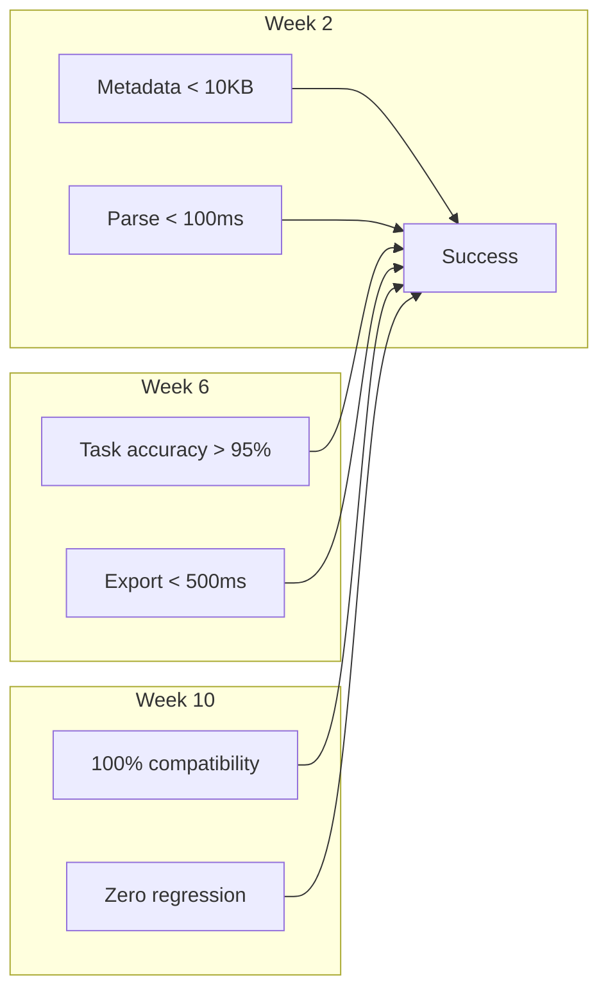

# Self-Contained ONNX Models - Implementation Plan

## Executive Summary

This document outlines the implementation plan for self-contained ONNX models (TEZ-157), organized into clear phases with deliverables, timelines, and success criteria.

## Implementation Phases

### Phase 2.1: Foundation (Week 1-2)

#### Objectives
- Establish metadata infrastructure
- Implement core extraction and embedding capabilities
- Validate approach with proof-of-concept

#### Tasks

| Task | Owner | Duration | Dependencies |
|------|-------|----------|--------------|
| Create metadata package structure | Backend | 2 days | None |
| Implement MetadataExtractor | Backend | 3 days | Package structure |
| Implement ONNXMetadataEmbedder | Backend | 3 days | Package structure |
| Implement ONNXMetadataReader | Backend | 2 days | Package structure |
| Create test harness | QA | 2 days | Core components |
| Validate with bert-tiny | Backend | 1 day | All above |

#### Deliverables
- [ ] `modelexport/conversion/metadata/` package
- [ ] `modelexport/inference/metadata/` package
- [ ] Working prototype with bert-tiny
- [ ] Test coverage > 80%

#### Success Criteria
- Successfully extract complete metadata from 3+ model types
- Embed metadata typically 5-20KB (without vocab)
- Read metadata < 100ms
- All unit tests passing

### Phase 2.2: Standalone Metadata Tool (Week 3-4)

#### Objectives
- Create standalone metadata embedding tool
- Preserve complete configurations without filtering
- Implement compression for large metadata
- Ensure compatibility with any ONNX export method

#### Tasks

| Task | Owner | Duration | Dependencies |
|------|-------|----------|--------------|
| Create metadata CLI | Backend | 2 days | Phase 2.1 |
| Implement embed-metadata command | Backend | 2 days | CLI structure |
| Implement complete config preservation | Backend | 1 day | CLI structure |
| Implement compression | Backend | 2 days | Embedder complete |
| Test with multiple exporters | Backend | 2 days | All above |
| Integration testing | QA | 1 day | All above |

#### Deliverables
- [ ] Standalone `modelexport/metadata/` package
- [ ] CLI command `embed-metadata`
- [ ] Compression for metadata > 10KB
- [ ] Works with HTP, Optimum, torch.onnx exports

#### Success Criteria
- Metadata embedding < 500ms
- Compression ratio > 50% for large configs
- Works with ONNX from any exporter
- Zero dependencies on specific export methods

### Phase 2.3: Processor Reconstruction (Week 5-6)

#### Objectives
- Implement processor reconstruction from metadata
- Create proxy processors for missing components
- Add caching for performance

#### Tasks

| Task | Owner | Duration | Dependencies |
|------|-------|----------|--------------|
| Implement ProcessorReconstructor | Backend | 3 days | Phase 2.1 |
| Create TokenizerProxy | Backend | 2 days | Reconstructor |
| Create ImageProcessorProxy | Backend | 2 days | Reconstructor |
| Implement caching | Backend | 1 day | Proxies complete |
| Test with multiple models | QA | 2 days | All above |

#### Deliverables
- [ ] `processor_reconstruction.py`
- [ ] Proxy processor implementations
- [ ] LRU cache for processors
- [ ] Test coverage for all processor types

#### Success Criteria
- Reconstruct processors for 90% of models
- Proxy processors functional for inference
- Cache hit rate > 80% in typical usage
- < 200ms processor creation time

### Phase 2.4: Pipeline Enhancement (Week 7-8)

#### Objectives
- Implement auto-task detection in pipeline
- Add fallback mechanisms
- Ensure backward compatibility

#### Tasks

| Task | Owner | Duration | Dependencies |
|------|-------|----------|--------------|
| Enhance pipeline() function | Backend | 3 days | Phase 2.3 |
| Implement task detector | Backend | 2 days | Metadata reader |
| Add fallback logic | Backend | 2 days | Task detector |
| Update ONNXAutoModel | Backend | 1 day | All above |
| End-to-end testing | QA | 2 days | All above |

#### Deliverables
- [ ] Enhanced `pipelines.py` with auto-detection
- [ ] `task_detector.py` module
- [ ] Fallback mechanisms for missing metadata
- [ ] End-to-end test suite

#### Success Criteria
- Task detection accuracy > 95%
- Zero regression for Phase 1 models
- Pipeline creation < 300ms
- All integration tests passing

### Phase 2.5: Testing & Documentation (Week 9-10)

#### Objectives
- Comprehensive testing across model architectures
- Performance benchmarking
- Complete documentation

#### Tasks

| Task | Owner | Duration | Dependencies |
|------|-------|----------|--------------|
| Test 20+ model architectures | QA | 3 days | Phase 2.4 |
| Performance benchmarking | QA | 2 days | All features |
| Write user documentation | Docs | 3 days | All features |
| Create migration guide | Docs | 1 day | Documentation |
| Code review | Team | 1 day | All above |

#### Deliverables
- [ ] Test report for 20+ models
- [ ] Performance benchmark report
- [ ] User documentation
- [ ] Migration guide from Phase 1
- [ ] Code review completed

#### Success Criteria
- 100% backward compatibility verified
- Performance targets met
- Documentation complete
- Code review approved

### Phase 2.6: Production Release (Week 11)

#### Objectives
- Final validation
- Gradual rollout
- Monitor adoption

#### Tasks

| Task | Owner | Duration | Dependencies |
|------|-------|----------|--------------|
| Final testing | QA | 1 day | Phase 2.5 |
| Create release notes | Docs | 1 day | Final testing |
| Deploy to staging | DevOps | 1 day | Release notes |
| Gradual production rollout | DevOps | 2 days | Staging success |
| Monitor metrics | DevOps | Ongoing | Rollout |

#### Deliverables
- [ ] Release notes
- [ ] Staged deployment
- [ ] Production deployment
- [ ] Monitoring dashboard

#### Success Criteria
- Zero critical bugs in staging
- < 0.1% error rate in production
- 20% adoption in first week
- Positive user feedback

## Resource Allocation

### Team Structure

### Effort Distribution

| Phase | Backend | QA | Documentation | Total |
|-------|---------|----|--------------| ------|
| 2.1 Foundation | 8 days | 2 days | 0 days | 10 days |
| 2.2 Integration | 9 days | 3 days | 0 days | 12 days |
| 2.3 Reconstruction | 8 days | 2 days | 0 days | 10 days |
| 2.4 Pipeline | 8 days | 2 days | 0 days | 10 days |
| 2.5 Testing | 0 days | 5 days | 4 days | 9 days |
| 2.6 Release | 0 days | 1 day | 1 day | 4 days |
| **Total** | **33 days** | **15 days** | **5 days** | **55 days** |

## Risk Management

### Technical Risks

| Risk | Impact | Probability | Mitigation | Contingency |
|------|--------|-------------|------------|-------------|
| Metadata too large | High | Medium | Tiered embedding, compression | External config files |
| Vocab embedding fails | High | Low | Proxy processors | Reference external vocab |
| Performance degradation | Medium | Low | Caching, lazy loading | Disable auto-detection |
| Compatibility issues | High | Low | Extensive testing | Feature flag rollback |

### Schedule Risks

| Risk | Impact | Probability | Mitigation | Contingency |
|------|--------|-------------|------------|-------------|
| HTP integration complex | Medium | Medium | Early prototype | Extend Phase 2.2 |
| Testing reveals issues | High | Medium | Continuous testing | Buffer time in 2.5 |
| Documentation delays | Low | Low | Start early | Delay non-critical docs |

## Dependencies

### External Dependencies
- ONNX 1.14+ (metadata_props support)
- ONNX Runtime 1.14+
- HuggingFace Transformers 4.0+
- Python 3.8+

### Internal Dependencies
- HTP exporter (existing)
- Phase 1 inference pipeline (existing)
- CLI framework (existing)

## Success Metrics

### Quantitative Metrics

### Qualitative Metrics
- Developer satisfaction with simplified deployment
- Reduced support tickets for configuration issues
- Positive feedback on single-file deployment
- Adoption rate exceeding expectations

## Communication Plan

### Stakeholder Updates
- Weekly progress reports to PM
- Bi-weekly demos to stakeholders
- Daily standups within team
- Slack channel for quick updates

### Documentation Plan
- Technical design docs (complete)
- API documentation (Week 9)
- User guides (Week 9)
- Migration guide (Week 9)
- Release notes (Week 11)

## Testing Strategy

### Test Coverage Goals

| Component | Unit Tests | Integration | E2E | Total |
|-----------|------------|-------------|-----|-------|
| Metadata Discovery | 90% | 80% | 70% | 85% |
| Embedder | 90% | 80% | 70% | 85% |
| Reader | 90% | 80% | 70% | 85% |
| Processor Reconstruction | 85% | 75% | 70% | 80% |
| Pipeline | 85% | 85% | 80% | 83% |
| **Overall** | **88%** | **80%** | **72%** | **84%** |

### Test Environments
- Local development (Python 3.8-3.11)
- CI/CD pipeline (GitHub Actions)
- Staging environment (production-like)
- Production (gradual rollout)

## Rollout Strategy

### Phase 1: Internal Testing (Week 10)
- Deploy to internal staging
- Test with internal models
- Gather feedback from team

### Phase 2: Beta Release (Week 11, Day 1-2)
- Release to 10% of users
- Monitor error rates
- Gather user feedback

### Phase 3: General Availability (Week 11, Day 3-5)
- Gradual rollout to 100%
- Monitor all metrics
- Ready for rollback if needed

## Monitoring Plan

### Key Metrics to Monitor
- Metadata extraction time (target < 500ms)
- Metadata parse time (target < 100ms)
- Task detection accuracy (target > 95%)
- Error rates (target < 0.1%)
- Adoption rate (target 60% in 6 months)

### Monitoring Tools
- Application metrics (Prometheus/Grafana)
- Error tracking (Sentry)
- User analytics (custom telemetry)
- Performance monitoring (APM)

## Conclusion

This implementation plan provides a clear roadmap for delivering self-contained ONNX models with embedded metadata. The phased approach ensures:

1. **Incremental delivery** with clear milestones
2. **Risk mitigation** through continuous testing
3. **Quality assurance** through comprehensive testing
4. **Smooth rollout** through gradual deployment

The plan balances technical excellence with practical delivery timelines, ensuring we deliver a transformative feature that simplifies ML model deployment.