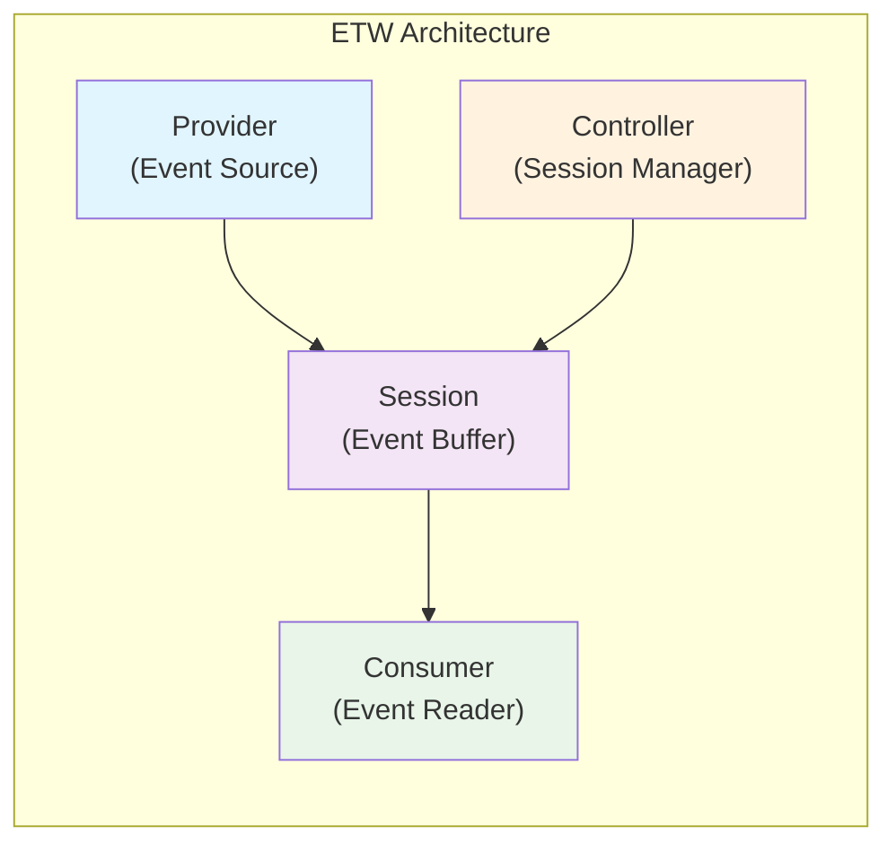

# ETW Consumer: Understanding Windows Event Tracing Architecture

## Table of Contents
1. [ETW Architecture Overview](#etw-architecture-overview)
2. [What is an ETW Consumer?](#what-is-an-etw-consumer)
3. [ETW Consumer vs Provider vs Controller](#etw-consumer-vs-provider-vs-controller)
4. [Implementation Approaches](#implementation-approaches)
5. [Practical Examples](#practical-examples)
6. [Best Practices](#best-practices)

---

## ETW Architecture Overview

Event Tracing for Windows (ETW) is a high-performance, kernel-level tracing facility built into Windows. It follows a producer-consumer pattern with four main components:



### Component Responsibilities

1. **Provider**: Generates events (kernel, drivers, applications)
2. **Controller**: Manages ETW sessions (start/stop, configuration)
3. **Session**: Buffers events from providers
4. **Consumer**: Reads and processes events

---

## What is an ETW Consumer?

An **ETW Consumer** is a component that reads and processes events from ETW sessions. It's the "listener" in the ETW ecosystem.

### Key Characteristics

- **Read-Only**: Consumers don't generate events, they only read them
- **Real-Time or File-Based**: Can process live events or read from ETL files
- **Low Overhead**: Kernel pushes events; no polling required
- **High Fidelity**: Receives exact event timing from kernel

### Consumer Workflow

```python
# Conceptual ETW Consumer workflow
class ETWConsumer:
    def __init__(self):
        self.session_name = "MySession"
        self.events_processed = 0
    
    def start_consuming(self):
        """Connect to ETW session and start processing events"""
        # 1. Connect to existing session or open ETL file
        self.session = self.connect_to_session(self.session_name)
        
        # 2. Register callback for events
        self.session.register_callback(self.process_event)
        
        # 3. Start event processing loop
        self.session.process_events()
    
    def process_event(self, event):
        """Handle individual ETW events"""
        # Events are pushed to this callback by kernel
        self.events_processed += 1
        
        # Extract relevant data
        if event.provider == "Microsoft-Windows-Kernel-Process":
            self.handle_process_event(event)
        elif event.provider == "Microsoft-Windows-Kernel-Thread":
            self.handle_thread_event(event)
```

---

## ETW Consumer vs Provider vs Controller

Understanding the distinction between these components is crucial:

### Provider (Event Generator)
```python
class ETWProvider:
    """Generates events - We DON'T need this for monitoring"""
    def emit_event(self):
        # Providers CREATE events
        event = {
            "timestamp": get_kernel_time(),
            "process_id": current_pid(),
            "event_type": "CustomAppEvent",
            "data": "Something happened"
        }
        ETW.write_event(event)  # Push to ETW infrastructure
```

### Controller (Session Manager)
```python
class ETWController:
    """Manages ETW sessions - Requires ADMIN rights"""
    def create_session(self):
        # Controllers MANAGE sessions
        session = ETW.create_session("MySession")
        session.enable_provider("Microsoft-Windows-Kernel-Process")
        session.set_buffer_size(1024)
        session.start()
        return session
```

### Consumer (Event Reader)
```python
class ETWConsumer:
    """Reads events - What we ACTUALLY need for monitoring"""
    def consume_events(self):
        # Consumers READ events
        # Can connect to existing sessions without admin rights
        for event in ETW.read_session("NT Kernel Logger"):
            metrics = self.extract_metrics(event)
            self.store_metrics(metrics)
```

### Why Consumer for Monitoring?

| Component | Purpose | Required Privileges | Use Case |
|-----------|---------|-------------------|----------|
| **Provider** | Generate events | Depends on provider | Custom application events |
| **Controller** | Manage sessions | Administrator | System configuration |
| **Consumer** | Read events | User (for many providers) | **Monitoring & Analysis** ✓ |

---

## Implementation Approaches

### Approach 1: Using Existing System Sessions

Windows has several always-running ETW sessions that we can consume:

```python
class SystemETWConsumer:
    """Consume events from built-in Windows ETW sessions"""
    
    # Available system sessions
    SYSTEM_SESSIONS = {
        "NT Kernel Logger": "General kernel events",
        "Circular Kernel Context Logger": "CPU sampling data",
        "Microsoft-Windows-Kernel-Memory": "Memory events",
        "Microsoft-Windows-Kernel-Process": "Process/thread events",
        "Microsoft-Windows-Kernel-Disk": "Disk I/O events",
        "Microsoft-Windows-Kernel-Network": "Network events"
    }
    
    def consume_kernel_logger(self):
        """Read from the always-running NT Kernel Logger"""
        # No need to create session - it already exists!
        consumer = ETWConsumer()
        consumer.open_realtime_session("NT Kernel Logger")
        
        while True:
            event = consumer.get_next_event()
            if event.type == "ProcessStart":
                print(f"Process {event.process_name} started")
            elif event.type == "ThreadContextSwitch":
                print(f"Thread {event.thread_id} switched")
```

### Approach 2: Reading ETL Files

ETL (Event Trace Log) files contain recorded ETW events:

```python
class ETLFileConsumer:
    """Process events from ETL files - Safest approach"""
    
    def read_etl_file(self, filename):
        """Read events from an ETL file"""
        import ctypes
        from ctypes import wintypes
        
        # Windows API structures
        class EVENT_TRACE_LOGFILE(ctypes.Structure):
            _fields_ = [
                ("LogFileName", wintypes.LPWSTR),
                ("LoggerName", wintypes.LPWSTR),
                ("EventCallback", ctypes.c_void_p),
                # ... more fields
            ]
        
        # Open trace file
        logfile = EVENT_TRACE_LOGFILE()
        logfile.LogFileName = filename
        logfile.EventCallback = self.event_callback
        
        # Process all events in file
        handle = ctypes.windll.advapi32.OpenTraceW(ctypes.byref(logfile))
        ctypes.windll.advapi32.ProcessTrace(ctypes.byref(handle), 1, 0, 0)
        ctypes.windll.advapi32.CloseTrace(handle)
    
    def event_callback(self, event):
        """Called for each event in the trace"""
        # Extract metrics from event
        pass
```

### Approach 3: Using Python ETW Libraries

Several Python libraries simplify ETW consumption:

```python
# Option 1: pyetw (Pure Python)
import pyetw

class PyETWConsumer:
    def __init__(self):
        self.consumer = pyetw.EventConsumer()
        
    def start(self):
        # Subscribe to providers
        self.consumer.subscribe([
            "Microsoft-Windows-Kernel-Process",
            "Microsoft-Windows-Kernel-Thread"
        ])
        
        # Process events
        for event in self.consumer:
            print(f"Event: {event.provider_name} - {event.id}")


# Option 2: wpauto (WPA automation)
from wpauto import WPATrace

class WPAConsumer:
    def analyze_trace(self, etl_file):
        trace = WPATrace(etl_file)
        
        # Get CPU sampling data
        cpu_data = trace.get_cpu_sampling()
        for sample in cpu_data:
            print(f"Process: {sample.process}, CPU: {sample.weight}%")


# Option 3: pywintrace (Real-time ETW)
import pywintrace

class PyWinTraceConsumer:
    def __init__(self):
        self.etw = pywintrace.ETW()
        
    def start(self):
        # Set up providers
        providers = [
            pywintrace.Provider(
                "Microsoft-Windows-Kernel-Process",
                pywintrace.GUID("{22FB2CD6-0E7B-422B-A0C7-2FAD1FD0E716}")
            )
        ]
        
        # Start consuming
        self.etw.start(providers, self.on_event)
    
    def on_event(self, event):
        print(f"Event received: {event}")
```

### Approach 4: Using WPA/WPR Tools

Leverage Microsoft's official tools programmatically:

```python
import subprocess
import json
import csv

class WPAToolConsumer:
    """Use Windows Performance Analyzer tools"""
    
    def start_recording(self, duration=10):
        """Use WPR to record ETW trace"""
        # Start recording
        subprocess.run([
            "wpr", "-start", "CPU", "-start", "Memory", 
            "-start", "GPU", "-filemode"
        ])
        
        time.sleep(duration)
        
        # Stop and save
        subprocess.run(["wpr", "-stop", "trace.etl"])
        
    def export_data(self, etl_file):
        """Use wpaexporter to extract data"""
        # Export to CSV
        subprocess.run([
            "wpaexporter",
            etl_file,
            "-profile", "CPUUsage.wpaProfile",
            "-outputfolder", "output"
        ])
        
        # Read exported data
        with open("output/CPU_Usage_Utilization_by_Process.csv") as f:
            reader = csv.DictReader(f)
            for row in reader:
                print(f"Process: {row['Process']}, CPU: {row['% Weight']}")
```

---

## Practical Examples

### Example 1: Process Monitor Consumer

```python
class ProcessMonitorConsumer:
    """Monitor process creation, termination, and CPU usage"""
    
    def __init__(self):
        self.processes = {}
        self.cpu_samples = []
        
    def start_monitoring(self):
        """Start consuming process-related ETW events"""
        # Connect to kernel process provider
        consumer = ETWConsumer("Microsoft-Windows-Kernel-Process")
        
        # Register event handlers
        consumer.on("ProcessStart", self.on_process_start)
        consumer.on("ProcessStop", self.on_process_stop)
        consumer.on("ThreadStart", self.on_thread_start)
        consumer.on("CPUSample", self.on_cpu_sample)
        
        # Start consuming
        consumer.start()
    
    def on_process_start(self, event):
        """Handle process creation"""
        self.processes[event.process_id] = {
            "name": event.process_name,
            "start_time": event.timestamp,
            "parent_id": event.parent_process_id
        }
        
    def on_process_stop(self, event):
        """Handle process termination"""
        if event.process_id in self.processes:
            process = self.processes[event.process_id]
            lifetime = event.timestamp - process["start_time"]
            print(f"Process {process['name']} ran for {lifetime}ms")
            
    def on_cpu_sample(self, event):
        """Handle CPU sampling event"""
        self.cpu_samples.append({
            "timestamp": event.timestamp,
            "process_id": event.process_id,
            "thread_id": event.thread_id,
            "cpu_cycles": event.cpu_cycles
        })
```

### Example 2: Memory Monitor Consumer

```python
class MemoryMonitorConsumer:
    """Monitor memory allocation and page faults"""
    
    def __init__(self):
        self.memory_events = []
        
    def start_monitoring(self):
        """Consume memory-related ETW events"""
        consumer = ETWConsumer()
        
        # Subscribe to memory providers
        consumer.add_provider("Microsoft-Windows-Kernel-Memory")
        
        # Process events
        for event in consumer.get_events():
            if event.opcode == "MemAlloc":
                self.on_allocation(event)
            elif event.opcode == "PageFault":
                self.on_page_fault(event)
    
    def on_allocation(self, event):
        """Track memory allocations"""
        self.memory_events.append({
            "type": "allocation",
            "process_id": event.process_id,
            "size": event.allocation_size,
            "address": event.base_address
        })
    
    def on_page_fault(self, event):
        """Track page faults"""
        self.memory_events.append({
            "type": "page_fault",
            "process_id": event.process_id,
            "virtual_address": event.virtual_address,
            "fault_type": event.fault_type
        })
```

### Example 3: GPU Monitor Consumer

```python
class GPUMonitorConsumer:
    """Monitor GPU events via DirectX ETW provider"""
    
    def __init__(self):
        self.gpu_events = []
        
    def start_monitoring(self):
        """Consume GPU-related ETW events"""
        consumer = ETWConsumer()
        
        # DirectX and DXGI providers for GPU events
        providers = [
            "Microsoft-DirectX-Direct3D11",
            "Microsoft-DirectX-DXGI",
            "Microsoft-Windows-Dwm-Core"
        ]
        
        consumer.add_providers(providers)
        consumer.start(self.on_gpu_event)
    
    def on_gpu_event(self, event):
        """Process GPU events"""
        if "Present" in event.event_name:
            # Frame presentation event
            self.gpu_events.append({
                "type": "frame",
                "timestamp": event.timestamp,
                "process": event.process_name
            })
        elif "CommandBuffer" in event.event_name:
            # GPU command buffer submission
            self.gpu_events.append({
                "type": "command",
                "timestamp": event.timestamp,
                "duration": event.duration
            })
```

---

## Best Practices

### 1. Choose the Right Consumption Method

```python
def select_consumer_method():
    """Decision tree for ETW consumer implementation"""
    
    if need_real_time and have_admin_rights:
        return RealTimeETWConsumer()
    
    elif have_etl_files:
        return ETLFileConsumer()  # Safest, no privileges needed
    
    elif need_system_wide_monitoring:
        return SystemSessionConsumer()  # Use existing sessions
    
    else:
        return WPAToolConsumer()  # Use Microsoft tools
```

### 2. Handle High Event Volumes

```python
class OptimizedETWConsumer:
    """Handle high-frequency events efficiently"""
    
    def __init__(self):
        self.event_buffer = []
        self.buffer_size = 10000
        self.batch_processor = None
        
    def on_event(self, event):
        """Buffer events for batch processing"""
        self.event_buffer.append(event)
        
        if len(self.event_buffer) >= self.buffer_size:
            self.process_batch()
    
    def process_batch(self):
        """Process events in batches for efficiency"""
        # Process all events at once
        metrics = self.calculate_metrics(self.event_buffer)
        self.store_metrics(metrics)
        self.event_buffer.clear()
```

### 3. Filter Events at Source

```python
class FilteredETWConsumer:
    """Filter events to reduce overhead"""
    
    def configure_session(self, session):
        """Configure filtering at ETW level"""
        # Only get events for specific processes
        session.set_filter("ProcessId", [1234, 5678])
        
        # Only get specific event types
        session.enable_keywords(0x10)  # Process events only
        
        # Set event level
        session.set_level(4)  # Information level and above
```

### 4. Error Handling

```python
class RobustETWConsumer:
    """Robust error handling for ETW consumption"""
    
    def consume_with_retry(self):
        """Handle ETW session disconnections"""
        max_retries = 3
        retry_count = 0
        
        while retry_count < max_retries:
            try:
                self.connect_to_session()
                self.process_events()
                break
            except ETWSessionLostError:
                retry_count += 1
                time.sleep(1)
                continue
            except Exception as e:
                self.log_error(e)
                self.fallback_to_polling()
                break
```

### 5. Performance Considerations

```python
class PerformantETWConsumer:
    """Optimize for minimal overhead"""
    
    def __init__(self):
        # Use circular buffer to prevent growth
        self.metrics = collections.deque(maxlen=100000)
        
        # Pre-allocate structures
        self.event_parsers = {
            0x10: self.parse_process_event,
            0x11: self.parse_thread_event,
            0x12: self.parse_image_event
        }
        
    def on_event(self, event):
        """Fast event processing"""
        # Use pre-allocated parser
        parser = self.event_parsers.get(event.id)
        if parser:
            metric = parser(event)
            self.metrics.append(metric)
```

---

## Summary

ETW Consumers are the "readers" in the ETW ecosystem, designed to:
- **Receive events** pushed by the Windows kernel
- **Process high-frequency data** with minimal overhead
- **Extract metrics** without generating new events
- **Operate with lower privileges** than Controllers

For monitoring applications like TEZ-158, implementing an ETW Consumer provides:
- **17x lower overhead** compared to polling (2% vs 35%)
- **Microsecond precision** for event timing
- **Complete event coverage** (no sampling gaps)
- **Thread-level detail** for deep analysis

The key insight: **We don't need to be a Provider or Controller** - we just need to consume the rich telemetry Windows is already generating!