# ETW Monitor Design Document

## Overview

True Event Tracing for Windows (ETW) implementation for low-overhead, kernel-level process monitoring on Windows platforms.

## Architecture

```mermaid
flowchart TB
    subgraph "ETW Monitor Architecture"
        subgraph "ETW Core"
            Controller["ETW Controller<br/>Session Management"]
            Consumer["ETW Consumer<br/>Event Processing"]
            Buffer["Event Buffer<br/>Circular Queue"]
        end
        
        subgraph "Event Providers"
            KernelProcess["Kernel-Process<br/>Process/Thread Events"]
            KernelCPU["Kernel-CPU<br/>CPU Sampling"]
            KernelMemory["Kernel-Memory<br/>Memory Events"]
            KernelDisk["Kernel-Disk<br/>I/O Events"]
        end
        
        subgraph "Data Processing"
            Parser["Event Parser<br/>Binary → Structured"]
            Aggregator["Metric Aggregator<br/>Per-Process Stats"]
            Sampler["Adaptive Sampler<br/>Rate Control"]
        end
        
        subgraph "Output"
            Metrics["Metric Samples<br/>Structured Data"]
            Callbacks["Real-time Callbacks<br/>Push Updates"]
        end
    end
    
    KernelProcess --> Buffer
    KernelCPU --> Buffer
    KernelMemory --> Buffer
    KernelDisk --> Buffer
    
    Controller --> Buffer
    Buffer --> Consumer
    Consumer --> Parser
    Parser --> Aggregator
    Aggregator --> Sampler
    Sampler --> Metrics
    Sampler --> Callbacks
    
    style Controller fill:#f9f,stroke:#333,stroke-width:2px
    style Consumer fill:#9f9,stroke:#333,stroke-width:2px
    style Metrics fill:#99f,stroke:#333,stroke-width:2px
```



## Core Metrics

### 1. Process Metrics (High Priority)
```yaml
process_metrics:
  - pid: Process ID
  - name: Process name
  - parent_pid: Parent process ID
  - session_id: Windows session ID
  - create_time: Process creation timestamp
  - exit_time: Process termination timestamp (if applicable)
  - exit_code: Process exit code
  - command_line: Full command line
```

### 2. CPU Metrics (Critical)
```yaml
cpu_metrics:
  - cpu_percent: CPU utilization percentage
  - cpu_cycles: Exact CPU cycles consumed
  - kernel_time: Time spent in kernel mode (ms)
  - user_time: Time spent in user mode (ms)
  - context_switches: Number of context switches
  - priority: Process priority level
  - affinity_mask: CPU affinity settings
```

### 3. Memory Metrics (Critical)
```yaml
memory_metrics:
  - working_set_size: Working set in bytes
  - private_bytes: Private memory in bytes
  - virtual_bytes: Virtual memory in bytes
  - page_faults: Number of page faults
  - hard_faults: Number of hard page faults
  - peak_working_set: Peak working set size
  - paged_pool: Paged pool usage
  - non_paged_pool: Non-paged pool usage
```

### 4. Thread Metrics (Important)
```yaml
thread_metrics:
  - thread_count: Number of threads
  - thread_ids: List of thread IDs
  - active_threads: Number of active threads
  - suspended_threads: Number of suspended threads
  - thread_cpu_cycles: Per-thread CPU cycles
  - thread_states: Thread state distribution
```

### 5. I/O Metrics (Important)
```yaml
io_metrics:
  - read_operations: Number of read operations
  - write_operations: Number of write operations
  - other_operations: Other I/O operations
  - read_bytes: Total bytes read
  - write_bytes: Total bytes written
  - io_priority: I/O priority level
```

### 6. Handle & Object Metrics (Nice to Have)
```yaml
handle_metrics:
  - handle_count: Number of handles
  - gdi_objects: GDI object count
  - user_objects: USER object count
  - peak_handle_count: Peak handle count
```

## ETW Session Configuration

```python
ETW_SESSION_CONFIG = {
    # Session properties
    "session_name": "OnnxInferenceMonitor",
    "buffer_size": 64,  # KB per buffer
    "min_buffers": 4,
    "max_buffers": 64,
    "flush_timer": 1,  # seconds
    
    # Kernel providers to enable
    "kernel_flags": [
        "EVENT_TRACE_FLAG_PROCESS",     # Process events
        "EVENT_TRACE_FLAG_THREAD",      # Thread events  
        "EVENT_TRACE_FLAG_IMAGE_LOAD",  # DLL/Image loads
        "EVENT_TRACE_FLAG_DISK_IO",     # Disk I/O
        "EVENT_TRACE_FLAG_MEMORY_PAGE", # Memory paging
        "EVENT_TRACE_FLAG_PROFILE",     # CPU sampling
        "EVENT_TRACE_FLAG_CSWITCH",     # Context switches
    ],
    
    # Sampling configuration
    "cpu_sampling_interval": 1000,  # CPU samples per second
    "stack_walk_enabled": False,    # Enable stack walking (high overhead)
    
    # Filtering
    "process_filter": {
        "include_pids": None,        # List of PIDs to include
        "exclude_pids": [0, 4],      # System and Idle process
        "include_names": None,       # Process names to include
        "exclude_names": ["System", "Idle", "Registry"]
    }
}
```

## Implementation Strategy

### Phase 1: Basic ETW Consumer (Immediate)
```python
class BasicETWConsumer:
    """
    Consume events from existing Windows ETW sessions
    - No admin rights required for many providers
    - Use NT Kernel Logger session
    - Read Process and Thread events
    """
    
    def connect_to_kernel_session(self):
        # Connect to existing kernel session
        pass
    
    def process_events(self):
        # Process incoming events
        pass
```

### Phase 2: Custom ETW Session (Week 1-2)
```python
class CustomETWSession:
    """
    Create custom ETW session for targeted monitoring
    - Requires admin rights
    - Custom buffer configuration
    - Selective provider enablement
    """
    
    def create_session(self):
        # Create new ETW session
        pass
    
    def enable_providers(self):
        # Enable specific providers
        pass
```

### Phase 3: Advanced Features (Week 3-4)
```python
class AdvancedETWMonitor:
    """
    Advanced ETW features
    - Stack walking for call stacks
    - Kernel object tracking
    - Custom event correlation
    """
    
    def enable_stack_walking(self):
        # Enable stack traces
        pass
    
    def correlate_events(self):
        # Correlate related events
        pass
```

## Performance Characteristics

### Expected Overhead
```yaml
overhead_analysis:
  10Hz_sampling:
    cpu_overhead: "< 0.5%"
    memory_overhead: "< 10MB"
    
  100Hz_sampling:
    cpu_overhead: "< 2%"
    memory_overhead: "< 20MB"
    
  1000Hz_sampling:
    cpu_overhead: "< 5%"
    memory_overhead: "< 50MB"
```

### Comparison with PSUtil
```mermaid
xychart-beta
    title "Overhead Comparison: PSUtil vs ETW"
    x-axis ["10Hz", "50Hz", "100Hz", "500Hz", "1000Hz"]
    y-axis "CPU Overhead %" 0 --> 40
    bar [4, 18, 35, "N/A", "N/A"]
    bar [0.5, 1, 2, 3, 5]
```

## API Design

### Public Interface
```python
class ETWMonitor(BaseMonitor):
    """Windows ETW-based process monitor"""
    
    def __init__(self, config: ETWMonitorConfig):
        """Initialize ETW monitor with configuration"""
        
    def start_monitoring(self) -> None:
        """Start ETW session and begin event collection"""
        
    def stop_monitoring(self) -> None:
        """Stop ETW session and cleanup resources"""
        
    def collect_metrics(self) -> List[MetricSample]:
        """Collect current metrics from ETW events"""
        
    def get_process_metrics(self, pid: int) -> ProcessMetrics:
        """Get detailed metrics for specific process"""
        
    def set_kernel_flags(self, flags: List[str]) -> None:
        """Configure which kernel events to capture"""
        
    def enable_stack_walking(self, enable: bool) -> None:
        """Enable/disable stack trace collection"""
```

### Configuration
```python
@dataclass
class ETWMonitorConfig(MonitorConfig):
    """ETW Monitor configuration"""
    
    # Session configuration
    session_name: str = "OnnxInferenceMonitor"
    buffer_size_kb: int = 64
    min_buffers: int = 4
    max_buffers: int = 64
    
    # Kernel providers
    enable_process_events: bool = True
    enable_thread_events: bool = True
    enable_cpu_sampling: bool = True
    enable_memory_events: bool = True
    enable_disk_io: bool = False
    enable_context_switch: bool = True
    
    # Performance settings
    cpu_sampling_interval: int = 1000  # Samples per second
    enable_stack_walking: bool = False
    
    # Filtering
    target_processes: Optional[Set[int]] = None
    target_process_names: Optional[Set[str]] = None
    exclude_system_processes: bool = True
```

## Error Handling

```python
class ETWError(Exception):
    """Base ETW error"""
    pass

class ETWSessionError(ETWError):
    """ETW session creation/management error"""
    pass

class ETWAccessDeniedError(ETWError):
    """Insufficient privileges for ETW operation"""
    pass

class ETWProviderError(ETWError):
    """ETW provider enable/disable error"""
    pass
```

## Testing Strategy

### Unit Tests
- Mock ETW events for testing
- Verify event parsing logic
- Test metric aggregation

### Integration Tests
- Test with real ETW sessions
- Verify low overhead claims
- Compare with PSUtil accuracy

### Performance Tests
- Measure actual overhead at various rates
- Stress test with many processes
- Long-running stability tests

## Security Considerations

1. **Privilege Requirements**
   - Reading some events requires admin rights
   - Custom sessions always require admin
   - Use least privilege principle

2. **Data Sensitivity**
   - ETW can expose sensitive process information
   - Filter command lines and environment variables
   - Don't log user data

3. **Resource Limits**
   - Implement buffer size limits
   - Add event rate limiting
   - Monitor memory usage

## Migration Path from PSUtil


## Success Criteria

1. **Performance**: < 2% CPU overhead at 100Hz
2. **Accuracy**: Exact kernel-level metrics
3. **Coverage**: All process/thread events captured
4. **Reliability**: No missed events
5. **Compatibility**: Windows 10+ support