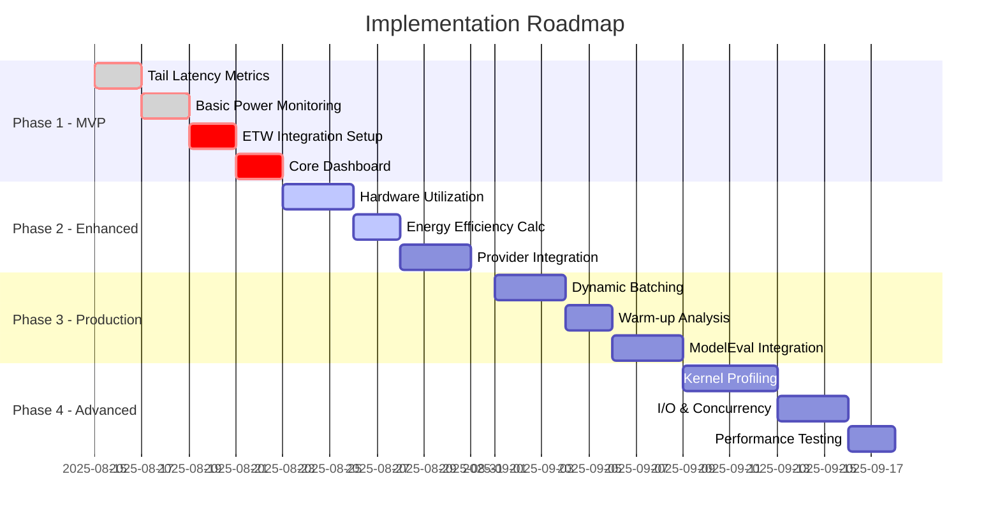
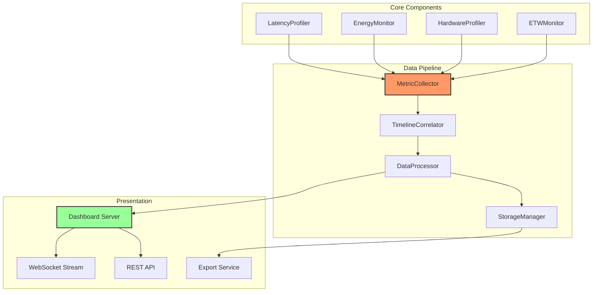

# ONNX Runtime Inference Profiling - Implementation Plan

**Project ID**: TEZ-158  
**Document Version**: 1.0  
**Date**: 2025-08-14  
**Status**: Ready for Development

## Executive Summary

This implementation plan outlines the development roadmap for the ONNX Runtime Inference Profiling system. Based on comprehensive requirements analysis and industry gap assessment, we've identified a phased approach that delivers critical MVP features in Weeks 1-2, followed by progressive enhancements to achieve industry-leading capabilities by Week 8.

## Development Phases Overview



## Phase 1: MVP Critical Features (Weeks 1-2)

### Sprint 1.1: Tail Latency Implementation (2 days)

#### Objectives
- Implement percentile tracking (P50, P90, P95, P99, P99.9)
- Add jitter and stability metrics
- Create latency distribution histograms

#### Implementation Tasks

```python
# File: modeleval/profiling/latency_tracker.py
from collections import deque
from dataclasses import dataclass
from typing import Dict, Optional
import numpy as np

@dataclass
class LatencyMetrics:
    """Complete latency metrics including percentiles"""
    p50: float
    p90: float
    p95: float
    p99: float
    p99_9: float
    mean: float
    std: float  # jitter
    min: float
    max: float
    samples: int

class LatencyProfiler:
    """High-performance latency profiler with percentile tracking"""
    
    def __init__(self, window_size: int = 10000):
        self.window_size = window_size
        self.latencies = deque(maxlen=window_size)
        self.histogram_bins = np.logspace(-1, 3, 50)  # 0.1ms to 1000ms
        
    def record(self, latency_ms: float) -> None:
        """Record a single inference latency"""
        self.latencies.append(latency_ms)
        
    def get_metrics(self) -> Optional[LatencyMetrics]:
        """Calculate current latency metrics"""
        if len(self.latencies) < 100:
            return None
            
        arr = np.array(self.latencies)
        return LatencyMetrics(
            p50=np.percentile(arr, 50),
            p90=np.percentile(arr, 90),
            p95=np.percentile(arr, 95),
            p99=np.percentile(arr, 99),
            p99_9=np.percentile(arr, 99.9),
            mean=np.mean(arr),
            std=np.std(arr),
            min=np.min(arr),
            max=np.max(arr),
            samples=len(arr)
        )
```

#### Deliverables
- [ ] LatencyProfiler class implementation
- [ ] Unit tests with >90% coverage
- [ ] Integration with existing monitoring
- [ ] Dashboard widget for percentile display

### Sprint 1.2: Basic Power Monitoring (2 days)

#### Objectives
- Implement Windows power monitoring via WMI
- Add GPU power tracking via pynvml
- Calculate basic efficiency metrics

#### Implementation Tasks

```python
# File: modeleval/profiling/energy_monitor.py
import wmi
import pynvml
from typing import Dict, Optional
from dataclasses import dataclass

@dataclass
class PowerMetrics:
    """System-wide power consumption metrics"""
    cpu_power_w: float
    gpu_power_w: float
    system_power_w: float
    temperature_c: float
    thermal_throttle: bool

class EnergyMonitor:
    """Cross-platform energy monitoring"""
    
    def __init__(self):
        self.wmi_client = None
        self.gpu_handle = None
        self._init_monitors()
        
    def _init_monitors(self):
        """Initialize platform-specific monitors"""
        # Windows WMI
        try:
            self.wmi_client = wmi.WMI(namespace="root\\OpenHardwareMonitor")
        except:
            pass
            
        # NVIDIA GPU
        try:
            pynvml.nvmlInit()
            self.gpu_handle = pynvml.nvmlDeviceGetHandleByIndex(0)
        except:
            pass
            
    def get_power_metrics(self) -> PowerMetrics:
        """Get current power consumption"""
        metrics = PowerMetrics(
            cpu_power_w=self._get_cpu_power(),
            gpu_power_w=self._get_gpu_power(),
            system_power_w=self._get_system_power(),
            temperature_c=self._get_temperature(),
            thermal_throttle=self._check_throttling()
        )
        return metrics
        
    def calculate_efficiency(self, throughput: float, power: float) -> Dict:
        """Calculate efficiency metrics"""
        return {
            'inferences_per_watt': throughput / power if power > 0 else 0,
            'watts_per_inference': power / throughput if throughput > 0 else 0,
            'efficiency_score': self._calculate_efficiency_score(throughput, power)
        }
```

#### Deliverables
- [ ] EnergyMonitor class implementation
- [ ] Platform-specific power reading adapters
- [ ] Efficiency calculation methods
- [ ] Real-time power dashboard widget

### Sprint 1.3: ETW Integration Setup (2 days)

#### Objectives
- Implement pythonnet bridge to TraceEvent
- Create ETW session management
- Set up event parsing pipeline

#### Implementation Tasks

```python
# File: modeleval/profiling/etw_integration.py
import clr
import sys
from typing import Callable, Dict, Any
from dataclasses import dataclass

# Load .NET assemblies
sys.path.append(r"C:\path\to\TraceEvent")
clr.AddReference("Microsoft.Diagnostics.Tracing.TraceEvent")

from Microsoft.Diagnostics.Tracing import TraceEventSession
from Microsoft.Diagnostics.Tracing.Parsers import KernelTraceEventParser

class ETWMonitor:
    """Modern ETW integration using TraceEvent"""
    
    def __init__(self, session_name: str = "ONNXProfiler"):
        self.session_name = session_name
        self.session = None
        self.callbacks = {}
        
    def start_monitoring(self):
        """Start ETW monitoring session"""
        self.session = TraceEventSession(self.session_name)
        
        # Enable kernel events
        self.session.EnableKernelProvider(
            KernelTraceEventParser.Keywords.Process |
            KernelTraceEventParser.Keywords.Thread |
            KernelTraceEventParser.Keywords.Memory
        )
        
        # Set up event handlers
        kernel = self.session.Source.Kernel
        kernel.ProcessStart += self._on_process_event
        kernel.MemoryAlloc += self._on_memory_event
        
        # Start processing in background
        self.session.Source.Process()
        
    def register_callback(self, event_type: str, callback: Callable):
        """Register custom event callback"""
        self.callbacks[event_type] = callback
```

#### Deliverables
- [ ] ETW session management implementation
- [ ] Event parsing and callback system
- [ ] Integration with profiling pipeline
- [ ] Documentation for ETW setup

### Sprint 1.4: Core Dashboard (2 days)

#### Objectives
- Create real-time monitoring dashboard
- Implement WebSocket streaming
- Add interactive visualizations

#### Implementation Tasks

```python
# File: modeleval/dashboard/app.py
from fastapi import FastAPI, WebSocket
from fastapi.staticfiles import StaticFiles
import asyncio
import json
from typing import Dict, Any

class ProfilingDashboard:
    """Real-time profiling dashboard server"""
    
    def __init__(self):
        self.app = FastAPI()
        self.clients = []
        self.metrics_queue = asyncio.Queue()
        self._setup_routes()
        
    def _setup_routes(self):
        """Configure API endpoints and WebSocket"""
        
        @self.app.websocket("/ws/metrics")
        async def websocket_endpoint(websocket: WebSocket):
            await websocket.accept()
            self.clients.append(websocket)
            try:
                while True:
                    # Send metrics to client
                    if not self.metrics_queue.empty():
                        metrics = await self.metrics_queue.get()
                        await websocket.send_json(metrics)
                    await asyncio.sleep(0.1)  # 10Hz update
            except:
                self.clients.remove(websocket)
                
        @self.app.get("/api/metrics/current")
        async def get_current_metrics():
            return self.get_latest_metrics()
            
        @self.app.get("/api/metrics/history")
        async def get_metric_history(duration: int = 3600):
            return self.get_historical_metrics(duration)
```

#### Deliverables
- [ ] FastAPI dashboard server
- [ ] WebSocket real-time streaming
- [ ] REST API endpoints
- [ ] Frontend dashboard UI

## Phase 2: Enhanced Monitoring (Weeks 3-4)

### Sprint 2.1: Hardware Utilization Details (3 days)

#### Key Metrics
- GPU SM occupancy and efficiency
- Tensor Core utilization
- Cache hit rates (L1/L2/L3)
- Memory bandwidth utilization
- Vectorization efficiency

#### Implementation Approach
```python
# Enhanced hardware monitoring
class HardwareProfiler:
    def get_gpu_details(self):
        return {
            'sm_occupancy': self._get_sm_occupancy(),
            'tensor_cores': self._get_tensor_utilization(),
            'cache_rates': self._get_cache_metrics(),
            'memory_bandwidth': self._get_bandwidth_usage()
        }
```

### Sprint 2.2: Energy Efficiency Calculations (2 days)

#### Key Metrics
- FLOPS per Watt
- Thermal monitoring
- Carbon footprint estimation
- Performance per dollar

### Sprint 2.3: Provider Integration (3 days)

#### Providers to Support
- CUDA (via pynvml and cupti)
- DirectML (via WMI)
- QNN (via Qualcomm APIs)
- CPU (via performance counters)

## Phase 3: Production Features (Weeks 5-6)

### Sprint 3.1: Dynamic Batching Metrics (3 days)

#### Key Features
- Queue depth monitoring
- Padding overhead analysis
- Optimal batch size detection
- Batch formation latency

### Sprint 3.2: Warm-up Analysis (2 days)

#### Key Features
- Cold start penalty measurement
- JIT compilation time tracking
- Cache priming analysis
- Steady-state detection

### Sprint 3.3: ModelEval Integration (3 days)

#### Integration Points
- Metric name standardization
- Data format compatibility
- UI component integration
- API endpoint alignment

## Phase 4: Advanced Profiling (Weeks 7-8)

### Sprint 4.1: Kernel-Level Profiling (4 days)

#### Key Features
- Individual operation timing
- Kernel fusion effectiveness
- Arithmetic intensity analysis
- Register/shared memory usage

### Sprint 4.2: I/O & Concurrency (3 days)

#### Key Features
- PCIe bandwidth monitoring
- DMA efficiency tracking
- Request queuing analysis
- Concurrent execution patterns

### Sprint 4.3: Performance Testing (2 days)

#### Testing Suite
- Benchmark validation
- Regression testing
- Stress testing
- Provider compatibility

## Technical Architecture



## Development Standards

### Code Quality
- **Testing**: Minimum 80% code coverage
- **Documentation**: All public APIs documented
- **Linting**: Ruff/Black formatting enforced
- **Type Hints**: Full type annotations required

### Performance Requirements
- **Monitoring Overhead**: < 1ms per inference
- **Dashboard Updates**: 10Hz minimum
- **Memory Usage**: < 100MB for monitoring
- **Startup Time**: < 2 seconds

### Security Requirements
- **No Model Data**: Never log weights or activations
- **Input Sanitization**: All user inputs validated
- **Local Storage**: Default to local-only metrics
- **API Security**: Token-based authentication

## Testing Strategy

### Unit Testing (Per Sprint)
```python
# Example test structure
class TestLatencyProfiler:
    def test_percentile_calculation(self):
        profiler = LatencyProfiler()
        # Add known latencies
        for latency in [1, 2, 3, 4, 5]:
            profiler.record(latency)
        metrics = profiler.get_metrics()
        assert metrics.p50 == 3.0
        assert metrics.p99 > metrics.p50
```

### Integration Testing (End of Phase)
- End-to-end workflow validation
- Provider compatibility testing
- Dashboard integration verification
- Performance benchmark validation

### Performance Testing (Phase 4)
- Overhead measurement
- Scalability testing
- Memory leak detection
- Long-running stability

## Risk Mitigation

### Technical Risks

| Risk | Mitigation Strategy |
|------|-------------------|
| ETW complexity | Use proven TraceEvent library, implement fallbacks |
| Provider-specific bugs | Extensive testing, graceful degradation |
| Performance overhead | Conditional monitoring, sampling strategies |
| Platform compatibility | Abstract platform differences, provide alternatives |

### Schedule Risks

| Risk | Mitigation Strategy |
|------|-------------------|
| Scope creep | Strict phase boundaries, MVP focus |
| Integration delays | Early ModelEval coordination |
| Testing bottlenecks | Continuous testing, automation |
| Documentation lag | Document as you code |

## Success Metrics

### Phase 1 Success (Week 2)
- [ ] Latency percentiles working (P50-P99.9)
- [ ] Basic power monitoring operational
- [ ] ETW integration functional
- [ ] Dashboard showing real-time metrics

### Phase 2 Success (Week 4)
- [ ] Hardware utilization details captured
- [ ] Energy efficiency dashboard complete
- [ ] All providers integrated
- [ ] < 1ms monitoring overhead achieved

### Phase 3 Success (Week 6)
- [ ] Dynamic batching analytics working
- [ ] ModelEval fully integrated
- [ ] Production-ready stability
- [ ] Documentation complete

### Phase 4 Success (Week 8)
- [ ] Kernel-level profiling operational
- [ ] Full test suite passing
- [ ] Performance targets met
- [ ] Ready for release

## Deliverables Checklist

### Week 1-2 Deliverables
- [ ] LatencyProfiler implementation
- [ ] EnergyMonitor implementation
- [ ] ETW integration setup
- [ ] Basic dashboard UI
- [ ] Initial documentation

### Week 3-4 Deliverables
- [ ] HardwareProfiler implementation
- [ ] Provider adapters (CUDA, DirectML, QNN)
- [ ] Enhanced dashboard features
- [ ] Integration tests

### Week 5-6 Deliverables
- [ ] Batching analytics
- [ ] ModelEval integration
- [ ] Production deployment guide
- [ ] Performance benchmarks

### Week 7-8 Deliverables
- [ ] Kernel profiling features
- [ ] Complete test suite
- [ ] Final documentation
- [ ] Release package

## Next Steps

1. **Immediate Actions**:
   - [ ] Set up development environment
   - [ ] Install required dependencies (pythonnet, pynvml, wmi)
   - [ ] Create project structure
   - [ ] Initialize git repository

2. **Week 1 Focus**:
   - [ ] Implement LatencyProfiler class
   - [ ] Create basic EnergyMonitor
   - [ ] Set up unit testing framework
   - [ ] Begin dashboard development

3. **Communication**:
   - [ ] Update Linear ticket TEZ-158 with plan
   - [ ] Schedule weekly progress reviews
   - [ ] Create demo environment
   - [ ] Document API contracts

## Conclusion

This implementation plan provides a clear roadmap to deliver a cutting-edge ONNX Runtime inference profiling system. By addressing critical gaps (energy efficiency and tail latency) in the first two weeks, we establish a strong MVP foundation. The subsequent phases progressively add sophistication, ultimately delivering an industry-leading profiling solution that combines the best features of existing tools while adding unique energy efficiency insights.

The phased approach ensures we can demonstrate value quickly while building toward a comprehensive solution that meets enterprise production requirements.

---

**Document Version**: 1.0  
**Last Updated**: 2025-08-14  
**Next Review**: End of Week 1 (2025-08-21)