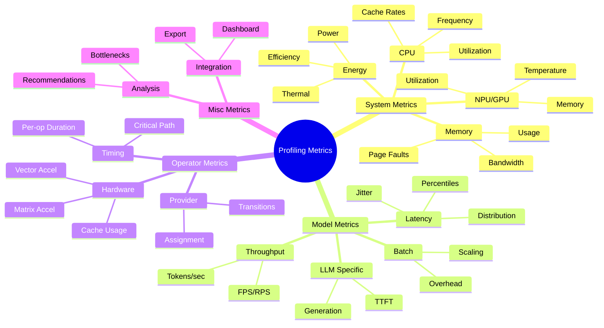

# ONNX Inference Profiling - Metrics Categorization

**Project**: TEZ-158  
**Date**: 2025-08-15  
**Status**: Development Planning

## Overview

This document categorizes all profiling metrics into four distinct buckets for organized implementation and clear separation of concerns.

## Metric Categories



## 1. System Metrics (TEZ-164, TEZ-165, TEZ-166)

**Focus**: Hardware and system-level resource monitoring  
**Priority**: HIGH - Foundation for all other metrics

### Components to Implement

#### A. CPU Metrics (TEZ-164)
```python
class CPUMonitor:
    """Monitor CPU-level metrics"""
    
    metrics = {
        'utilization': {
            'total_percent': float,      # 0-100%
            'per_core': List[float],      # Per-core usage
            'process_percent': float      # This process only
        },
        'performance': {
            'frequency_mhz': float,       # Current frequency
            'turbo_active': bool,         # Turbo boost status
            'throttling': bool            # Thermal throttling
        },
        'cache': {
            'l1_hit_rate': float,         # L1 cache hit rate
            'l2_hit_rate': float,         # L2 cache hit rate
            'l3_hit_rate': float          # L3 cache hit rate
        },
        'context': {
            'switches_per_sec': int,      # Context switches
            'interrupts_per_sec': int     # Hardware interrupts
        }
    }
```

#### B. Memory Metrics (TEZ-164)
```python
class MemoryMonitor:
    """Monitor memory usage and patterns"""
    
    metrics = {
        'usage': {
            'total_mb': float,            # Total system memory
            'available_mb': float,        # Available memory
            'process_rss_mb': float,      # Process resident set
            'process_vms_mb': float       # Process virtual memory
        },
        'performance': {
            'bandwidth_gb_s': float,      # Memory bandwidth
            'page_faults_per_sec': int,   # Page fault rate
            'swap_usage_mb': float        # Swap usage
        },
        'numa': {
            'node_distribution': Dict,    # NUMA node usage
            'remote_access_rate': float   # Cross-node access
        }
    }
```

#### C. Accelerator Metrics (TEZ-164)
```python
class AcceleratorMonitor:
    """Monitor NPU/GPU metrics"""
    
    metrics = {
        'utilization': {
            'npu_percent': float,         # NPU utilization
            'gpu_percent': float,         # GPU utilization
            'gpu_memory_mb': float,       # GPU memory used
            'sm_occupancy': float         # SM occupancy (CUDA)
        },
        'performance': {
            'tensor_core_usage': float,   # Tensor Core utilization
            'memory_bandwidth': float,    # Memory bandwidth
            'pcie_bandwidth': float       # PCIe bandwidth
        },
        'thermal': {
            'gpu_temp_c': float,          # GPU temperature
            'throttle_status': bool       # Thermal throttling
        }
    }
```

#### D. Energy Metrics (TEZ-166) - **CRITICAL GAP**
```python
class EnergyMonitor:
    """Monitor power and energy efficiency"""
    
    metrics = {
        'power': {
            'system_watts': float,        # Total system power
            'cpu_watts': float,           # CPU package power
            'gpu_watts': float,           # GPU power
            'npu_watts': float            # NPU power (estimated)
        },
        'efficiency': {
            'inferences_per_watt': float, # Performance/Watt
            'flops_per_watt': float,      # FLOPS/Watt
            'joules_per_inference': float # Energy per inference
        },
        'thermal': {
            'cpu_temp_c': float,          # CPU temperature
            'thermal_state': str,         # Cooling state
            'throttle_percentage': float  # Throttling amount
        },
        'sustainability': {
            'carbon_g_co2': float,        # Carbon footprint
            'efficiency_score': float     # 0-100 score
        }
    }
```

#### E. ETW Integration (TEZ-165)
```python
class ETWMonitor:
    """Windows ETW integration for kernel events"""
    
    capabilities = {
        'process_events': ['creation', 'termination', 'context_switch'],
        'memory_events': ['allocation', 'deallocation', 'page_fault'],
        'io_events': ['disk_read', 'disk_write', 'network'],
        'power_events': ['state_change', 'throttle', 'frequency_change']
    }
```

### Linear Subtasks Created:
- **TEZ-164**: [System Monitor] Implement Core System Metrics Collection
- **TEZ-165**: [System Monitor] Implement ETW Integration for Windows  
- **TEZ-166**: [System Monitor] Implement Energy and Thermal Monitoring (URGENT)

## 2. Model Metrics (TEZ-167)

**Focus**: Model inference performance and behavior  
**Priority**: URGENT - Critical missing metrics (percentiles)

### Components to Implement

#### A. Latency Metrics - **CRITICAL GAP**
```python
class LatencyProfiler:
    """Track latency with percentiles"""
    
    metrics = {
        'percentiles': {
            'p50': float,                 # Median latency
            'p90': float,                 # 90th percentile
            'p95': float,                 # 95th percentile
            'p99': float,                 # 99th percentile
            'p99_9': float                # 99.9th percentile
        },
        'statistics': {
            'mean': float,                # Average latency
            'std': float,                 # Standard deviation (jitter)
            'min': float,                 # Minimum latency
            'max': float                  # Maximum latency
        },
        'sla': {
            'target_ms': float,           # SLA target
            'violations': int,            # Count of violations
            'compliance_rate': float      # % meeting SLA
        }
    }
```

#### B. Throughput Metrics
```python
class ThroughputMonitor:
    """Track inference throughput"""
    
    metrics = {
        'rate': {
            'inferences_per_sec': float,  # Inference rate
            'frames_per_sec': float,      # FPS for vision
            'requests_per_sec': float,    # RPS for serving
            'tokens_per_sec': float       # For LLMs
        },
        'batch': {
            'effective_batch_size': float,# After padding
            'throughput_scaling': float,  # Batch efficiency
            'queue_depth': int            # Pending requests
        }
    }
```

#### C. LLM-Specific Metrics
```python
class LLMMetricsTracker:
    """LLM-specific performance metrics"""
    
    metrics = {
        'generation': {
            'ttft_ms': float,             # Time to first token
            'tpot_ms': float,             # Time per output token
            'generation_rate': float,     # Tokens/second
            'total_tokens': int           # Total generated
        },
        'phases': {
            'prefill_ms': float,          # Prefill latency
            'generation_ms': float,       # Generation latency
            'kv_cache_mb': float          # KV cache usage
        }
    }
```

### Linear Subtask Created:
- **TEZ-167**: [Model Metrics] Implement Inference Performance Tracking (URGENT)

## 3. Operator Metrics (TEZ-168)

**Focus**: Operation-level profiling and optimization  
**Priority**: MEDIUM - Important for optimization

### Components to Implement

#### A. Operation Timing
```python
class OperatorProfiler:
    """Profile individual operations"""
    
    metrics = {
        'timing': {
            'duration_us': float,         # Operation duration
            'start_time': float,          # Start timestamp
            'end_time': float,            # End timestamp
            'cumulative_ms': float        # Total time for op type
        },
        'details': {
            'op_type': str,               # Conv2D, MatMul, etc.
            'provider': str,              # NPU/GPU/CPU
            'input_shapes': List,         # Input tensor shapes
            'output_shapes': List,        # Output tensor shapes
            'params': int                 # Parameter count
        }
    }
```

#### B. Hardware Acceleration
```python
class HardwareAccelMonitor:
    """Monitor hardware acceleration usage"""
    
    metrics = {
        'vector': {
            'avx512_usage': float,        # AVX-512 utilization
            'vnni_usage': float,          # VNNI utilization
            'vectorization_rate': float   # % vectorized
        },
        'matrix': {
            'tensor_core_usage': float,   # Tensor Core usage
            'gemm_efficiency': float,     # GEMM efficiency
            'tiling_efficiency': float    # Tiling effectiveness
        },
        'npu': {
            'htp_usage': float,           # HTP utilization
            'vtcm_usage': float,          # VTCM usage
            'dma_efficiency': float       # DMA efficiency
        }
    }
```

#### C. Kernel Analysis
```python
class KernelAnalyzer:
    """Analyze kernel-level metrics"""
    
    metrics = {
        'fusion': {
            'fused_ops': List[str],       # Fused operations
            'fusion_benefit_ms': float,   # Time saved
            'fusion_rate': float          # % ops fused
        },
        'memory': {
            'bandwidth_gb_s': float,      # Memory bandwidth
            'cache_hit_rate': float,      # Cache efficiency
            'register_usage': int         # Register pressure
        },
        'compute': {
            'arithmetic_intensity': float, # Ops/byte
            'flops': float,               # Floating point ops
            'efficiency': float           # % of peak
        }
    }
```

### Linear Subtask Created:
- **TEZ-168**: [Operator Metrics] Implement Operation-Level Profiling

## 4. Miscellaneous Metrics (TEZ-169)

**Focus**: Integration, visualization, and auxiliary features  
**Priority**: HIGH - Required for usability

### Components

#### A. Dashboard & Visualization
- Real-time monitoring dashboard
- WebSocket streaming
- Interactive timeline
- Export capabilities

#### B. Integration
- ModelEval UI integration
- REST API endpoints
- Data standardization
- Format compatibility

#### C. Analysis Tools
- Bottleneck detection
- Optimization recommendations
- Performance regression detection
- Comparative analysis

### Linear Subtask Created:
- **TEZ-169**: [Integration] Dashboard and ModelEval UI Integration

## Implementation Priority

### Phase 1: Critical Gaps (Week 1-2)
1. **TEZ-166**: Energy Monitoring (URGENT) - #1 missing feature
2. **TEZ-167**: Latency Percentiles (URGENT) - Industry standard
3. **TEZ-164**: System Metrics - Foundation for all monitoring

### Phase 2: Core Features (Week 3-4)
4. **TEZ-165**: ETW Integration - Advanced system monitoring
5. **TEZ-169**: Dashboard Integration - User interface

### Phase 3: Advanced (Week 5-6)
6. **TEZ-168**: Operator Profiling - Optimization insights

## System Monitor Deep Dive

Since you want to focus on System Monitor first, here's the detailed implementation plan:

### 1. Start with EnergyMonitor (TEZ-166) - URGENT
```python
# experiments/tez-158_infer-profiling/monitors/energy_monitor.py

import wmi
import pynvml
from dataclasses import dataclass
from typing import Optional

@dataclass
class EnergyMetrics:
    system_power_w: float
    cpu_power_w: float
    gpu_power_w: float
    temperature_c: float
    throttling: bool
    inferences_per_watt: float = 0.0

class EnergyMonitor:
    def __init__(self):
        self._init_wmi()
        self._init_nvidia()
        
    def _init_wmi(self):
        """Initialize Windows WMI for power monitoring"""
        try:
            self.wmi = wmi.WMI(namespace="root\\OpenHardwareMonitor")
        except:
            self.wmi = None
            
    def _init_nvidia(self):
        """Initialize NVIDIA monitoring"""
        try:
            pynvml.nvmlInit()
            self.gpu_handle = pynvml.nvmlDeviceGetHandleByIndex(0)
        except:
            self.gpu_handle = None
            
    def get_metrics(self) -> EnergyMetrics:
        """Collect current energy metrics"""
        return EnergyMetrics(
            system_power_w=self._get_system_power(),
            cpu_power_w=self._get_cpu_power(),
            gpu_power_w=self._get_gpu_power(),
            temperature_c=self._get_temperature(),
            throttling=self._check_throttling()
        )
```

### 2. Then SystemMonitor Base (TEZ-164)
```python
# experiments/tez-158_infer-profiling/monitors/system_monitor.py

from abc import ABC, abstractmethod
from typing import Dict, Any
import asyncio

class SystemMonitor(ABC):
    """Base class for all system monitors"""
    
    def __init__(self, update_rate_hz: float = 10):
        self.update_rate = update_rate_hz
        self.is_monitoring = False
        
    @abstractmethod
    async def collect_metrics(self) -> Dict[str, Any]:
        """Collect current metrics"""
        pass
        
    async def start_monitoring(self):
        """Start continuous monitoring"""
        self.is_monitoring = True
        while self.is_monitoring:
            metrics = await self.collect_metrics()
            await self._publish_metrics(metrics)
            await asyncio.sleep(1.0 / self.update_rate)
```

### 3. Finally ETWMonitor (TEZ-165)
```python
# experiments/tez-158_infer-profiling/monitors/etw_monitor.py

import clr
import pythonnet

class ETWMonitor:
    """Modern ETW integration using TraceEvent"""
    
    def __init__(self):
        self._init_dotnet()
        
    def _init_dotnet(self):
        """Initialize .NET runtime and load assemblies"""
        clr.AddReference("Microsoft.Diagnostics.Tracing.TraceEvent")
        from Microsoft.Diagnostics.Tracing import TraceEventSession
        self.TraceEventSession = TraceEventSession
```

## Next Steps

1. **Immediate Action**: Start implementing EnergyMonitor (TEZ-166)
2. **Setup Environment**: Install required libraries (pynvml, wmi, pythonnet)
3. **Create Test Framework**: Mock data for unit testing
4. **Build Incrementally**: Start with basic metrics, add advanced features progressively

## Success Metrics

- ✅ All 6 subtasks created in Linear under TEZ-158
- ✅ Clear categorization into 4 buckets
- ✅ Priority assigned based on gap analysis
- ✅ System Monitor components detailed for implementation
- ✅ Energy monitoring identified as #1 priority