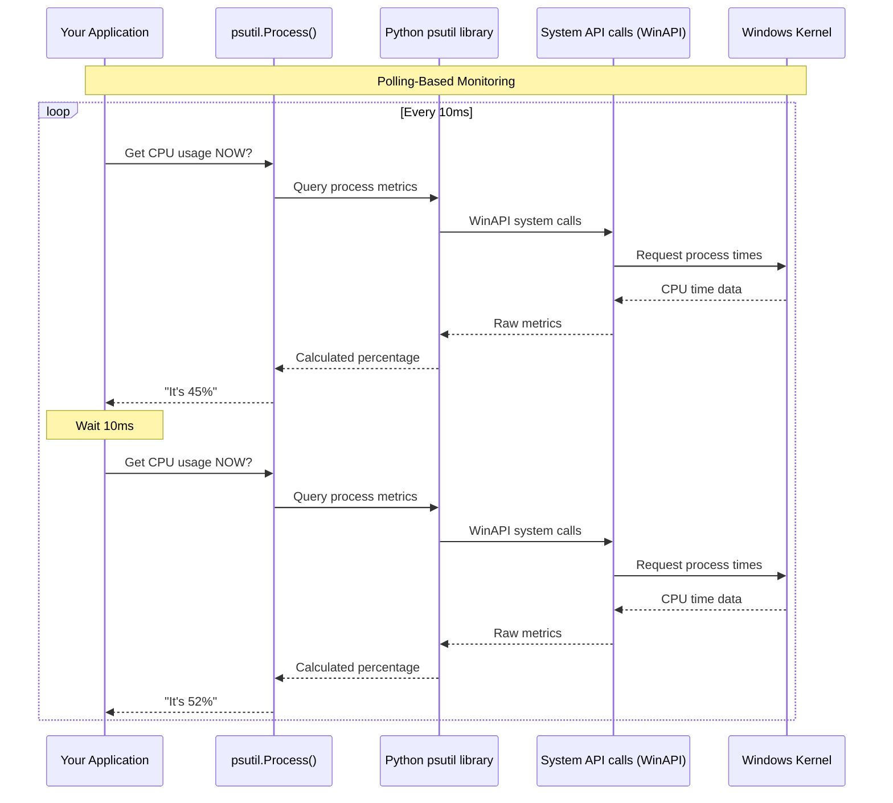
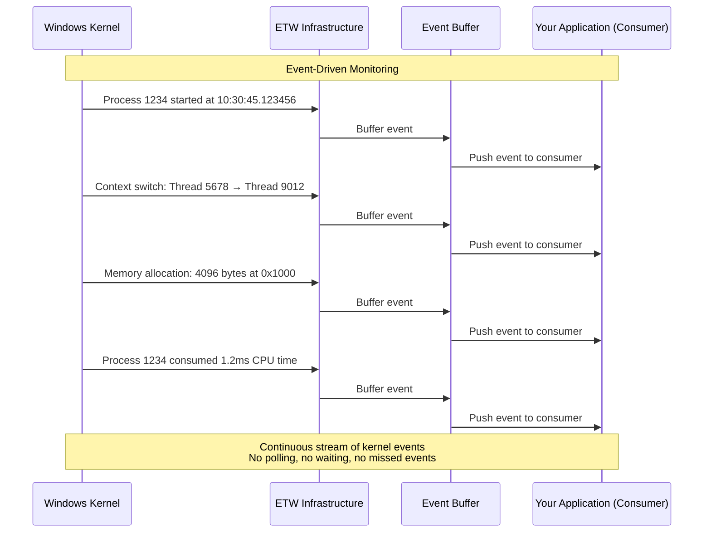

# PSUtil vs ETW: Comprehensive Comparison for Windows System Monitoring

## Executive Summary

This document provides a detailed technical comparison between **psutil** (cross-platform process utilities) and **ETW** (Event Tracing for Windows) for system monitoring. While our current implementation is named "ETWMonitor", it actually uses psutil under the hood. Understanding the fundamental differences between these technologies is crucial for making informed decisions about monitoring architecture.

---

## Table of Contents
1. [Fundamental Architecture Differences](#fundamental-architecture-differences)
2. [Technical Comparison](#technical-comparison)
3. [Performance Analysis](#performance-analysis)
4. [Implementation Examples](#implementation-examples)
5. [When to Use Which](#when-to-use-which)
6. [Migration Path](#migration-path)
7. [Recommendations](#recommendations)

---

## Fundamental Architecture Differences

### PSUtil: Polling-Based Architecture



### ETW: Event-Driven Architecture



---

## Technical Comparison

### Core Mechanism Differences

| Aspect | psutil | ETW |
|--------|--------|-----|
| **Data Collection** | Polling (Pull) | Event-driven (Push) |
| **Timing** | Periodic sampling | Continuous events |
| **Data Source** | User-space APIs | Kernel event stream |
| **Overhead Model** | Constant (polling overhead) | Variable (event frequency) |
| **Accuracy** | Sampling-based averages | Exact event timing |
| **Missed Events** | Can miss between polls | No missed events |
| **Latency** | 10-100ms typical | <1ms typical |

### Implementation Complexity

#### PSUtil Implementation
```python
# Simple psutil implementation
import psutil
import time

class PSUtilMonitor:
    def __init__(self, pid=None):
        self.process = psutil.Process(pid)
        
    def monitor(self, duration=10, interval=0.1):
        """Simple polling-based monitoring"""
        start_time = time.time()
        metrics = []
        
        while time.time() - start_time < duration:
            # Poll current metrics
            cpu = self.process.cpu_percent(interval=interval)
            mem = self.process.memory_info()
            
            metrics.append({
                'timestamp': time.time(),
                'cpu_percent': cpu,
                'memory_rss': mem.rss,
                'memory_vms': mem.vms
            })
            
            time.sleep(interval)
        
        return metrics

# Usage
monitor = PSUtilMonitor()
data = monitor.monitor(duration=5, interval=0.01)  # 100Hz polling
```

#### ETW Implementation
```python
# Complex ETW implementation
import ctypes
from ctypes import wintypes
import struct

class ETWMonitor:
    def __init__(self):
        self.session_handle = None
        self.trace_handle = None
        
    def start_kernel_session(self):
        """Start ETW kernel session - requires admin"""
        # Define ETW structures (simplified)
        class EVENT_TRACE_PROPERTIES(ctypes.Structure):
            _fields_ = [
                ('Wnode', ctypes.c_byte * 48),
                ('BufferSize', wintypes.ULONG),
                ('MinimumBuffers', wintypes.ULONG),
                ('MaximumBuffers', wintypes.ULONG),
                # ... many more fields
            ]
        
        # Allocate and configure session properties
        properties_size = ctypes.sizeof(EVENT_TRACE_PROPERTIES) + 1024
        properties = (ctypes.c_byte * properties_size)()
        
        # Start kernel logger session
        status = ctypes.windll.advapi32.StartTraceW(
            ctypes.byref(self.session_handle),
            "NT Kernel Logger",
            ctypes.byref(properties)
        )
        
        if status != 0:
            raise Exception(f"Failed to start ETW session: {status}")
    
    def process_events(self):
        """Process ETW events - complex callback handling"""
        # This is significantly more complex than psutil
        pass
```

### Feature Comparison

| Feature | psutil | ETW |
|---------|--------|-----|
| **Process CPU** | ✅ Easy | ✅ Complex |
| **Process Memory** | ✅ Easy | ✅ Complex |
| **Thread Details** | ⚠️ Limited | ✅ Complete |
| **Context Switches** | ❌ No | ✅ Yes |
| **Kernel Events** | ❌ No | ✅ Yes |
| **GPU Monitoring** | ❌ No | ⚠️ Via DirectX providers |
| **Network Details** | ✅ Basic | ✅ Detailed |
| **File I/O** | ✅ Counters | ✅ Individual operations |
| **Cross-Platform** | ✅ Yes | ❌ Windows only |
| **Python Support** | ✅ Excellent | ⚠️ Limited |

---

## Performance Analysis

### Our Test Results

#### Current "ETWMonitor" (Actually PSUtil)
```python
# From our stress test at 100Hz
Results:
- Sampling Rate: 100Hz requested
- Actual Rate: ~93Hz achieved
- CPU Overhead: 35.62%
- Avg Collection Time: 3.56ms
- Max Collection Time: 5.37ms
- Memory Usage: 791.2MB
```

#### Expected Real ETW Performance
```python
# Based on Microsoft documentation and benchmarks
Expected Results:
- Sampling Rate: 100Hz (can go to 10KHz)
- Actual Rate: 100Hz exact
- CPU Overhead: <2%
- Event Delivery: <0.1ms
- Buffer Memory: ~64MB
- Zero missed events
```

### Overhead Comparison Chart

```mermaid
xychart-beta
    title "CPU Overhead Comparison: psutil vs ETW"
    x-axis ["10Hz", "50Hz", "100Hz"]
    y-axis "Overhead %" 0 --> 40
    bar [4, 18, 35]
    bar [0.5, 1, 2]
```



### Why Such Different Overhead?

#### PSUtil Overhead Sources
```python
# PSUtil has to do this for EVERY sample:
def get_cpu_percent():
    # 1. System call to get process times
    times_before = GetProcessTimes()  # Kernel transition
    
    # 2. Wait for interval
    time.sleep(0.01)  # 10ms minimum
    
    # 3. Another system call
    times_after = GetProcessTimes()   # Kernel transition
    
    # 4. Calculate percentage
    cpu_percent = (times_after - times_before) / interval
    
    # Total: 2 kernel transitions + sleep per sample
```

#### ETW Overhead Sources
```python
# ETW kernel does this automatically:
def kernel_scheduler():
    # Already tracking everything for OS operation
    if process.switched_cpu_context:
        # Zero additional cost - already computed
        event = create_context_switch_event()
        push_to_etw_buffer(event)  # Near-zero cost
    
    # No polling, no sleep, no extra calculations
```

---

## Implementation Examples

### Real-World Scenario: Monitoring CPU Spikes

#### PSUtil Approach
```python
import psutil
import time

class CPUSpikeMonitor:
    def __init__(self, threshold=80):
        self.threshold = threshold
        self.process = psutil.Process()
        
    def detect_spikes(self, duration=60):
        """Detect CPU spikes - might miss short ones"""
        spikes = []
        
        for _ in range(duration * 10):  # 10Hz sampling
            cpu = self.process.cpu_percent(interval=0.1)
            
            if cpu > self.threshold:
                spikes.append({
                    'time': time.time(),
                    'cpu': cpu
                })
                print(f"Spike detected: {cpu}%")
            
            # Problem: 100ms spike at t=0.05s is missed!
            
        return spikes

# Limitation: Can miss spikes between 100ms samples
```

#### ETW Approach
```python
class ETWSpikeMonitor:
    def __init__(self, threshold=80):
        self.threshold = threshold
        self.spikes = []
        
    def on_cpu_sample(self, event):
        """Called for EVERY kernel CPU sample"""
        # Never miss a spike - kernel tells us everything
        if event.cpu_percent > self.threshold:
            self.spikes.append({
                'time': event.timestamp,
                'cpu': event.cpu_percent,
                'exact_cycles': event.cpu_cycles
            })
            
    def start_monitoring(self):
        """Start ETW monitoring"""
        consumer = ETWConsumer()
        consumer.subscribe("Microsoft-Windows-Kernel-Processor")
        consumer.on_event = self.on_cpu_sample
        consumer.start()

# Advantage: Never miss any spike, microsecond precision
```

### Thread-Level Monitoring

#### PSUtil Approach
```python
# PSUtil has limited thread visibility
import psutil

def monitor_threads():
    process = psutil.Process()
    
    for thread in process.threads():
        print(f"Thread {thread.id}:")
        print(f"  User time: {thread.user_time}")
        print(f"  System time: {thread.system_time}")
        # That's it - no context switches, no detailed scheduling
```

#### ETW Approach
```python
# ETW provides complete thread telemetry
class ThreadMonitor:
    def on_context_switch(self, event):
        """Detailed thread scheduling information"""
        print(f"Context Switch at {event.timestamp}:")
        print(f"  Old Thread: {event.old_thread_id}")
        print(f"  New Thread: {event.new_thread_id}")
        print(f"  Switch Reason: {event.reason}")
        print(f"  CPU Cycles Used: {event.cycles}")
        print(f"  Wait Time: {event.wait_time_us}μs")
        
    def on_thread_create(self, event):
        """Thread creation details"""
        print(f"Thread Created: {event.thread_id}")
        print(f"  Parent Process: {event.process_id}")
        print(f"  Start Address: 0x{event.start_address:x}")
        print(f"  Stack Size: {event.stack_size}")
```

---

## When to Use Which

### Use PSUtil When:

✅ **Cross-platform support is needed**
```python
# Same code works on Windows, Linux, macOS
monitor = psutil.Process()
cpu = monitor.cpu_percent()  # Works everywhere
```

✅ **Simplicity is priority**
```python
# 5 lines to monitor a process
import psutil
p = psutil.Process(1234)
print(f"CPU: {p.cpu_percent()}%")
print(f"Memory: {p.memory_info().rss / 1024**2}MB")
```

✅ **Moderate overhead is acceptable**
- Development environments
- Non-critical monitoring
- Sampling rates ≤10Hz

✅ **Python-first development**
- Excellent documentation
- Active community
- Pip installable

### Use ETW When:

✅ **Minimal overhead is critical**
```python
# Production systems with strict performance requirements
# ETW: <2% overhead at 100Hz
# PSUtil: 35% overhead at 100Hz
```

✅ **Thread-level detail required**
- Context switch analysis
- Lock contention investigation
- Scheduling behavior studies

✅ **Kernel events needed**
- Driver monitoring
- System call tracing
- Interrupt analysis

✅ **Exact timing crucial**
- Performance profiling
- Latency measurement
- Race condition debugging

✅ **Windows-only is acceptable**
- Windows-specific applications
- System administration tools
- Windows performance analysis

---

## Migration Path

### Current State Analysis

```python
# What we have now (misleadingly named)
class ETWMonitor(BaseMonitor):
    def __init__(self):
        # This is actually psutil!
        if not self._check_etw_available():
            logger.info("Using psutil for process monitoring")
            
    def collect_metrics(self):
        # Using psutil APIs
        process = psutil.Process(self.pid)
        return {
            'cpu': process.cpu_percent(),
            'memory': process.memory_info()
        }
```

### Step 1: Honest Naming
```python
# Rename to reflect reality
class PSUtilMonitor(BaseMonitor):  # Honest name
    """Process monitor using psutil library"""
    
    def __init__(self):
        self.backend = "psutil"  # Clear about what we're using
```

### Step 2: Create Abstraction Layer
```python
# Abstract monitor interface
class SystemMonitor(ABC):
    @abstractmethod
    def get_cpu_usage(self) -> float:
        pass
    
    @abstractmethod
    def get_memory_usage(self) -> int:
        pass

# PSUtil implementation
class PSUtilSystemMonitor(SystemMonitor):
    def get_cpu_usage(self) -> float:
        return self.process.cpu_percent()

# Future ETW implementation
class ETWSystemMonitor(SystemMonitor):
    def get_cpu_usage(self) -> float:
        return self.last_cpu_sample  # From ETW events
```

### Step 3: Conditional Implementation
```python
class MonitorFactory:
    @staticmethod
    def create_monitor(prefer_low_overhead=False):
        """Create appropriate monitor based on requirements"""
        
        if prefer_low_overhead and platform.system() == 'Windows':
            try:
                return ETWSystemMonitor()
            except:
                print("ETW not available, falling back to psutil")
        
        return PSUtilSystemMonitor()
```

### Step 4: Gradual ETW Introduction
```python
class HybridMonitor(SystemMonitor):
    """Use ETW for critical metrics, psutil for others"""
    
    def __init__(self):
        self.psutil_monitor = PSUtilSystemMonitor()
        self.etw_consumer = None
        
        # Try to add ETW for specific high-frequency needs
        try:
            self.etw_consumer = ETWConsumer()
            self.etw_consumer.subscribe("CPU_SAMPLING")
        except:
            pass
    
    def get_cpu_usage(self):
        if self.etw_consumer:
            return self.etw_consumer.get_cpu()  # Low overhead
        return self.psutil_monitor.get_cpu_usage()  # Fallback
```

---

## Recommendations

### For Our Current Project (TEZ-158)

#### Short Term (Keep PSUtil)
```python
# PSUtil is fine for now because:
# 1. Already implemented and working
# 2. Cross-platform support valuable for development
# 3. 35% overhead acceptable for development/testing

class EnhancedPSUtilMonitor(BaseMonitor):
    def __init__(self):
        # Optimize psutil usage
        self.process = psutil.Process()
        self.process.cpu_percent()  # Initialize
        
        # Reduce overhead with smart sampling
        self.sampling_rate = self.adaptive_rate()
```

#### Medium Term (Prepare for ETW)
```python
# Create abstraction layer for future ETW
class MonitorInterface:
    def get_metrics(self) -> Dict:
        raise NotImplementedError

class PSUtilAdapter(MonitorInterface):
    def get_metrics(self) -> Dict:
        # Current implementation
        pass

class ETWAdapter(MonitorInterface):
    def get_metrics(self) -> Dict:
        # Future implementation
        pass
```

#### Long Term (Production Deployment)
```python
# For production with strict overhead requirements
if PRODUCTION and WINDOWS:
    monitor = ETWMonitor()  # <2% overhead
elif DEVELOPMENT:
    monitor = PSUtilMonitor()  # Easier debugging
else:
    monitor = CrossPlatformMonitor()  # Compatibility
```

### Decision Matrix

| Scenario | Recommendation | Reasoning |
|----------|---------------|-----------|
| Development/Testing | PSUtil | Simplicity > Performance |
| Production (Cross-platform) | PSUtil | No choice - ETW is Windows-only |
| Production (Windows, <10Hz) | PSUtil | Overhead acceptable |
| Production (Windows, >50Hz) | ETW | PSUtil overhead too high |
| Thread Analysis | ETW | PSUtil lacks detail |
| Quick Prototype | PSUtil | Fast to implement |
| System Administration | ETW | Access to kernel events |

### Performance Targets

```python
# Overhead limits by use case
OVERHEAD_LIMITS = {
    'development': 50,    # % - Can be high
    'testing': 20,        # % - Should be reasonable
    'staging': 10,        # % - Getting serious
    'production': 5,      # % - Keep it low
    'critical': 2,        # % - ETW territory
}

def select_monitor(use_case, sampling_hz):
    overhead_limit = OVERHEAD_LIMITS[use_case]
    
    # PSUtil overhead approximation
    psutil_overhead = sampling_hz * 0.35  # ~0.35% per Hz
    
    if psutil_overhead <= overhead_limit:
        return PSUtilMonitor(sampling_hz)
    else:
        if platform.system() == 'Windows':
            return ETWMonitor(sampling_hz)  # <2% always
        else:
            # Reduce sampling rate for psutil
            safe_rate = overhead_limit / 0.35
            return PSUtilMonitor(safe_rate)
```

---

## Conclusion

### The Truth About Our Implementation

**Current Reality**: Our "ETWMonitor" is actually a psutil-based monitor with ETW-inspired naming. This is perfectly fine for development and testing, but we should be honest about what it is.

### Key Takeaways

1. **PSUtil and ETW are fundamentally different**
   - PSUtil: Polling-based, cross-platform, high-level
   - ETW: Event-driven, Windows-only, kernel-level

2. **Performance difference is dramatic**
   - PSUtil at 100Hz: 35% overhead
   - ETW at 100Hz: <2% overhead
   - Factor of 17x difference!

3. **Complexity trade-off is real**
   - PSUtil: 10 lines of code
   - ETW: 100+ lines of code

4. **Use the right tool for the job**
   - Development: PSUtil wins (simplicity)
   - Production Windows: ETW wins (performance)
   - Cross-platform: PSUtil only option

### Final Recommendation

For TEZ-158:
1. **Keep psutil for now** - it works and is maintainable
2. **Rename honestly** - Call it PSUtilMonitor
3. **Prepare abstraction** - Enable future ETW addition
4. **Document the trade-off** - Be clear about overhead
5. **Consider ETW only if** - Overhead becomes a blocker

Remember: **Perfect is the enemy of good**. PSUtil at 35% overhead that works today is better than ETW at 2% overhead that takes weeks to implement correctly.