# ONNX Runtime Inference Profiling Requirements Document

**Project ID**: TEZ-158  
**Document Version**: 2.0  
**Date**: 2025-08-14  
**Status**: Enhanced with visualizations

## Table of Contents
1. [Executive Summary](#executive-summary)
2. [Project Overview](#project-overview)
3. [Stakeholders](#stakeholders)
4. [Functional Requirements](#functional-requirements)
5. [Non-Functional Requirements](#non-functional-requirements)
6. [System Architecture](#system-architecture)
7. [Data Requirements](#data-requirements)
8. [Integration Requirements](#integration-requirements)
9. [Security & Compliance](#security--compliance)
10. [Testing Requirements](#testing-requirements)
11. [Acceptance Criteria](#acceptance-criteria)
12. [Appendices](#appendices)

## Executive Summary

This document outlines the requirements for implementing a comprehensive monitoring and profiling system for ONNX Runtime inference workloads on Windows platforms. The system will provide real-time performance metrics, execution provider analysis, and seamless integration with the ModelEval evaluation UI, enabling developers to optimize ML model inference performance across various hardware accelerators.

## Project Overview

### Business Context
The ModelEval platform requires detailed performance profiling capabilities to evaluate and optimize ONNX models across different execution providers (NPU, GPU, CPU). Current evaluation capabilities show aggregated metrics but lack real-time monitoring and detailed operation-level profiling essential for performance optimization.

### Project Goals


1. **Real-time Monitoring**: Provide sub-millisecond latency monitoring of inference operations
2. **Multi-Provider Support**: Enable profiling across CUDA, DirectML, QNN, and CPU execution providers
3. **Minimal Overhead**: Maintain monitoring overhead below 1ms per inference
4. **Comprehensive Metrics**: Capture all performance, resource, and execution timeline data
5. **Modern ETW Integration**: Replace deprecated monitoring tools with modern alternatives

### Scope


## Stakeholders


| Stakeholder | Role | Interest |
|------------|------|----------|
| ML Engineers | Primary Users | Performance optimization, bottleneck identification |
| DevOps Teams | Secondary Users | System monitoring, resource management |
| ModelEval Platform Team | Integration Partner | UI integration, data standardization |
| QA Teams | Quality Assurance | Performance validation, regression testing |
| Product Owners | Decision Makers | Feature prioritization, ROI analysis |

## Functional Requirements

### FR1: Performance Metrics Collection


#### FR1.1: Inference Timing Metrics
- **FR1.1.1**: Capture individual inference latency with microsecond precision
- **FR1.1.2**: Track first load time vs. subsequent load times
- **FR1.1.3**: Measure per-operation execution time
- **FR1.1.4**: Calculate throughput in FPS and requests/second
- **FR1.1.5**: Record CPU/GPU synchronization overhead
- **FR1.1.6**: 🆕 **Tail latency analysis (P50, P90, P95, P99, P99.9)**
- **FR1.1.7**: 🆕 **Jitter and stability metrics**

#### FR1.2: Resource Utilization Metrics
- **FR1.2.1**: Monitor peak memory usage in MB
- **FR1.2.2**: Track memory allocation patterns per inference
- **FR1.2.3**: Measure NPU utilization percentage (0-100%)
- **FR1.2.4**: Measure CPU utilization percentage per core
- **FR1.2.5**: Measure GPU utilization and memory usage
- **FR1.2.6**: Calculate memory efficiency (samples/MB)
- **FR1.2.7**: 🆕 **SM occupancy and Tensor Core utilization**
- **FR1.2.8**: 🆕 **Cache hierarchy metrics (L1/L2/L3)**

#### FR1.3: Batch Processing Metrics
- **FR1.3.1**: Track batch size impact on latency
- **FR1.3.2**: Monitor memory scaling with batch size
- **FR1.3.3**: Calculate per-sample vs. per-batch overhead
- **FR1.3.4**: Measure batch processing throughput

#### FR1.4: Energy Efficiency Metrics (🆕 Critical Addition)
- **FR1.4.1**: Real-time power consumption (Watts)
- **FR1.4.2**: Inferences per Watt calculation
- **FR1.4.3**: FLOPS per Watt efficiency
- **FR1.4.4**: Thermal monitoring and throttling detection
- **FR1.4.5**: Carbon footprint tracking

### FR2: Execution Timeline Tracking


#### FR2.1: Operation-Level Profiling
- **FR2.1.1**: Capture start/end time for each operation
- **FR2.1.2**: Identify execution provider per operation (NPU/CPU/GPU/Mixed)
- **FR2.1.3**: Record operation type (Conv2D, BatchNorm, Attention, etc.)
- **FR2.1.4**: Log input/output tensor shapes
- **FR2.1.5**: Track cycle counts per operation
- **FR2.1.6**: 🆕 **Kernel fusion effectiveness tracking**

#### FR2.2: Execution Flow Visualization
- **FR2.2.1**: Generate timeline view of operation execution
- **FR2.2.2**: Show parallel vs. sequential execution patterns
- **FR2.2.3**: Highlight provider transitions
- **FR2.2.4**: Display operation dependencies

### FR3: System & Environment Information


#### FR3.1: Device Information Collection
- **FR3.1.1**: Detect device type and model
- **FR3.1.2**: Identify processor specifications
- **FR3.1.3**: Query available accelerators (NPU/GPU)
- **FR3.1.4**: Report operating system version
- **FR3.1.5**: Capture driver versions

#### FR3.2: Runtime Environment Details
- **FR3.2.1**: Report ONNX Runtime version
- **FR3.2.2**: List active execution providers
- **FR3.2.3**: Capture backend versions (QNN, CUDA, DirectML)
- **FR3.2.4**: Log runtime configuration parameters

### FR4: Real-time Dashboard

```mermaid
flowchart TB
    subgraph Dashboard Components
        A[Performance Gauges]
        B[Resource Bars]
        C[Timeline View]
        D[Memory Charts]
        E[xPU Graphs]
        F[🆕 Energy Panel]
        G[🆕 Latency Distribution]
    end
    
    subgraph Interactive Features
        H[Pause/Resume]
        I[Zoom Controls]
        J[Filter Options]
        K[Export Data]
        L[Config Settings]
    end
    
    A & B & C & D & E & F & G --> M[Dashboard UI]
    H & I & J & K & L --> M
    
    style M fill:#fbb,stroke:#333,stroke-width:2px
    style F fill:#ff9,stroke:#333,stroke-width:2px
    style G fill:#ff9,stroke:#333,stroke-width:2px
```



#### FR4.1: Display Components
- **FR4.1.1**: Performance gauges (FPS, latency, throughput)
- **FR4.1.2**: Resource utilization bars (NPU/CPU/GPU)
- **FR4.1.3**: Execution timeline visualization
- **FR4.1.4**: Memory usage charts
- **FR4.1.5**: xPU usage over time graphs

#### FR4.2: Interactive Features
- **FR4.2.1**: Pause/resume monitoring
- **FR4.2.2**: Zoom in/out on timeline
- **FR4.2.3**: Filter by operation type
- **FR4.2.4**: Export metrics to file
- **FR4.2.5**: Configure update frequency

### FR5: Execution Provider Support

#### FR5.1: CUDA Provider Monitoring
- **FR5.1.1**: GPU memory allocation tracking via pynvml
- **FR5.1.2**: CUDA kernel execution timing
- **FR5.1.3**: SM utilization monitoring
- **FR5.1.4**: Temperature and power monitoring

#### FR5.2: DirectML Provider Monitoring
- **FR5.2.1**: Windows GPU performance counters via WMI
- **FR5.2.2**: DirectX resource tracking
- **FR5.2.3**: GPU engine utilization

#### FR5.3: QNN Provider Monitoring
- **FR5.3.1**: NPU utilization tracking
- **FR5.3.2**: HTP (Hexagon Tensor Processor) metrics
- **FR5.3.3**: VTCM (Vector Tightly Coupled Memory) usage

#### FR5.4: CPU Provider Monitoring
- **FR5.4.1**: Per-core CPU utilization
- **FR5.4.2**: Cache miss rates
- **FR5.4.3**: Memory bandwidth usage

### FR6: ETW Integration

#### FR6.1: TraceEvent Library Integration
- **FR6.1.1**: Implement pythonnet bridge to Microsoft.Diagnostics.Tracing.TraceEvent
- **FR6.1.2**: Subscribe to kernel events
- **FR6.1.3**: Process ETW events in real-time
- **FR6.1.4**: Parse ETL files for offline analysis

#### FR6.2: Event Collection
- **FR6.2.1**: Capture process/thread events
- **FR6.2.2**: Monitor file I/O operations
- **FR6.2.3**: Track memory allocations
- **FR6.2.4**: Record CPU context switches

### FR7: Data Analysis Tools

#### FR7.1: Performance Analysis
- **FR7.1.1**: Calculate statistical metrics (mean, median, p95, p99)
- **FR7.1.2**: Identify performance outliers
- **FR7.1.3**: Correlate system events with inference latency
- **FR7.1.4**: Generate performance regression reports

#### FR7.2: Memory Profiling
- **FR7.2.1**: Detect memory leaks
- **FR7.2.2**: Analyze allocation patterns
- **FR7.2.3**: Track memory fragmentation
- **FR7.2.4**: Profile batch size impact on memory

## Non-Functional Requirements

### NFR1: Performance Requirements


#### NFR1.1: Monitoring Overhead
- **NFR1.1.1**: Monitoring overhead shall not exceed 1ms per inference
- **NFR1.1.2**: CPU overhead shall remain below 5% during monitoring
- **NFR1.1.3**: Memory overhead shall not exceed 100MB for monitoring infrastructure

#### NFR1.2: Dashboard Performance
- **NFR1.2.1**: Dashboard shall update at minimum 10Hz without stuttering
- **NFR1.2.2**: Metric display latency shall be less than 100ms
- **NFR1.2.3**: Dashboard shall handle 100Hz metric collection rate

#### NFR1.3: Data Processing
- **NFR1.3.1**: Support buffering of 10,000 metrics in memory
- **NFR1.3.2**: Process correlation within 100ms time window
- **NFR1.3.3**: Support concurrent monitoring of multiple models

### NFR2: Scalability Requirements

- **NFR2.1**: System shall support monitoring batch sizes from 1 to 1024
- **NFR2.2**: Handle models with up to 10,000 operations
- **NFR2.3**: Support monitoring sessions up to 24 hours
- **NFR2.4**: Scale to monitor up to 10 concurrent inference sessions

### NFR3: Reliability Requirements

- **NFR3.1**: System shall have 99.9% uptime during monitoring sessions
- **NFR3.2**: Gracefully handle execution provider failures
- **NFR3.3**: Automatic recovery from transient errors
- **NFR3.4**: Data persistence in case of unexpected shutdown

### NFR4: Usability Requirements

- **NFR4.1**: Installation via single pip command
- **NFR4.2**: Zero-configuration startup for basic monitoring
- **NFR4.3**: Intuitive dashboard navigation
- **NFR4.4**: Comprehensive error messages and logging

### NFR5: Compatibility Requirements

- **NFR5.1**: Support Windows 10 version 1909 and later
- **NFR5.2**: Support Windows 11 all versions
- **NFR5.3**: Compatible with Python 3.8-3.12
- **NFR5.4**: Support ONNX Runtime 1.15.0 and later

### NFR6: Security Requirements

- **NFR6.1**: No collection of model weights or training data
- **NFR6.2**: Local-only data storage by default
- **NFR6.3**: Secure API endpoints with authentication
- **NFR6.4**: Sanitize all user inputs

## System Architecture

### Component Architecture


### Data Flow Architecture


## Data Requirements

### Data Models

#### Enhanced Inference Event

```json
{
  "timestamp_ns": 1234567890000000,
  "model_name": "mobilevit_v2",
  "session_id": "uuid",
  "inference_id": "uuid",
  
  "latency": {
    "end_to_end_ms": 4.71,
    "inference_only_ms": 4.52,
    "percentiles": {
      "p50": 4.2,
      "p90": 5.1,
      "p95": 5.8,
      "p99": 8.3,
      "p99_9": 12.1
    },
    "jitter": 1.2
  },
  
  "energy": {
    "power_w": 45.2,
    "joules": 0.213,
    "inferences_per_watt": 4.7,
    "flops_per_watt": 1.2e12
  },
  
  "hardware": {
    "npu_percent": 89.2,
    "gpu_sm_occupancy": 0.75,
    "tensor_core_usage": 0.82,
    "cache_hit_rates": {
      "l1": 0.94,
      "l2": 0.87,
      "l3": 0.76
    }
  },
  
  "batch_context": {
    "batch_size": 16,
    "padding_ratio": 0.11,
    "queue_depth": 12
  }
}
```

#### Operation Metric
```json
{
  "operation_id": "conv2d_0",
  "operation_type": "Conv2D",
  "provider": "NPU",
  "start_time_ns": 1234567890000000,
  "duration_ms": 0.84,
  "cycles": 2100000,
  "input_shapes": [[1, 256, 256, 3]],
  "output_shapes": [[1, 128, 128, 32]],
  "memory_bytes": 1048576
}
```

#### System Metric
```json
{
  "timestamp_ns": 1234567890000000,
  "cpu_percent": 18.5,
  "memory_percent": 42.3,
  "gpu_percent": 4.1,
  "npu_percent": 89.2,
  "gpu_memory_mb": 512,
  "process_memory_mb": 256
}
```

### Data Storage Requirements

- **Retention**: Minimum 24 hours of metrics in memory
- **Export Formats**: JSON, CSV, Parquet
- **Compression**: Support for gzip compression
- **Batch Writing**: Buffer and write in 1000-record batches

### Data Storage Architecture


## Integration Requirements

### ModelEval UI Integration


#### Data Format Compatibility
- Match existing ModelEval evaluation page structure
- Support same metric names and units
- Provide compatible visualization data

### ONNX Runtime Integration

#### Hooking Mechanisms
- Session creation hooks
- Pre/post inference callbacks
- Provider-specific instrumentation
- Memory allocation tracking

### External Tool Integration

- **Export to PerfView**: Generate compatible ETL files
- **Export to TensorBoard**: Plugin for visualization
- **Integration with pytest**: Performance regression testing
- **CI/CD Integration**: GitHub Actions / Azure DevOps

## Security & Compliance

### Security Requirements

1. **Data Protection**
   - No PII collection
   - Encrypted storage for sensitive metrics
   - Secure deletion of temporary files

2. **Access Control**
   - API authentication via tokens
   - Role-based access control
   - Audit logging for all access

3. **Network Security**
   - HTTPS only for API endpoints
   - WebSocket over TLS
   - Input validation and sanitization

### Compliance Requirements

- **GDPR**: No personal data collection
- **SOC 2**: Audit trail maintenance
- **Industry Standards**: Follow OWASP guidelines

## Testing Requirements

### Testing Strategy


### Unit Testing
- **Coverage Target**: Minimum 80% code coverage
- **Test Categories**:
  - Metric collection accuracy
  - Provider adapter functionality
  - Data correlation logic
  - Dashboard rendering

### Integration Testing
- Test with all supported execution providers
- Verify ModelEval UI integration
- ETW integration validation
- End-to-end workflow testing

### Performance Testing
- **Benchmark Suite**:
  - Overhead measurement per inference
  - Dashboard update rate validation
  - Memory usage profiling
  - Concurrent session testing

### Stress Testing
- 1000+ inferences per second
- 24-hour continuous monitoring
- Memory leak detection
- Provider failure recovery

### User Acceptance Testing
- ML engineer workflow validation
- Dashboard usability testing
- Export functionality verification
- Documentation review

## Acceptance Criteria

### Completion Checklist

```mermaid
flowchart LR
    subgraph Core Features
        A[✓ Metrics Capture]
        B[✓ Dashboard < 100ms]
        C[✓ Overhead < 1ms]
        D[✓ Multi-Provider]
    end
    
    subgraph Integration
        E[✓ ETW Working]
        F[✓ UI Connected]
        G[✓ API Active]
        H[✓ WebSocket Live]
    end
    
    subgraph Quality
        I[✓ 80% Coverage]
        J[✓ All Providers]
        K[✓ Perf Targets]
        L[✓ Docs Complete]
    end
    
    A & B & C & D --> M[MVP<br/>Ready]
    E & F & G & H --> N[Integration<br/>Complete]
    I & J & K & L --> O[Production<br/>Ready]
    
    M & N & O --> P[Project<br/>Complete]
    
    style P fill:#9f9,stroke:#333,stroke-width:4px
```



### Core Functionality
- [ ] All metrics from ModelEval evaluation page are captured
- [ ] Real-time dashboard displays metrics with <100ms latency
- [ ] Monitoring overhead stays below 1ms per inference
- [ ] Support for CUDA, DirectML, QNN, and CPU providers implemented

### Integration
- [ ] ETW integration working without pywintrace dependency
- [ ] ModelEval UI integration completed
- [ ] API endpoints functioning correctly
- [ ] WebSocket streaming operational

### Quality
- [ ] All unit tests passing with >80% coverage
- [ ] Integration tests passing for all providers
- [ ] Performance benchmarks meeting targets
- [ ] Documentation complete and reviewed

### Deployment
- [ ] pip package published
- [ ] Installation guide created
- [ ] Configuration templates provided
- [ ] Sample applications included

## Appendices

### Appendix A: Reference Architecture Patterns

#### Monitoring Pattern Comparison

```mermaid
graph TB
    subgraph Decorator Pattern
        A1[Simple]
        A2[Low Overhead]
        A3[Function Level]
    end
    
    subgraph Context Manager
        B1[Batch Aware]
        B2[Lifecycle Mgmt]
        B3[Scoped Monitoring]
    end
    
    subgraph Wrapper Class
        C1[Comprehensive]
        C2[Session Level]
        C3[Full Control]
    end
    
    A1 & A2 & A3 --> D[@monitor.monitor_inference]
    B1 & B2 & B3 --> E[with monitor.monitor_batch]
    C1 & C2 & C3 --> F[MonitoredInferenceSession]
    
    style D fill:#9ff,stroke:#333,stroke-width:2px
    style E fill:#f9f,stroke:#333,stroke-width:2px
    style F fill:#ff9,stroke:#333,stroke-width:2px
```

#### Decorator Pattern Implementation
```python
@monitor.monitor_inference("model_name")
def run_inference(session, inputs):
    return session.run(None, inputs)
```

#### Context Manager Pattern
```python
with monitor.monitor_batch(batch_size=32):
    for i in range(32):
        outputs = session.run(None, {"input": data[i]})
```

#### Wrapper Class Pattern
```python
monitored_session = MonitoredInferenceSession(
    "model.onnx",
    providers=['QNNExecutionProvider'],
    monitoring_config={'enable_profiling': True}
)
```

### Appendix B: Technology Stack


### Appendix C: Risk Assessment


| Risk | Impact | Probability | Mitigation |
|------|--------|-------------|------------|
| ETW integration complexity | High | Medium | Use proven pythonnet bridge, fallback options |
| Performance overhead exceeds target | High | Low | Optimize critical paths, conditional monitoring |
| Provider-specific bugs | Medium | Medium | Extensive testing, gradual rollout |
| Dashboard performance issues | Low | Low | Buffering, rate limiting |
| Memory leaks in monitoring | High | Low | Regular profiling, automated testing |

### Appendix D: Glossary

- **ETW**: Event Tracing for Windows
- **NPU**: Neural Processing Unit
- **QNN**: Qualcomm Neural Network
- **VTCM**: Vector Tightly Coupled Memory
- **HTP**: Hexagon Tensor Processor
- **DirectML**: Direct Machine Learning (Microsoft)
- **ONNX**: Open Neural Network Exchange
- **FPS**: Frames Per Second
- **WMI**: Windows Management Instrumentation
- **pynvml**: Python NVIDIA Management Library

### Appendix E: References

1. ModelEval Platform Documentation
2. ONNX Runtime Performance Tuning Guide
3. Microsoft.Diagnostics.Tracing.TraceEvent Documentation
4. Windows Performance Toolkit Documentation
5. Research: "Comprehensive monitoring integration for ONNX Runtime inference workloads"
6. Research: "A Comprehensive Analysis of Alternatives to pywintrace for Modern ETW Consumption"

### Appendix F: Implementation Timeline


---

**Document Control**

| Version | Date | Author | Changes |
|---------|------|--------|---------|
| 1.0 | 2025-08-14 | System | Initial draft |
| 2.0 | 2025-08-14 | System | Added Mermaid diagrams, energy metrics, tail latency |
| 2.1 | 2025-08-14 | System | Complete version with all requirements preserved |

**Approval**

| Role | Name | Signature | Date |
|------|------|-----------|------|
| Technical Lead | | | |
| Product Owner | | | |
| QA Lead | | | |